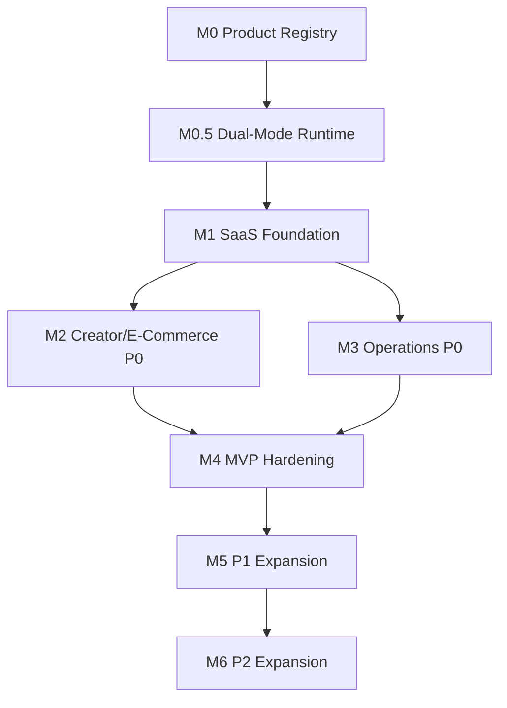

# MVP Development Roadmap

Source PRD: `docs/saas-product-prd.md`

This roadmap turns the 67-feature product surface into buildable milestones. The guiding choice is to ship a usable SaaS wedge first: creator/e-commerce operating workspace with persistence, asset records, AI jobs, billing visibility, and audit logs. The remaining 67-feature surface stays visible as a product map, but production readiness is staged.

## 1. Planning Assumptions

### Evidence From Current Codebase

- `src/main.tsx:8` mounts the React app and wraps it with `ThemeProvider` and `UndoRedoProvider`.
- `src/App.tsx:104` owns the main application shell state.
- `src/App.tsx:392` maps `ModuleId` values to page components.
- `src/App.tsx:526` mounts the sidebar; `src/App.tsx:537` mounts the topbar.
- `src/product/registry.ts` defines the current 14-domain / 67-feature navigation plus hidden/internal compatibility records.
- `src/types.ts:1` defines the `ModuleId` union.
- `src/lib/firebaseConfig.ts` already contains Firebase environment wiring, but production data contracts are not centralized yet.

### Product Assumptions

- MVP should prioritize paying-user value over showing every feature as production-ready.
- The first commercial wedge is "AI e-commerce and creator operating workspace".
- Current static/mock-heavy modules can remain accessible, but must be labeled internally by readiness before production launch.
- Backend can begin with Firebase-style persistence if it satisfies workspace tenancy, auditability, and export needs.
- AI provider should start with Gemini-compatible generation/chat contracts, while keeping provider abstraction open for BYOK or multi-provider later.

## 2. MVP Definition

MVP means a real owner can repeatedly:

1. Sign in to a workspace.
2. Navigate a stable product registry.
3. Generate or record a useful business asset.
4. Save assets with metadata and reuse them later.
5. Create and complete a task.
6. View AI/token usage.
7. See audit logs for meaningful actions.
8. Return after reload and keep workspace state.

## 3. Milestone Overview

| Milestone | Name | Target Outcome | Suggested Duration |
|---|---|---|---:|
| M0 | Product Registry And Route Hygiene | One canonical feature registry drives navigation, routing, search, permissions, and docs. | 3-5 days |
| M0.5 | Dual-Mode Runtime Foundation | Runtime provider, Web/mock mode, Multica Desktop bridge detection, read-only Multica runtime status, and compatibility contract exist before task dispatch depends on them. | 4-7 days |
| M1 | SaaS Foundation | Auth, workspace tenancy, persistence layer, and audit base exist. | 1-2 weeks |
| M2 | Creator/E-Commerce P0 | Asset generation workflow, copywriting, asset vault, and AI job records are usable. | 2-3 weeks |
| M3 | Operations P0 | Tasks, billing/token visibility, settings/API keys, and activity logs are usable. | 1-2 weeks |
| M4 | MVP Hardening | Permissions, empty/error states, build quality, smoke tests, and launch checklist pass. | 1 week |
| M5 | P1 Expansion | CRM, customer service, campaigns, team approval, video/avatar/store foundations. | 3-6 weeks |
| M6 | P2 Expansion | Finance/tax, API surface, enterprise controls, distribution network, mini app management. | 6+ weeks |

## 4. Milestone M0: Product Registry And Route Hygiene

### Objective

Remove drift between `ModuleId`, `Sidebar.navGroups`, `App.renderContent`, command palette, search, recommended modules, usage heatmaps, and future permissions.

### Tasks

#### M0-T1: Create Central Product Registry

- Create `src/product/registry.ts`.
- Move all 14 domains and 67 visible feature entries into a typed registry.
- Each feature record should include:
  - `id`
  - `label`
  - `domain`
  - `icon`
  - `phase`: `p0 | p1 | p2 | later`
  - `readiness`: `implemented | mock | placeholder | hidden`
  - `componentKey`
  - `permission`
  - `dataDependencies`
  - `description`

Acceptance criteria:

- Registry contains exactly 67 visible feature records.
- Every visible feature id is assignable to `ModuleId`.
- Registry exports grouped navigation data equivalent to current sidebar groups.
- `npm run lint` passes.

#### M0-T2: Generate Sidebar From Registry

- Replace hardcoded `navGroups` body in `src/components/Sidebar.tsx` with registry-derived groups.
- Preserve current labels, icons, sort-by-usage behavior, collapsed mode, and active group behavior.

Acceptance criteria:

- Sidebar visual structure remains unchanged.
- Sort-by-usage still reads `module_time_tracker`.
- All 14 domains appear in the same order.

#### M0-T3: Validate Route Coverage

- Add a registry validation utility that checks:
  - every visible registry feature has a render target
  - every `ModuleId` either has a render target or is intentionally hidden
  - no `App.renderContent` route exists without a registry entry unless marked internal

Acceptance criteria:

- Current `e_white_bg` and `marketing_diy` inconsistencies are explicitly resolved as visible, hidden, or removed.
- A validation script or test fails on future drift.

#### M0-T4: Refactor App Rendering To Registry Metadata

- Keep `App.renderContent` as the rendering boundary, but use registry metadata for title, breadcrumbs, phase, and fallback state.
- Replace ad hoc title lookup loops with registry helper functions.

Acceptance criteria:

- Breadcrumbs and pinned modules display labels from the registry.
- Unknown or hidden routes show a controlled fallback.
- No visible P0 route renders only the generic "under development" fallback.

## Milestone M0.5: Dual-Mode Runtime Foundation

### Objective

Keep `aistudio` independently deployable as Web SaaS while adding an optional Desktop Agent Runtime powered by Multica.

### Tasks

#### M0.5-T1: Runtime Provider Contract

- Add `AgentRuntimeProvider` and canonical runtime/task/agent types.
- Add a Web/mock provider that is always available in browser mode.
- Add fixture-based contract checks for daemon, runtime, agent, issue, and task mappings.

Acceptance criteria:

- App builds with no Multica configuration.
- Web mode reports a healthy remote/mock runtime.
- Runtime contract scripts pass without a live Multica server.

#### M0.5-T2: Desktop Bridge Detection

- Add `DesktopAgentBridge` detection for Multica Desktop's `window.daemonAPI`.
- Map daemon states: `running`, `stopped`, `starting`, `stopping`, `installing_cli`, `cli_not_found`, `auth_expired`.
- Keep desktop controls unavailable in normal browser mode.

Acceptance criteria:

- Browser mode detects no bridge and hides daemon controls.
- Desktop bridge fixtures can start, stop, restart, stream logs, and report auth-expired.

#### M0.5-T3: Multica Read-Only Adapter

- Configure Multica API/WS URLs through environment and settings.
- Read agents and runtimes through Multica HTTP endpoints.
- Combine daemon status and runtime list in Settings and Agent Status Dashboard.

Acceptance criteria:

- Settings shows runtime mode, server URL, daemon state, CLI agents, and provider count.
- Agent dashboard distinguishes cloud/web and local Multica runtimes.
- Unreachable Multica marks desktop runtime degraded while Web SaaS remains usable.

## 5. Milestone M1: SaaS Foundation

### Objective

Turn the local AI Studio panel into a multi-user SaaS shell.

### Tasks

#### M1-T1: Auth And Workspace Tenancy

- Add auth provider abstraction.
- Define `Workspace`, `User`, `Membership`, and `Role` contracts.
- Add workspace context for current tenant state.
- Gate app shell behind authenticated workspace state.
- Current first pass uses a local demo workspace session; production Firebase Auth/OAuth remains a later adapter swap.

Acceptance criteria:

- Unauthenticated users see a login/onboarding entry.
- Authenticated users land in their default workspace.
- Workspace id is available to all data operations.
- Reload preserves current workspace.

#### M1-T2: Persistence Layer

- Create `src/lib/data/` with repository-style modules for assets, tasks, settings, audit logs, generation jobs, and usage.
- Start with Firebase-backed implementations if Firebase remains the chosen backend.
- Provide local mock adapters for tests and offline development.

Acceptance criteria:

- UI code does not call Firebase directly outside data adapters.
- Data operations include workspace id.
- Repository methods return typed results and normalized errors.

#### M1-T3: Audit Foundation

- Define `AuditLog` schema:
  - actor
  - workspace id
  - action
  - module id
  - target type
  - target id
  - metadata
  - timestamp
- Replace scattered local-only activity logging with central `logAuditEvent`.
- Current first pass keeps local storage as the backing store but upgrades records to workspace-scoped audit events.

Acceptance criteria:

- Pin/unpin module, create task, save asset, generation job start/finish, settings change, and export emit audit events.
- Audit logs are visible in `ActivityLogsView`.

#### M1-T4: Environment And Secrets

- Document required `.env.local` keys.
- Ensure `GEMINI_API_KEY` is not exposed to client-side code unless intentionally proxied.
- Decide whether AI calls run client-side, server-side, or through a small API proxy.

Acceptance criteria:

- `.env.example` matches required runtime keys.
- Build works without real production secrets.
- Missing optional integrations show controlled UI states.

## 6. Milestone M2: Creator/E-Commerce P0

### Objective

Ship the first revenue-relevant loop: create business content, save it, reuse it, and track its cost.

### P0 Feature Scope

- 主图设计
- 创意海报
- 详情页设计助理
- 克隆设计
- AI 图像编辑
- 文案创作
- 创作工具
- 关键词库
- 商用级图像生成
- 全能顾问对话
- 数字资产保险库

### Tasks

#### M2-T1: Generation Job Contract

- Define `GenerationJob` for image, copy, edit, clone, and detail-page helper flows.
- Capture prompt, parameters, provider, status, cost estimate, outputs, errors, and linked assets.

Acceptance criteria:

- Starting a generation creates a pending job.
- Success links outputs to asset records.
- Failure stores a readable error and retry metadata.

#### M2-T2: E-Commerce Asset Flow

- Convert `ECommerceView` actions from local mock progress/results into real generation job calls or adapter-backed mock calls.
- Support product name, selling points, platform, aspect ratio, style/tone/lighting/angle, batch count, and references.

Acceptance criteria:

- User can submit a generation request from at least two e-commerce P0 modules.
- Generated or mocked output is saved as an `Asset`.
- Job status and result survive reload.

#### M2-T3: Copywriting Flow

- Connect `CopywritingView` to prompt templates and generation jobs.
- Save drafts, outputs, selected platform, tone, and keywords.

Acceptance criteria:

- User can generate one copy output.
- User can save output to asset vault or project.
- Keywords can be reused in a later generation.

#### M2-T4: Asset Vault P0

- Implement persistent asset list, upload, tags, type filters, preview, detail drawer, export/download, and delete/archive.
- Support generated and uploaded asset sources.

Acceptance criteria:

- User can upload or create an asset.
- User can tag and find it.
- User can export/download it.
- Asset activity is audited.

#### M2-T5: AI Chat/Copilot P0

- Provide cross-module assistant entry.
- Support workspace context summary, current module id, and optional selected asset/task context.

Acceptance criteria:

- User can ask a general question.
- Assistant response is tied to current module context.
- Chat usage is logged as a generation/usage event.

## 7. Milestone M3: Operations P0

### Objective

Make the workspace operational: tasks, billing visibility, API settings, audit, and dashboard state.

### P0 Feature Scope

- 全域指挥概览
- 全局任务调度
- Agent 状态监测
- 算力与 Token 监控
- API 密钥与开发者
- 全局偏好配置
- 全站操作审计日志

### Tasks

#### M3-T1: Dashboard Persistence

- Persist pinned modules, layout presets, last module, session summaries, and recent activity per workspace/user.
- Keep local storage as a cache, not the source of truth.

Acceptance criteria:

- User returns to the same workspace layout after reload.
- Different users do not share private layout state unless intentionally workspace-wide.

#### M3-T2: Task Center P0

- Add persistent `Task` records.
- Support create, assign, status, due date, module source, and completion.
- Keep global task modal and `TasksView` in sync.

Acceptance criteria:

- User can create, complete, reopen, and filter tasks.
- Task changes emit audit logs.

#### M3-T3: Usage And Billing P0

- Record usage from generation jobs and chat calls.
- Show token/credit usage by workspace, module, and time range.
- Keep plan/quota display simple for MVP.

Acceptance criteria:

- Billing page shows current plan, consumed credits, remaining credits, and recent usage.
- Generation jobs affect usage totals.
- Over-quota state disables paid generation actions or shows upgrade prompt.

#### M3-T4: API Keys And Provider Settings

- Add provider settings page for Gemini and future providers.
- Store key metadata securely; do not expose raw secret after save.
- Support test connection.

Acceptance criteria:

- User can view provider connection status.
- User can save/update/delete provider config.
- Failed provider test shows actionable error.

#### M3-T5: Activity Logs P0

- Make `ActivityLogsView` read persistent audit logs.
- Add filters by actor, module, action, target type, and date.

Acceptance criteria:

- At least six P0 actions appear in the log.
- Logs include actor, module, action, target, and timestamp.

## 8. Milestone M4: MVP Hardening

### Objective

Make P0 coherent, testable, and launchable.

### Tasks

#### M4-T1: Permissions And Role Gates

- Implement Owner, Admin, Operator, Creator, Finance, and Viewer roles.
- Gate billing/API/admin/audit modules appropriately.

Acceptance criteria:

- Viewer cannot create, delete, export, or change settings.
- Finance can access billing/finance but not API secrets by default.
- Owner can access all P0 modules.

#### M4-T2: Empty, Loading, Error, And Offline States

- Add reusable state components.
- Apply to asset vault, generation jobs, tasks, billing, settings, and audit logs.

Acceptance criteria:

- P0 views have empty/loading/error states.
- Network/provider failure does not blank the page.

#### M4-T3: Smoke And Regression Tests

- Add route coverage tests for registry and `renderContent`.
- Add data adapter tests for assets, tasks, generation jobs, audit logs, and usage.
- Add browser smoke tests for dashboard, asset generation path, copywriting path, task creation, and billing page.

Acceptance criteria:

- `npm run lint` passes.
- `npm run build` passes.
- Smoke tests prove dashboard renders and P0 flows do not crash.

#### M4-T4: Launch Checklist

- Verify secrets, build output, access control, billing guardrails, audit logging, and backup/export plan.
- Create production environment checklist.

Acceptance criteria:

- A release checklist document exists.
- All P0 acceptance criteria are checked or explicitly deferred.

## 9. Milestone M5: P1 Expansion

### Objective

Expand from creator/e-commerce MVP into customer loop, collaboration, video/avatar, and store foundation.

### Feature Packages

#### M5-A: CRM And Customer Service

- 智能客户管家 (CRM)
- 全天候 AI 客服

Tasks:

- Customer profile schema.
- Service conversation schema.
- Customer tags and follow-up tasks.
- AI reply suggestion adapter.
- Escalation/audit events.

#### M5-B: Campaign Pages

- 爆店码
- 碰一碰
- 智能官网

Tasks:

- Campaign schema.
- QR/NFC entry page generator.
- Landing page records and publish state.
- Campaign metrics.

#### M5-C: Team And Approval

- 数字员工概览
- 异步协同任务
- 共享给 Agent 的库
- 主理人审批流

Tasks:

- Agent/member model.
- Approval records.
- Assign/review/approve flow.
- Shared knowledge/resource access.

#### M5-D: Video And Avatar

- 混剪首页
- 智能混剪
- 爆款视频复刻
- 混剪素材
- 标题模板
- 视频模板
- 分身管理
- 克隆声音与形象
- 声音资产
- 数字人空间

Tasks:

- Video project schema.
- Media asset linkage.
- Avatar/voice consent status.
- Provider adapter for video/avatar jobs.

#### M5-E: Store Foundation

- 多店全盘看板
- 门店官网与分店
- 统一订单管理
- 智能调拨与库存
- 自动营销策略

Tasks:

- Store, order, inventory, promotion schemas.
- Dashboard metrics.
- Basic CRUD and audit.

## 10. Milestone M6: P2 Expansion

### Objective

Complete advanced monetization, operations, finance, and enterprise-readiness surface.

### Feature Packages

- 财务与票据管理
- 税务筹划与计算
- 分销代理网络
- 活动与引流
- 小程序端管理
- 社媒矩阵挂载
- 兼职员工账号池
- 系统管理
- Advanced API keys and developer portal
- Enterprise permissions and compliance exports

Acceptance criteria:

- P2 modules are backed by persistent data.
- Each module has role gates and audit events.
- Enterprise plan can export logs, usage, billing, and workspace data.

## 11. Dependency Graph

Critical path:

1. Registry and route hygiene.
2. Workspace/auth/data/audit foundation.
3. Asset/generation/copywriting loop.
4. Tasks/billing/settings/audit visibility.
5. Permission and test hardening.

## 12. Task Priority Matrix

### Must Ship For MVP

- Product registry.
- Workspace tenancy.
- Auth shell.
- Data adapter layer.
- Audit log foundation.
- Asset vault.
- Generation job contract.
- E-commerce asset generation.
- Copywriting generation.
- Task center.
- Billing/token usage.
- API/provider settings.
- Role gates.
- Smoke tests.

### Should Ship For MVP

- Layout presets persisted server-side.
- Global search tied to registry.
- Command palette tied to registry.
- Recommended modules tied to usage.
- Provider test connection.
- Basic export/download for generated assets.

### Could Ship After MVP

- Full video remix automation.
- Full avatar/voice cloning pipeline.
- CRM automation builder.
- Store inventory automation.
- Finance/tax automation.
- Plugin marketplace.

### Explicitly Defer

- Enterprise SSO.
- Multi-provider marketplace.
- Full ERP/accounting replacement.
- Advanced custom workflow scripting.
- Public API platform.

## 13. Verification Plan

### Static Verification

- `npm run lint`
- `npm run build`
- Registry validation script
- Type-level check that all visible registry ids are valid `ModuleId`

### Browser Smoke Tests

- Dashboard loads at `/`.
- Sidebar opens every P0 feature.
- Asset vault creates and displays an asset.
- E-commerce flow creates a generation job and output asset.
- Copywriting flow creates and saves output.
- Task center creates and completes a task.
- Billing page reflects usage from a generation job.
- Activity log shows audited actions.

### Data Verification

- Workspace id is present on persisted records.
- User A cannot read User B workspace records.
- Audit logs cannot be edited through normal UI.
- Deleting/archive actions are logged.

### Release Verification

- Production build passes.
- Secrets are configured in environment only.
- Missing provider key produces controlled UI.
- Over-quota state is enforced.
- P0 role matrix is verified.

## 14. Suggested Work Breakdown For Parallel Execution

### Lane A: Product Registry And Navigation

Owner role: frontend architect / executor

Tasks:

- M0-T1 through M0-T4.
- Registry validation.
- Sidebar, breadcrumbs, command palette, search alignment.

### Lane B: SaaS Data Foundation

Owner role: backend/data executor

Tasks:

- M1-T1 through M1-T3.
- Data adapter layer.
- Auth/workspace context.
- Audit base.

### Lane C: Creator/E-Commerce Loop

Owner role: frontend/product executor

Tasks:

- M2-T1 through M2-T4.
- E-commerce generation jobs.
- Copywriting persistence.
- Asset vault.

### Lane D: Operations And Billing

Owner role: full-stack executor

Tasks:

- M3-T1 through M3-T5.
- Tasks, usage, billing, settings, logs.

### Lane E: Verification And Launch

Owner role: verifier/test engineer

Tasks:

- M4-T1 through M4-T4.
- Route tests, smoke tests, permission matrix, launch checklist.

## 15. Definition Of Done

MVP is done when:

- A new user can create or enter a workspace.
- The P0 registry is internally consistent.
- P0 features do not depend on local-only state for critical records.
- A user can generate or record at least one asset and reuse it later.
- Tasks, usage, settings, and audit logs are persisted.
- Role gates protect sensitive pages.
- Build, lint, route validation, and browser smoke tests pass.
- Known P0 placeholders are either implemented or hidden from production navigation.
