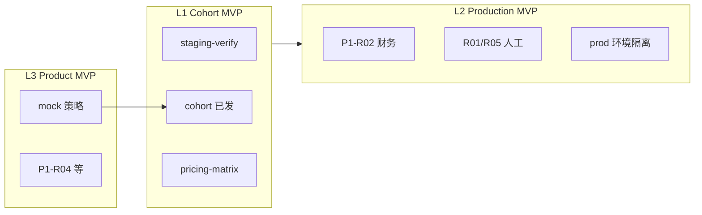

# MVP 进度深入分析（2026-06-26）

**基线：** `main` @ `d9d36d5`  
**商业锚点：** P0 签字 2026-06-24 · tag `v0.1.0-paid-beta-staging`  
**分析范围：** Paid-Beta / Commercial MVP（非 P2 Business Edition 全量、非 ai_canvas 独立项目）

---

## 1. 执行摘要

| 维度 | 结论 |
|------|------|
| **工程交付** | **高完成度**：P0 控制面 + P1 创收模块链路（job→asset→usage→audit→billing）已在代码与自动化门禁中闭合；`test:p0-release`、`test:staging-verify`（compose 栈）已于 2026-06-26 跑通。 |
| **产品可卖性（L1 Cohort）** | **差一步**：G1 工程侧仅剩文档勾选同步；**真正挡路的是运营/财务人工**（Cohort 发送、P1-R02 单价签字）及 **staging 可被内测用户稳定访问**（Docker 常开、端口 8081、代理直连）。 |
| **生产可收费（L2）** | **未关门**：财务定价、P1-R01/R05 人工验收、生产环境与 staging 密钥隔离、image 全链路 UI 验收均未在 evidence 中关闭。 |
| **L3 产品面（增长环）** | **工程已完成** Phase 2–3 清单项；G3 在计划上已与 P1-R04/06/07/08 对齐，无新增硬编码阻塞。 |

**一句话：** 代码和测试已站在 **Paid-Beta Staging 可内测** 门口；**商业闭环** 卡在「人」和「环境运维」，不在「缺大功能」。

---

## 2. 三层完成定义 vs 实际



| 层级 | 门禁 | 工程 | 人工/运维 | 评估 |
|------|------|------|-----------|------|
| **L1** | G1 | staging-verify **pass**（日志）；pricing-matrix **pass** | Cohort **未发**；Release 可选未建 | **~85%** — 关 G1 需勾选 + 发邮件 |
| **L2** | G2 | 矩阵同步、billable-generation、callback 单测+staging smoke | 财务批价；R01/R05 签字；prod 分离 | **~40%** |
| **L3** | G3 | mock 策略、关键词 implemented、PreviewBanner、营销→CRM、Chat/Speech 审计 | 可选法务/文案 | **~90%** 工程 |

---

## 3. 模块与 Registry（产品面）

| 指标 | 数值 | 来源 |
|------|------|------|
| 可见功能 | **67** | `product-registry.test.ts` |
| 导航域 | **14** | 同上 |
| `implemented` | **62** | `registry.ts` 统计 |
| `mock`（可见） | **5** | 策略：`ai_canvas` + Avatar×4 |
| P0 Batch-1 模块 | 12 个控制面 id | registry 与 `App.tsx` switch 同步 enforced |

**Paid-Beta 承诺边界**（[paid-beta-scope.md](./paid-beta-scope.md) + [mock-module-strategy](./mock-module-strategy-2026-06-26.md)）：

- **可依赖：** P0 全家桶 + P1 电商/图视频/文案/Chat/Speech/混剪/营销/导演台/设计工作流 + **关键词库**。
- **仅预览：** 画布、Avatar（界面有 `ModulePreviewBanner`）。
- **运行时：** Staging **必须** `VITE_DATA_BACKEND=http` + 真 API 扣费；本地 `npm run dev` 仍为 local/mock provider，**不能**当作 paid-beta 验收环境。

---

## 4. P1 问题单（创收硬化）

| ID | 工程 | 自动化证据 | 仍开放 |
|----|------|------------|--------|
| **P1-R01** | 失败任务恢复面板 + `generation_job_retry` | launch-readiness | **人工 UI 签字** |
| **P1-R02** | API/UI 单价一致 | `test:pricing-matrix-sync`（22 API / 35 UI） | **财务书面批准** |
| **P1-R03** | Callback 处理器 + mock-render 路径 | `test:provider-callback` + `staging-callback-smoke` | **真机外部 render**（已 defer 文档） |
| **P1-R04** | Marketing → CRM handoff | launch-readiness | — |
| **P1-R05** | 导出 metering + audit | launch-readiness | **人工导出签字** |
| **P1-R06** | 关键词 CRUD | `test:keyword-repo` + registry | — |
| **P1-R07** | Chat 显式保存 + `chat_memory_save` | launch-readiness | 可选产品文案 |
| **P1-R08** | Speech consent + `speech_voice_consent` | launch-readiness | 可选法务 |

**结论：** P1 **8/8 工程实现**；商业化认证只剩 **R02 财务** + **R01/R05 人工** + **R03 真机**（可延后到 prod 前）。

---

## 5. 自动化门禁矩阵

| 门禁 | 命令 | 最近状态 | 作用 |
|------|------|----------|------|
| P0 发布 | `npm run test:p0-release` | **pass** 2026-06-26 | registry、repos、runtime、lint、build、browser-smoke |
| 定价一致 | `test:pricing-matrix-sync` | **pass** | 防 API/UI 单价漂移 |
| Staging API | `test:staging-api-smoke` | **pass**（compose 起后） | 注册、hold/capture/refund、refresh |
| Staging callback | `test:staging-callback-smoke` | **pass** | video/remix/director 异步路径 |
| 合并 | `test:staging-verify` | **pass** 2026-06-26 | **G1 工程核心** |
| Provider 契约 | `test:provider-callback` | pass（无 API） | P1-R03 单测 |
| Launch 契约 | `test:launch-readiness` | pass | 审计/权限/导出/营销/Chat/Speech |
| API E2E | `apps/api` Jest e2e | 文档记 36 suites（2026-06-24） | 后端回归（独立 npm 于 api 目录） |

**缺口：** 无「一键 CI」在仓库外证明；依赖本机 Docker + `.env.deploy`。

---

## 6. Phase 0–3 计划勾选（与真相差）

[mvp-completion-plan-2026.md](./mvp-completion-plan-2026.md) 中建议**立即同步**：

| 项 | 计划勾选 | 建议 |
|----|----------|------|
| G1 `staging-verify` | [ ] | 改为 **[x]**（与 [mvp-execution-log](./mvp-execution-log-2026-06-26.md) 一致） |
| G1 Cohort | [ ] | 保持至邮件发出 |
| [mvp-priority-queue](./mvp-priority-queue-2026-06-26.md) 序 2 | 「阻塞 G1」 | 改为 **工程 done**，阻塞改为 **cohort + 浏览器可达** |

Phase **2–3** 在计划上已全部 [x]，与代码一致。

---

## 7. 架构与风险（深入）

### 7.1 数据与计费

- **三后端：** local / firebase / http；Paid-Beta 仅认证 **http** 路径。
- **扣费链：** hold → capture/refund，模块价来自 `COMMERCIAL_USAGE_PRICING` + API 矩阵；staging smoke 已覆盖 image 等典型模块。
- **风险：** 财务若调价而未更新双端矩阵 → `pricing-matrix-sync` 会红；**流程**上依赖 R02 签字。

### 7.2 Agent 运行时

- 默认 **web mock provider**；Multica desktop/self-hosted 为可选，契约测试有，**live 设备不在本 release**。
- Cohort 文案已写明：内测非生产 Gemini/Multica 集群。

### 7.3 部署与运维（当前痛点）

- **唯一官方栈：** Docker Compose（k3s 已移除）。
- **本机实践：** WSL2 + Docker Desktop；Hub 拉取需 **Windows Clash 网关**（`172.31.x.x:7897`）；Web **8081**（非默认 8080）。
- **「拒绝连接」** = 容器未起或 Docker 未 Running，非应用 bug → [staging-browser-access.md](./staging-browser-access.md)、`staging-up.ps1`。

### 7.4 安全与合规

- JWT + `FIELD_ENCRYPTION_KEY` 强制；`.env.deploy` gitignored。
- Speech/Avatar 涉及 consent；Speech 已审计，Avatar 仍 mock。

### 7.5 技术债（计划内明确不做）

- `App.tsx` 大重构、ai_canvas 全栈、Avatar B01/B02 全量 → **不计入当前 MVP**。

---

## 8. P2 / P3  backlog（MVP 之后）

[remaining-issues](./saas-commercial-mvp-remaining-issues.md) 中 **P2 Business Edition**（CRM 深化、门店、团队、Avatar 持久化等）与 **P3 平台**（Public API、插件、风控闸门）均 **未纳入** 当前 Paid-Beta 关门范围；依赖图以 P1-R02、P2-B04 等为枢纽。

**对当前 MVP 的影响：** 无阻塞；仅影响「全产品 67/67 implemented」远期目标。

---

## 9. 关键路径（接下来 2 周）

```text
1. 运维：Docker Desktop 常开 + staging-up.ps1 → 内测可访问 http://127.0.0.1:8081
2. 运营：发 Cohort（paid-beta-cohort-notice）→ G1 商业闭环
3. 财务：P1-R02 签字 → 可对外声称单价；更新 evidence
4. 工程：勾选 G1 文档；可选 gh release
5. QA：P1-R01/R05 人工清单（staging 上操作）
6. 生产前：环境/密钥分离、R03 真机（可并行排期）
```

---

## 10. 量化总览

| 类别 | 完成度（主观） |
|------|----------------|
| P0 控制面 + 自动化 | **~95%** |
| P1 工程 | **~95%** |
| P1 商业认证（人+真机） | **~35%** |
| L1 Cohort MVP | **~85%** |
| L2 Production MVP | **~40%** |
| 文档与运维可重复性 | **~75%**（已补 WSL/Clash/浏览器指南） |

---

## 11. 相关文档索引

| 用途 | 文档 |
|------|------|
| 总计划 | [mvp-completion-plan-2026.md](./mvp-completion-plan-2026.md) |
| 执行记录 | [mvp-execution-log-2026-06-26.md](./mvp-execution-log-2026-06-26.md) |
| 待办队列 | [mvp-priority-queue-2026-06-26.md](./mvp-priority-queue-2026-06-26.md) |
| 一键发送 | [READY-TO-SEND-next-steps.md](./READY-TO-SEND-next-steps.md) |
| 范围 | [paid-beta-scope.md](./paid-beta-scope.md) |
| P0 证据 | [saas-commercial-mvp-p0-release-evidence.md](./saas-commercial-mvp-p0-release-evidence.md) |
| 浏览器 | [staging-browser-access.md](./staging-browser-access.md) |

---

- [mvp-engineering-analysis-2026-06-26.md](./mvp-engineering-analysis-2026-06-26.md)（排除人工/测试）

*本分析为仓库文档与测试门禁的静态综合；财务/运营状态以实际邮件与签字为准。*