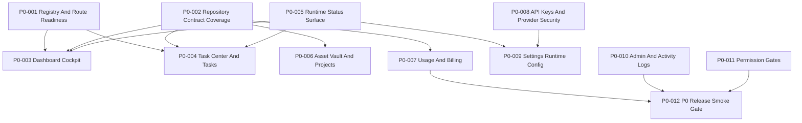

# SaaS Commercial MVP P0 Batch 1 Issue List

Date: 2026-06-10

Source plan: `docs/superpowers/plans/2026-06-10-commercial-mvp-custom-development-plan.md`

Acceptance source: `docs/saas-commercial-mvp-acceptance-test-checklist.md`

Completion source: `docs/saas-commercial-mvp-p0-batch-1-completion.md`

Scope: P0 first batch for the commercial control plane. This batch focuses on Dashboard, Workflow, Tasks, Agent Status, Topbar, Assets, Projects, Billing, API Keys, Settings, Admin, and Activity Logs. It does not include `ai_canvas`.

Execution status: local P0 Batch 1 implementation is complete in the working tree and the automated P0 release gate is ready for sign-off. External GitHub issue closure and business `go` / `no-go` approval remain separate release-management actions.

## Batch Goal

Ship the first executable P0 work package so the SaaS control plane can persist workspace state, route users reliably, show runtime health, create and complete tasks, save assets, meter usage, protect secrets, and produce audit evidence.

## Batch Labels

Use these GitHub labels consistently:

- `commercial-mvp`
- `p0`
- `saas-foundation`
- `control-plane`
- `runtime`
- `audit`
- `billing`
- `test-required`

## Batch Dependency Order



## Issue Index

| ID | Title | Size | Primary Area | Depends On |
|---|---|---:|---|---|
| P0-001 | Lock P0 registry, route, command, and fallback readiness | M | Product registry | None |
| P0-002 | Add repository contract coverage for P0 business objects | L | Data foundation | None |
| P0-003 | Replace Dashboard P0 KPIs and zero states with workspace data | M | Dashboard | P0-001, P0-002, P0-005 |
| P0-004 | Make Task Center and Tasks View share repository-backed task state | L | Tasks | P0-001, P0-002, P0-005 |
| P0-005 | Unify runtime health across Agent Workflow, Agent Status, and Topbar | M | Runtime UI | None |
| P0-006 | Complete asset and project lifecycle for generated/imported outputs | L | Assets/Projects | P0-002 |
| P0-007 | Wire usage, billing estimates, and quota preflight for P0 actions | M | Billing | P0-002 |
| P0-008 | Secure API Keys and provider configuration metadata | M | API Keys | P0-002 |
| P0-009 | Persist Settings runtime mode and workspace preferences | M | Settings | P0-005, P0-008 |
| P0-010 | Close Admin operations and Activity Logs audit visibility | M | Admin/Audit | P0-002 |
| P0-011 | Enforce P0 permission gates across destructive and billing actions | M | Permissions | P0-001, P0-002 |
| P0-012 | Add P0 release smoke gate and evidence checklist | M | Verification | P0-003 to P0-011 |

---

## P0-001: Lock P0 Registry, Route, Command, And Fallback Readiness

**GitHub title:** `[P0] Lock registry, route, command, and fallback readiness`

**Labels:** `commercial-mvp`, `p0`, `control-plane`, `test-required`

**Milestone:** Commercial MVP / P0 Batch 1

**Size:** M

**Objective:** Ensure every first-batch P0 control-plane module has a canonical registry entry, route target, command/search behavior, permission metadata, and no generic fallback.

**Files:**

- Modify: `src/product/registry.ts`
- Modify: `src/types.ts`
- Modify: `src/App.tsx`
- Modify: `src/components/Sidebar.tsx`
- Modify: `src/components/CommandPalette.tsx`
- Modify: `src/components/GlobalSearchOverlay.tsx`
- Test: `scripts/product-registry.test.ts`
- Test: `scripts/launch-readiness.test.ts`

**Implementation checklist:**

- [ ] Confirm these first-batch P0 module ids have visible registry records: `dashboard`, `workflow`, `tasks`, `agent_status`, `data`, `assets`, `projects`, `billing`, `saas_api_keys`, `settings`, `admin`, `activity_logs`.
- [ ] Confirm `ai_canvas` is not counted in this P0 batch readiness gate.
- [ ] Add or update registry metadata for phase, readiness, permission, component key, and data dependencies.
- [ ] Make command palette and global search use registry labels and permission metadata.
- [ ] Ensure no first-batch P0 route renders a generic under-development fallback.
- [ ] Add a launch-readiness assertion that fails when a P0 batch module has no route target.

**Acceptance criteria:**

- [ ] Sidebar, command palette, search, pinned modules, and route rendering all resolve labels from the registry.
- [ ] Unknown or hidden routes render a controlled fallback.
- [ ] First-batch P0 modules are excluded from generic fallback behavior.
- [ ] `ai_canvas` remains outside this P0 batch issue scope.

**Verification:**

```powershell
npm.cmd run test:product-registry
npm.cmd run test:launch-readiness
npm.cmd run lint
```

Expected:

```text
Product registry checks passed
Launch readiness checks passed
```

---

## P0-002: Add Repository Contract Coverage For P0 Business Objects

**GitHub title:** `[P0] Add repository contract coverage for P0 business objects`

**Labels:** `commercial-mvp`, `p0`, `saas-foundation`, `audit`, `test-required`

**Milestone:** Commercial MVP / P0 Batch 1

**Size:** L

**Objective:** Make the shared data foundation verifiable before P0 screens depend on it for commercial completion.

**Files:**

- Modify: `src/lib/data/assetRepository.ts`
- Modify: `src/lib/data/taskRepository.ts`
- Modify: `src/lib/data/auditLogRepository.ts`
- Modify: `src/lib/data/usageRepository.ts`
- Modify: `src/lib/data/settingsRepository.ts`
- Modify: `src/lib/data/apiKeyRepository.ts`
- Modify: `src/lib/data/billingRepository.ts`
- Modify: `src/lib/data/dataBackend.ts`
- Test: `scripts/data-backend.test.ts`
- Test: `scripts/saas-foundation.test.ts`
- Test: `scripts/workspace-state.test.ts`

**Implementation checklist:**

- [ ] Confirm every mutation accepts or derives `workspaceId`.
- [ ] Confirm every mutation returns a typed record or normalized error.
- [ ] Confirm asset, task, audit, usage, settings, provider/API key, and billing records can be created in test fixtures.
- [ ] Add repository contract assertions for create, list by workspace, update, delete or disable, and reload behavior.
- [ ] Add audit expectations for task, asset, settings, API key, billing, runtime, and admin actions.
- [ ] Keep direct browser local state as cache only when repository state remains source of truth.

**Acceptance criteria:**

- [ ] P0 repositories can create and list records by workspace.
- [ ] Business records include stable ids and timestamps.
- [ ] Audit records include actor, workspace, module, action, target, metadata, and timestamp.
- [ ] Usage records can link to a job, task, module, export, or runtime action.
- [ ] Settings and API key metadata survive reload in the configured backend.

**Verification:**

```powershell
npm.cmd run test:data-backend
npm.cmd run test:workspace-state
npm.cmd run test:saas-foundation
npm.cmd run lint
```

Expected:

```text
Data backend checks passed
Workspace state checks passed
SaaS foundation checks passed
```

---

## P0-003: Replace Dashboard P0 KPIs And Zero States With Workspace Data

**GitHub title:** `[P0] Replace Dashboard KPIs and zero states with workspace data`

**Labels:** `commercial-mvp`, `p0`, `control-plane`, `audit`, `test-required`

**Milestone:** Commercial MVP / P0 Batch 1

**Size:** M

**Depends on:** P0-001, P0-002, P0-005

**Objective:** Make the Dashboard a real workspace cockpit instead of a static panel.

**Files:**

- Modify: `src/components/Dashboard.tsx`
- Modify: `src/components/DailyFocusGoal.tsx`
- Modify: `src/components/DailyInsightsWidget.tsx`
- Modify: `src/components/FrequentWorkflowsWidget.tsx`
- Modify: `src/components/RecommendedModulesWidget.tsx`
- Modify: `src/components/WorkflowEfficiencyWidget.tsx`
- Modify: `src/components/ActivityHeatmap.tsx`
- Modify: `src/hooks/useModuleTimeTracker.ts`
- Test: `scripts/browser-smoke.test.ts`
- Test: `scripts/saas-foundation.test.ts`

**Implementation checklist:**

- [ ] Load KPI cards from workspace tasks, assets, usage, audit logs, and runtime status.
- [ ] Replace fake completed business rows with zero states when the workspace has no data.
- [ ] Make Dashboard quick actions route to real P0 modules or create repository-backed tasks.
- [ ] Log audit events for meaningful Dashboard actions such as creating a focus task or launching a workflow.
- [ ] Show runtime degraded state without blocking manual task, asset, and settings actions.
- [ ] Ensure reload keeps Dashboard metrics consistent with repository state.

**Acceptance criteria:**

- [ ] Empty workspace Dashboard shows zero counts and useful next actions.
- [ ] Creating a task changes Dashboard task metrics after reload.
- [ ] Saving an asset changes Dashboard asset metrics after reload.
- [ ] Runtime health card matches `useAgentRuntimeStatus`.
- [ ] Dashboard action success appears only after repository or runtime completion.

**Verification:**

```powershell
npm.cmd run test:saas-foundation
npm.cmd run test:browser-smoke
npm.cmd run lint
```

Expected:

```text
SaaS foundation checks passed
Browser smoke checks passed
```

---

## P0-004: Make Task Center And Tasks View Share Repository-Backed Task State

**GitHub title:** `[P0] Make Task Center and Tasks View share repository-backed task state`

**Labels:** `commercial-mvp`, `p0`, `control-plane`, `runtime`, `audit`, `test-required`

**Milestone:** Commercial MVP / P0 Batch 1

**Size:** L

**Depends on:** P0-001, P0-002, P0-005

**Objective:** Make task creation, status changes, runtime metadata, and audit logs consistent across Task Center and Tasks View.

**Files:**

- Modify: `src/components/TaskCenter.tsx`
- Modify: `src/components/TasksView.tsx`
- Modify: `src/components/GlobalAgentDispatcherModal.tsx`
- Modify: `src/lib/data/taskRepository.ts`
- Modify: `src/lib/data/auditLogRepository.ts`
- Modify: `src/runtime/agentRuntimeTypes.ts`
- Modify: `src/runtime/webMockAgentRuntimeProvider.ts`
- Test: `scripts/saas-foundation.test.ts`
- Test: `scripts/web-runtime-provider.test.ts`
- Test: `scripts/browser-smoke.test.ts`

**Implementation checklist:**

- [ ] Create tasks through `taskRepository` from Task Center, Tasks View, Dashboard, and dispatcher flows.
- [ ] Display the same task records in Task Center and Tasks View.
- [ ] Persist task status transitions: queued, running, blocked, completed, cancelled.
- [ ] Store runtime metadata on runtime-backed tasks: provider, runtime mode, external id, last event time.
- [ ] Emit audit logs for create, assign, status change, complete, cancel, and runtime failure.
- [ ] Add permission-disabled states for users who can view but not mutate tasks.

**Acceptance criteria:**

- [ ] A task created in Task Center appears in Tasks View without duplicate local state.
- [ ] Completing a task in Tasks View updates Task Center after reload.
- [ ] Cancelling a runtime-backed task calls the runtime provider when applicable.
- [ ] Runtime-backed task metadata is visible in task details.
- [ ] Task mutation failures leave the prior task state intact and show a recoverable error.

**Verification:**

```powershell
npm.cmd run test:saas-foundation
npm.cmd run test:web-runtime-provider
npm.cmd run test:browser-smoke
npm.cmd run lint
```

Expected:

```text
SaaS foundation checks passed
Web runtime provider checks passed
Browser smoke checks passed
```

---

## P0-005: Unify Runtime Health Across Agent Workflow, Agent Status, And Topbar

**GitHub title:** `[P0] Unify runtime health across Agent Workflow, Agent Status, and Topbar`

**Labels:** `commercial-mvp`, `p0`, `runtime`, `control-plane`, `test-required`

**Milestone:** Commercial MVP / P0 Batch 1

**Size:** M

**Objective:** Make all runtime health surfaces read from the same runtime status contract in Web, Desktop Multica, and self-hosted Multica modes.

**Files:**

- Modify: `src/hooks/useAgentLatencyMonitor.ts`
- Modify: `src/runtime/useAgentRuntimeStatus.ts`
- Modify: `src/components/AgentWorkflowView.tsx`
- Modify: `src/components/AgentStatusDashboardView.tsx`
- Modify: `src/components/Topbar.tsx`
- Modify: `src/components/SystemResources.tsx`
- Modify: `src/components/LatencyProjectionChart.tsx`
- Test: `scripts/runtime-contract.test.ts`
- Test: `scripts/desktop-bridge.test.ts`
- Test: `scripts/multica-mappers.test.ts`
- Test: `scripts/web-runtime-provider.test.ts`
- Test: `scripts/browser-smoke.test.ts`

**Implementation checklist:**

- [ ] Use `useAgentRuntimeStatus` as the runtime status source for Agent Workflow, Agent Status, and Topbar.
- [ ] Show mode: Web standalone, Desktop Multica, or self-hosted Multica.
- [ ] Show healthy, degraded, unavailable, auth-expired, and daemon-stopped states.
- [ ] Keep desktop controls hidden in normal browser mode.
- [ ] Remove timer-only latency and health success states from P0 runtime surfaces.
- [ ] Add runtime status audit event when mode or health changes materially.

**Acceptance criteria:**

- [ ] Browser mode works with no Multica bridge or URL.
- [ ] Desktop bridge fixture displays Desktop Multica mode.
- [ ] Auth-expired and daemon-stopped states are visible and recoverable.
- [ ] Runtime degraded state does not break manual P0 actions.
- [ ] Topbar status matches Agent Status Dashboard status.

**Verification:**

```powershell
npm.cmd run test:runtime-contract
npm.cmd run test:desktop-bridge
npm.cmd run test:multica-mappers
npm.cmd run test:web-runtime-provider
npm.cmd run test:browser-smoke
npm.cmd run lint
```

Expected:

```text
Runtime contract checks passed
Desktop bridge checks passed
Multica mapper checks passed
Web runtime provider checks passed
Browser smoke checks passed
```

---

## P0-006: Complete Asset And Project Lifecycle For Generated And Imported Outputs

**GitHub title:** `[P0] Complete asset and project lifecycle for generated/imported outputs`

**Labels:** `commercial-mvp`, `p0`, `saas-foundation`, `audit`, `test-required`

**Milestone:** Commercial MVP / P0 Batch 1

**Size:** L

**Depends on:** P0-002

**Objective:** Make Assets and Projects the source of truth for reusable generated, imported, exported, and project-linked business outputs.

**Files:**

- Modify: `src/components/AssetsView.tsx`
- Modify: `src/components/ProjectsView.tsx`
- Modify: `src/hooks/useWorkspaceAssets.ts`
- Modify: `src/lib/data/assetRepository.ts`
- Modify: `src/lib/data/generationJobRepository.ts`
- Modify: `src/lib/data/auditLogRepository.ts`
- Modify: `src/lib/data/usageRepository.ts`
- Test: `scripts/saas-foundation.test.ts`
- Test: `scripts/browser-smoke.test.ts`

**Implementation checklist:**

- [ ] Save generated outputs with workspace, module, source job id, owner, tags, metadata, and created time.
- [ ] Save imported files with workspace, file metadata, owner, tags, and audit event.
- [ ] Support asset search, filter, preview, export, and delete using repository state.
- [ ] Link assets to Projects or brand knowledge records where applicable.
- [ ] Emit audit logs for create, update, export, link, unlink, and delete.
- [ ] Record usage estimates for export and asset-processing actions that consume credits.

**Acceptance criteria:**

- [ ] Imported asset appears in Assets View after reload.
- [ ] Generated asset appears in Assets View after reload.
- [ ] Asset export creates audit and usage records.
- [ ] Asset delete requires permission and creates audit evidence.
- [ ] Project view can show linked assets without duplicating asset records.

**Verification:**

```powershell
npm.cmd run test:saas-foundation
npm.cmd run test:browser-smoke
npm.cmd run lint
```

Expected:

```text
SaaS foundation checks passed
Browser smoke checks passed
```

---

## P0-007: Wire Usage, Billing Estimates, And Quota Preflight For P0 Actions

**GitHub title:** `[P0] Wire usage, billing estimates, and quota preflight for P0 actions`

**Labels:** `commercial-mvp`, `p0`, `billing`, `saas-foundation`, `test-required`

**Milestone:** Commercial MVP / P0 Batch 1

**Size:** M

**Depends on:** P0-002

**Objective:** Make Billing View reflect real usage estimates and prevent quota-sensitive P0 actions from executing blindly.

**Files:**

- Modify: `src/components/BillingView.tsx`
- Modify: `src/hooks/useWorkspaceUsage.ts`
- Modify: `src/lib/data/usageRepository.ts`
- Modify: `src/lib/data/billingRepository.ts`
- Modify: `src/lib/data/auditLogRepository.ts`
- Modify: `src/components/GlobalAgentDispatcherModal.tsx`
- Modify: `src/components/AssetsView.tsx`
- Test: `scripts/saas-foundation.test.ts`
- Test: `scripts/browser-smoke.test.ts`

**Implementation checklist:**

- [ ] Define usage event types for generation, automation, export, runtime dispatch, and provider test.
- [ ] Show usage totals by workspace, module, provider, and period in Billing View.
- [ ] Add quota preflight before runtime dispatch, generation, export, and provider test actions.
- [ ] Show quota warning before provider execution when balance is insufficient.
- [ ] Emit audit events for usage estimate creation and quota block.
- [ ] Keep billing actions permission-gated.

**Acceptance criteria:**

- [ ] Billing View updates after runtime dispatch or export action.
- [ ] Quota block prevents execution before provider or runtime call.
- [ ] Usage record links to module and target action.
- [ ] Billing mutation actions require owner or billing permission.
- [ ] Usage records survive reload.

**Verification:**

```powershell
npm.cmd run test:saas-foundation
npm.cmd run test:browser-smoke
npm.cmd run lint
```

Expected:

```text
SaaS foundation checks passed
Browser smoke checks passed
```

---

## P0-008: Secure API Keys And Provider Configuration Metadata

**GitHub title:** `[P0] Secure API Keys and provider configuration metadata`

**Labels:** `commercial-mvp`, `p0`, `saas-foundation`, `test-required`

**Milestone:** Commercial MVP / P0 Batch 1

**Size:** M

**Depends on:** P0-002

**Objective:** Make API key and provider configuration flows safe enough for a commercial MVP.

**Files:**

- Modify: `src/components/ApiKeysView.tsx`
- Modify: `src/lib/data/apiKeyRepository.ts`
- Modify: `src/lib/data/providerRepository.ts`
- Modify: `src/lib/data/settingsRepository.ts`
- Modify: `src/lib/data/auditLogRepository.ts`
- Modify: `src/lib/data/usageRepository.ts`
- Test: `scripts/saas-foundation.test.ts`
- Test: `scripts/browser-smoke.test.ts`

**Implementation checklist:**

- [ ] Save provider key metadata without redisplaying raw secret values after save.
- [ ] Store provider name, masked key fingerprint, status, scopes, created time, last tested time, and owner.
- [ ] Add provider key test action with usage estimate and audit event.
- [ ] Add disable and remove actions with permission checks and audit events.
- [ ] Show invalid, expired, disabled, and untested states.
- [ ] Confirm Web mode never displays local daemon token values.

**Acceptance criteria:**

- [ ] Raw API key is not visible after save.
- [ ] Provider metadata survives reload.
- [ ] Provider test emits audit and usage records.
- [ ] Disable and remove actions require permission.
- [ ] API key list shows masked values or fingerprints only.

**Verification:**

```powershell
npm.cmd run test:saas-foundation
npm.cmd run test:browser-smoke
npm.cmd run lint
```

Expected:

```text
SaaS foundation checks passed
Browser smoke checks passed
```

---

## P0-009: Persist Settings Runtime Mode And Workspace Preferences

**GitHub title:** `[P0] Persist Settings runtime mode and workspace preferences`

**Labels:** `commercial-mvp`, `p0`, `runtime`, `saas-foundation`, `test-required`

**Milestone:** Commercial MVP / P0 Batch 1

**Size:** M

**Depends on:** P0-005, P0-008

**Objective:** Make Settings the durable control point for workspace preferences, provider metadata, runtime mode, and Multica endpoint configuration.

**Files:**

- Modify: `src/components/SettingsView.tsx`
- Modify: `src/components/runtime/DesktopAgentRuntimePanel.tsx`
- Modify: `src/lib/data/settingsRepository.ts`
- Modify: `src/lib/data/providerRepository.ts`
- Modify: `src/runtime/runtimeMode.ts`
- Modify: `src/runtime/multicaAgentRuntimeProvider.ts`
- Modify: `src/runtime/multicaApiClient.ts`
- Test: `scripts/saas-foundation.test.ts`
- Test: `scripts/multica-runtime-provider.test.ts`
- Test: `scripts/multica-api-client.test.ts`
- Test: `scripts/browser-smoke.test.ts`

**Implementation checklist:**

- [ ] Persist workspace preferences through `settingsRepository`.
- [ ] Persist selected runtime mode or runtime mode strategy.
- [ ] Persist Multica API and WS endpoint configuration without local daemon tokens in Web mode.
- [ ] Show Desktop Multica controls only when bridge detection allows them.
- [ ] Emit audit logs for runtime config, provider config, and workspace preference changes.
- [ ] Restore settings state after reload.

**Acceptance criteria:**

- [ ] Runtime mode configuration survives reload.
- [ ] Web standalone mode works with empty Multica settings.
- [ ] Desktop controls remain hidden in normal browser mode.
- [ ] Self-hosted endpoint failure marks runtime degraded without breaking navigation.
- [ ] Settings changes are visible in Activity Logs.

**Verification:**

```powershell
npm.cmd run test:saas-foundation
npm.cmd run test:multica-runtime-provider
npm.cmd run test:multica-api-client
npm.cmd run test:browser-smoke
npm.cmd run lint
```

Expected:

```text
SaaS foundation checks passed
Multica runtime provider checks passed
Multica API client checks passed
Browser smoke checks passed
```

---

## P0-010: Close Admin Operations And Activity Logs Audit Visibility

**GitHub title:** `[P0] Close Admin operations and Activity Logs audit visibility`

**Labels:** `commercial-mvp`, `p0`, `audit`, `saas-foundation`, `test-required`

**Milestone:** Commercial MVP / P0 Batch 1

**Size:** M

**Depends on:** P0-002

**Objective:** Make Admin actions auditable and make Activity Logs useful for commercial support, debugging, and customer trust.

**Files:**

- Modify: `src/components/AdminView.tsx`
- Modify: `src/components/ActivityLogsView.tsx`
- Modify: `src/lib/data/auditLogRepository.ts`
- Modify: `src/lib/data/settingsRepository.ts`
- Modify: `src/lib/data/dataBackend.ts`
- Modify: `src/saas/permissions.ts`
- Test: `scripts/saas-foundation.test.ts`
- Test: `scripts/browser-smoke.test.ts`

**Implementation checklist:**

- [ ] Make admin backup, restore, import, export, provider model detection, and permission actions emit audit events.
- [ ] Replace alert-only success states with repository-backed operation results.
- [ ] Add Activity Logs filters for module, action, actor, target type, and time period.
- [ ] Show empty audit log state for new workspaces.
- [ ] Add permission-denied states for non-admin users.
- [ ] Ensure audit export creates an asset or export record and audit event.

**Acceptance criteria:**

- [ ] Admin actions show success only after repository operation completion.
- [ ] Activity Logs display newly created task, asset, billing, settings, API key, runtime, and admin events.
- [ ] Activity Logs filters produce deterministic filtered results.
- [ ] Audit export is visible as an export record or asset.
- [ ] Non-admin user cannot execute admin mutations.

**Verification:**

```powershell
npm.cmd run test:saas-foundation
npm.cmd run test:browser-smoke
npm.cmd run lint
```

Expected:

```text
SaaS foundation checks passed
Browser smoke checks passed
```

---

## P0-011: Enforce P0 Permission Gates Across Destructive And Billing Actions

**GitHub title:** `[P0] Enforce permission gates across destructive and billing actions`

**Labels:** `commercial-mvp`, `p0`, `saas-foundation`, `billing`, `audit`, `test-required`

**Milestone:** Commercial MVP / P0 Batch 1

**Size:** M

**Depends on:** P0-001, P0-002

**Objective:** Prevent users without the right role from mutating admin, billing, API key, asset delete, export, and runtime settings.

**Files:**

- Modify: `src/saas/permissions.ts`
- Modify: `src/saas/types.ts`
- Modify: `src/product/registry.ts`
- Modify: `src/components/AssetsView.tsx`
- Modify: `src/components/BillingView.tsx`
- Modify: `src/components/ApiKeysView.tsx`
- Modify: `src/components/SettingsView.tsx`
- Modify: `src/components/AdminView.tsx`
- Modify: `src/components/TaskCenter.tsx`
- Modify: `src/components/TasksView.tsx`
- Test: `scripts/saas-foundation.test.ts`
- Test: `scripts/launch-readiness.test.ts`

**Implementation checklist:**

- [ ] Define permission mapping for viewer, operator, admin, billing, and owner roles.
- [ ] Gate destructive asset actions.
- [ ] Gate billing mutation and quota override actions.
- [ ] Gate API key create, test, disable, and remove actions.
- [ ] Gate runtime settings and daemon control actions.
- [ ] Gate admin import, export, backup, restore, and permission changes.
- [ ] Show disabled state with reason rather than hiding all context.
- [ ] Emit audit events for denied high-risk actions when the UI receives an explicit mutation attempt.

**Acceptance criteria:**

- [ ] Viewer can inspect allowed P0 views but cannot mutate protected actions.
- [ ] Operator can create tasks and assets but cannot manage billing or API keys.
- [ ] Admin can manage settings and admin operations but cannot access owner-only billing changes unless granted.
- [ ] Owner can execute all P0 commercial actions.
- [ ] Permission-disabled buttons do not call repositories or runtime providers.

**Verification:**

```powershell
npm.cmd run test:saas-foundation
npm.cmd run test:launch-readiness
npm.cmd run lint
```

Expected:

```text
SaaS foundation checks passed
Launch readiness checks passed
```

---

## P0-012: Add P0 Release Smoke Gate And Evidence Checklist

**GitHub title:** `[P0] Add P0 release smoke gate and evidence checklist`

**Labels:** `commercial-mvp`, `p0`, `test-required`

**Milestone:** Commercial MVP / P0 Batch 1

**Size:** M

**Depends on:** P0-003, P0-004, P0-005, P0-006, P0-007, P0-008, P0-009, P0-010, P0-011

**Objective:** Create a repeatable P0 release gate that proves the commercial control plane works before P1 workflow expansion.

**Files:**

- Modify: `package.json`
- Modify: `scripts/browser-smoke.test.ts`
- Modify: `scripts/launch-readiness.test.ts`
- Modify: `scripts/saas-foundation.test.ts`
- Modify: `docs/saas-commercial-mvp-acceptance-test-checklist.md`
- Create: `docs/saas-commercial-mvp-p0-release-evidence.md`

**Implementation checklist:**

- [x] Add browser smoke coverage for Dashboard -> task -> asset -> billing -> audit -> reload.
- [x] Add Web standalone runtime smoke with no Multica configuration.
- [x] Add permission smoke for viewer, operator, admin, and owner P0 actions.
- [x] Add quota block smoke before runtime or provider execution.
- [x] Add Activity Logs smoke for task, asset, settings, API key, billing, runtime, and admin events.
- [x] Create a release evidence document template for P0 Batch 1 sign-off.

**Acceptance criteria:**

- [x] One command sequence proves P0 Batch 1 readiness.
- [x] Browser smoke fails if task, asset, billing, or audit state disappears after reload.
- [x] Browser smoke fails if Web standalone mode requires Multica.
- [x] Evidence document records automated verification, manual smoke, known warnings, and release decision.

**Verification:**

```powershell
npm.cmd run test:p0-specialized
npm.cmd run test:launch-readiness
npm.cmd run test:saas-foundation
npm.cmd run lint
npm.cmd run build
npm.cmd run test:browser-smoke
npm.cmd run test:p0-release
git diff --check
```

Expected:

```text
Specialized registry, data, runtime, and Multica checks exit 0
Launch readiness checks passed
SaaS foundation checks passed
Browser smoke checks passed
```

Accepted known warning:

- Vite may report the `app-ops` chunk as larger than 500 kB.

---

## Batch Completion Criteria

P0 Batch 1 is complete when:

- [ ] Issues P0-001 through P0-012 are closed.
- [x] Local implementation for P0-001 through P0-012 is complete in the working tree.
- [x] First-batch P0 modules do not render generic fallback states.
- [x] Task, asset, settings, API key metadata, usage, billing, runtime status, admin, and audit loops persist after reload.
- [x] Web standalone mode works without Multica.
- [x] Desktop Multica failures degrade runtime features without breaking Web SaaS.
- [x] Permission gates prevent protected mutations.
- [x] Usage and billing estimates exist for quota-sensitive actions.
- [x] `ActivityLogsView` shows evidence for key P0 actions.
- [x] Full verification command sequence passes or records only accepted known warnings.
- [ ] Business approver records the final release `go` / `no-go`.
- [ ] Production deployment, backend, and real provider-secret policies are confirmed.

## Suggested Sprint Split

### Sprint 1: Foundation And Routing

- P0-001
- P0-002
- P0-005
- P0-011

### Sprint 2: Commercial Control Plane

- P0-003
- P0-004
- P0-006
- P0-007
- P0-008
- P0-009
- P0-010

### Sprint 3: Release Gate

- P0-012
