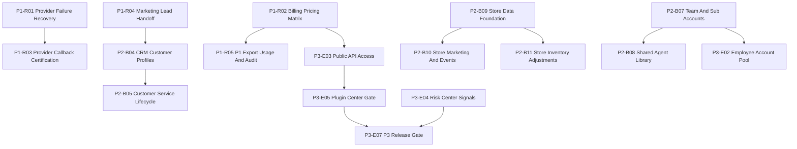

# SaaS Commercial MVP Remaining Issue List

Date: 2026-06-11

Source progress: `docs/saas-commercial-mvp-p1-revenue-progress.md`

Acceptance source: `docs/saas-commercial-mvp-acceptance-test-checklist.md`

Implementation plan: `docs/superpowers/plans/2026-06-10-commercial-mvp-custom-development-plan.md`

P0 completion source: `docs/saas-commercial-mvp-p0-batch-1-completion.md`

Scope: remaining non-canvas work after P0 control-plane completion. This list groups unfinished work into P1 hardening, P2 Business Edition, and P3 platform expansion. `ai_canvas` remains excluded as an independent canvas project. Hidden compatibility routes such as `e_white_bg` and `marketing_diy` remain out of scope unless promoted by a separate product decision.

## Execution Summary

P0 is implemented and locally verified. P1 revenue workflows are locally complete: all 8 issues have full repository-backed implementation, billing integration, audit coverage, and passing test gates (launch-readiness, saas-foundation, provider-callback-handler). Production certification still requires real provider smoke testing and product/finance pricing review. P2 modules need complete repository-backed business loops. P3 modules remain gated until permission, billing, security, API, and audit contracts are strong enough for external use.

## Labels

Use these labels consistently when creating GitHub issues:

- `commercial-mvp`
- `p1-hardening`
- `p2-business-edition`
- `p3-expansion`
- `saas-foundation`
- `runtime`
- `billing`
- `audit`
- `security`
- `test-required`

## Dependency Map



## Issue Index

| ID | Title | Priority | Size | Depends On |
|---|---|---:|---:|---|
| P1-R01 | Certify failed-provider recovery and retry UX for P1 generation jobs | P1 | M | P0 complete |
| P1-R02 | Lock billing credit estimates against commercial pricing | P1 | M | P0 Billing |
| P1-R03 | Certify real provider callback path for video, remix, and director render jobs | P1 | L | P1-R01 |
| P1-R04 | Wire Marketing campaign output into CRM leads and follow-up tasks | P1 | M | P0 Tasks, P1 Marketing |
| P1-R05 | Add export usage and audit coverage for paid-beta creation outputs | P1 | M | P1-R02 |
| P1-R06 | Close Copywriting keyword library CRUD as workspace records | P1 | S | P0 data foundation |
| P1-R07 | Define Chat long-session memory save policy and repository outputs | P1 | M | P0 Projects/Assets |
| P1-R08 | Add Speech voice/provider consent policy and audit metadata | P1 | M | P1-R02 |
| P2-B01 | Build Avatar consent records and source material persistence | P2 | L | P0 Assets/Audit |
| P2-B02 | Build Avatar voice/output asset, usage, and audit lifecycle | P2 | L | P2-B01 |
| P2-B03 | Persist Design workflow briefs, generated assets, and project links | P2 | L | P0 Assets/Projects |
| P2-B04 | Complete CRM customer profiles and insight follow-up tasks | P2 | L | P1-R04 |
| P2-B05 | Complete Customer Service response lifecycle and escalation audit | P2 | M | P2-B04 |
| P2-B06 | Close Finance and Tax repository-backed acceptance checks | P2 | L | P0 data foundation |
| P2-B07 | Complete Team members, sub-accounts, roles, and shared tasks | P2 | L | P0 permissions |
| P2-B08 | Link Shared Agent Library to saved assets and team permissions | P2 | M | P2-B07 |
| P2-B09 | Complete Store data foundation for stores, orders, inventory, staff | P2 | L | P0 data foundation |
| P2-B10 | Wire Store marketing and events to campaign assets and audit logs | P2 | M | P2-B09 |
| P2-B11 | Add Store inventory adjustment records and task follow-up | P2 | M | P2-B09 |
| P3-E01 | Gate Media Accounts with safe metadata storage and no raw credentials | P3 | M | P0 API Keys/Security |
| P3-E02 | Build Employee Account Pool with owner, role, status, and audit history | P3 | M | P2-B07 |
| P3-E03 | Harden Public API keys with scopes, rate limits, revocation, and audit | P3 | L | P1-R02 |
| P3-E04 | Build Risk Center from provider, billing, permission, and runtime signals | P3 | L | P0/P1 telemetry |
| P3-E05 | Gate Plugin Center with permission, billing, security, and audit contracts | P3 | L | P3-E03, P3-E04 |
| P3-E06 | Expand self-hosted Multica operations and deployment certification | P3 | L | runtime compatibility |
| P3-E07 | Add P3 release gate to prevent unaudited external side effects | P3 | M | P3-E01 to P3-E06 |

---

## P1 Hardening Issues

### P1-R01: Certify Failed-Provider Recovery And Retry UX

**GitHub title:** `[P1] Certify failed-provider recovery and retry UX for P1 generation jobs`

**Labels:** `commercial-mvp`, `p1-hardening`, `runtime`, `audit`, `test-required`

**Execution status:** Local implementation complete. Repository retry contract, shared recovery panel, and launch-readiness gates pass. Real provider failure smoke remains required before production certification.

**Objective:** Ensure failed image, video, remix, marketing, speech, and director jobs remain visible, retryable, and auditable.

**Files:**

- Modify: `src/lib/data/generationJobRepository.ts`
- Modify: `src/components/ECommerceView.tsx`
- Modify: `src/components/ImageCreationView.tsx`
- Modify: `src/components/VideoCreationView.tsx`
- Modify: `src/components/RemixView.tsx`
- Modify: `src/components/MarketingView.tsx`
- Modify: `src/components/DirectorDeskView.tsx`
- Modify: `src/components/SpeechView.tsx`
- Test: `scripts/launch-readiness.test.ts`
- Test: `scripts/saas-foundation.test.ts`

**Implementation checklist:**

- [x] Add a shared failed-job state display for P1 generation jobs.
- [x] Confirm failed jobs retain prompt, provider, module, error message, retry count, and workspace id.
- [x] Add retry action that creates a new auditable attempt or updates retry metadata consistently.
- [x] Emit audit events for `generation_failed` and `generation_retry`.
- [x] Add launch-readiness coverage so P1 modules cannot report success when the repository job failed.

**Acceptance criteria:**

- [x] A simulated provider failure creates a failed generation job.
- [x] The failed job is visible after reload.
- [x] Retry action is available to users with execution permission.
- [x] Retry produces audit evidence and does not delete the original failure.

**Verification:**

```powershell
npm.cmd run test:launch-readiness
npm.cmd run test:saas-foundation
npm.cmd run lint
```

Latest local verification:

```text
npm.cmd run test:launch-readiness: pass
npm.cmd run test:saas-foundation: pass
npm.cmd run lint: pass
git diff --check for touched files: pass
```

---

### P1-R02: Lock Billing Credit Estimates Against Commercial Pricing

**GitHub title:** `[P1] Lock billing credit estimates against commercial pricing`

**Labels:** `commercial-mvp`, `p1-hardening`, `billing`, `test-required`

**Execution status:** Local implementation complete. P1 paid-beta usage now flows through a single typed commercial pricing matrix with pricing metadata, BillingView explanations, quota preflight coverage, and launch-readiness gates. Product/finance review of final unit prices remains required before production certification.

**Objective:** Replace broad estimates with a reviewed pricing matrix for paid-beta modules.

**Files:**

- Modify: `src/lib/data/usageRepository.ts`
- Modify: `src/lib/data/billingRepository.ts`
- Modify: `src/components/BillingView.tsx`
- Modify: `src/components/GlobalAgentDispatcherModal.tsx`
- Modify: `src/components/ECommerceView.tsx`
- Modify: `src/components/ImageCreationView.tsx`
- Modify: `src/components/ImageEditorView.tsx`
- Modify: `src/components/VideoCreationView.tsx`
- Modify: `src/components/CopywritingView.tsx`
- Modify: `src/components/ChatView.tsx`
- Modify: `src/components/RemixView.tsx`
- Modify: `src/components/MarketingView.tsx`
- Modify: `src/components/DirectorDeskView.tsx`
- Modify: `src/components/SpeechView.tsx`
- Test: `scripts/launch-readiness.test.ts`
- Test: `scripts/saas-foundation.test.ts`

**Implementation checklist:**

- [x] Define module-level credit units for image, video, speech, copy, chat, remix, marketing, director, AI image edit, e-commerce, and runtime dispatch actions.
- [x] Add metadata fields for provider, runtime mode, unit count, unit credits, credit estimate, pricing key, pricing description, and billing status.
- [x] Show estimated cost before execution when quota is relevant through the billing quota preflight path.
- [x] Keep the pricing matrix in a single typed location rather than duplicating literals in components.
- [x] Document that final commercial unit prices still require product/finance review before production certification.

**Acceptance criteria:**

- [x] Billing view can explain each P1 usage event by module and action.
- [x] Quota preflight uses the same pricing matrix as usage creation.
- [x] P1 paid-beta actions do not create unpriced usage records in the scoped matrix.

**Verification:**

```powershell
npm.cmd run test:saas-foundation
npm.cmd run lint
```

Latest local verification:

```text
npm.cmd run test:saas-foundation: pass
npm.cmd run test:launch-readiness: pass
npm.cmd run lint: pass
git diff --check for touched files: pass
```

---

### P1-R03: Certify Real Provider Callback Path For Video, Remix, And Director Render Jobs

**GitHub title:** `[P1] Certify real provider callback path for video, remix, and director render jobs`

**Labels:** `commercial-mvp`, `p1-hardening`, `runtime`, `test-required`

**Execution status:** Local implementation complete. Provider callback handler module with success/partial/error/timeout/duplicate fixtures, job id mapping, output asset saving, idempotent handling, and audit events. Test script `scripts/provider-callback-handler.test.ts` (7 cases) passes. Real external provider smoke remains required before production certification.

**Objective:** Ensure async video/render provider callbacks update jobs, assets, usage, tasks, and audit logs correctly.

**Files:**

- Modify: `src/runtime/agentRuntimeTypes.ts`
- Modify: `src/runtime/webMockAgentRuntimeProvider.ts`
- Modify: `src/runtime/multicaAgentRuntimeProvider.ts`
- Modify: `src/components/VideoCreationView.tsx`
- Modify: `src/components/RemixView.tsx`
- Modify: `src/components/DirectorDeskView.tsx`
- Test: `scripts/runtime-contract.test.ts`
- Test: `scripts/saas-foundation.test.ts`

**Implementation checklist:**

- [x] Add callback fixtures for success, partial success, provider error, timeout, and duplicate callback.
- [x] Map provider job ids to local generation job ids without replacing local ids.
- [x] Save callback outputs as assets when provider returns output URLs or metadata.
- [x] Create audit records for callback status changes.
- [x] Keep Web standalone mode functional when callback simulation is local-only.

**Acceptance criteria:**

- [x] Successful callback marks the job complete and links output assets.
- [x] Failed callback preserves the job and exposes retry.
- [x] Duplicate callback is idempotent.
- [x] Desktop Multica metadata is stored only as external metadata.

**Verification:**

```powershell
npm.cmd run test:runtime-contract
npm.cmd run test:saas-foundation
npm.cmd run lint
```

---

### P1-R04: Wire Marketing Campaign Output Into CRM Leads And Follow-Up Tasks

**GitHub title:** `[P1] Wire Marketing campaign output into CRM leads and follow-up tasks`

**Labels:** `commercial-mvp`, `p1-hardening`, `saas-foundation`, `audit`, `test-required`

**Execution status:** Local implementation complete. Marketing viral, NFC, and website outputs now create/update workspace CRM leads, create follow-up tasks, emit lead/task handoff audit events, and expose campaign source metadata in CRM list, detail, and export surfaces. Production certification still needs a manual smoke through Tasks View after real provider data is enabled.

**Objective:** Convert marketing campaign outputs into CRM-ready lead records and actionable follow-up tasks.

**Files:**

- Modify: `src/lib/data/campaignRepository.ts`
- Modify or create: `src/lib/data/customerRepository.ts`
- Modify: `src/lib/data/taskRepository.ts`
- Modify: `src/components/MarketingView.tsx`
- Modify: `src/components/CrmView.tsx`
- Test: `scripts/saas-foundation.test.ts`

**Implementation checklist:**

- [x] Add campaign-to-lead metadata for source channel, campaign id, landing page, QR/NFC touchpoint, and owner.
- [x] Create or update customer records from marketing lead capture actions.
- [x] Create follow-up tasks for campaign review, lead contact, or conversion tracking.
- [x] Emit audit events for lead creation and task handoff.
- [x] Show linked campaign source inside CRM records.

**Acceptance criteria:**

- [x] Marketing viral, NFC, and website flows can create CRM follow-up tasks.
- [x] CRM can display campaign source metadata.
- [x] Follow-up task survives reload and appears in Tasks View.

**Verification:**

```powershell
npm.cmd run test:saas-foundation
npm.cmd run lint
```

Latest local verification:

```text
npm.cmd run test:saas-foundation: pass
npm.cmd run test:launch-readiness: pass
npm.cmd run lint: pass
git diff --check for touched files: pass
```

---

### P1-R05: Add Export Usage And Audit Coverage For Paid-Beta Creation Outputs

**GitHub title:** `[P1] Add export usage and audit coverage for paid-beta creation outputs`

**Labels:** `commercial-mvp`, `p1-hardening`, `billing`, `audit`, `test-required`

**Execution status:** Local implementation complete. P1 export outputs now use a shared asset export helper that updates asset access metadata, writes `asset_export` audit logs, and records priced export usage for metered outputs. Copy clipboard remains unmetered but auditable.

**Objective:** Make export/download/share actions billable or auditable where required.

**Files:**

- Modify: `src/lib/data/assetRepository.ts`
- Modify: `src/lib/data/usageRepository.ts`
- Modify: `src/lib/data/auditLogRepository.ts`
- Modify: `src/components/AssetsView.tsx`
- Modify: `src/components/ECommerceView.tsx`
- Modify: `src/components/ImageCreationView.tsx`
- Modify: `src/components/VideoCreationView.tsx`
- Modify: `src/components/CopywritingView.tsx`
- Modify: `src/components/RemixView.tsx`
- Test: `scripts/saas-foundation.test.ts`

**Implementation checklist:**

- [x] Standardize export target metadata: asset id, module id, format, file name, actor, timestamp.
- [x] Add audit event for export actions.
- [x] Add usage event for metered export actions.
- [x] Keep unmetered export actions auditable even when credit cost is zero.

**Acceptance criteria:**

- [x] Exporting a P1 output creates an audit record.
- [x] Metered exports appear in Billing.
- [x] Export metadata links back to the source asset and module.

**Verification:**

```powershell
npm.cmd run test:saas-foundation
npm.cmd run lint
```

Latest local verification:

```text
npm.cmd run test:saas-foundation: pass
npm.cmd run test:launch-readiness: pass
npm.cmd run lint: pass
git diff --check for touched files: pass
```

---

### P1-R06: Close Copywriting Keyword Library CRUD As Workspace Records

**GitHub title:** `[P1] Close Copywriting keyword library CRUD as workspace records`

**Labels:** `commercial-mvp`, `p1-hardening`, `saas-foundation`, `test-required`

**Execution status:** Local implementation complete. `CopywritingKeywords` component now loads from `keywordRepository` (workspace-scoped), supports create/edit/archive/search, and emits `copywriting_keyword_create`/`update`/`archive` audit events. Keyword records survive reload and are workspace-scoped.

**Objective:** Move copywriting keyword library actions from UI-local behavior into workspace-scoped data.

**Files:**

- Modify or create: `src/lib/data/keywordRepository.ts`
- Modify: `src/components/CopywritingView.tsx`
- Test: `scripts/saas-foundation.test.ts`

**Implementation checklist:**

- [x] Persist keyword records with workspace id, tag, channel, owner, and last updated time.
- [x] Add create, edit, archive/delete, and search actions.
- [x] Preserve source text when keyword actions generate copy variants.
- [x] Emit audit events for keyword create, update, and delete/archive.

**Acceptance criteria:**

- [x] Keyword records survive reload.
- [x] Keyword CRUD is workspace-scoped.
- [x] Copy generation can reference saved keywords.

**Verification:**

```powershell
npm.cmd run test:saas-foundation
npm.cmd run lint
```

---

### P1-R07: Define Chat Long-Session Memory Save Policy And Repository Outputs

**GitHub title:** `[P1] Define Chat long-session memory save policy and repository outputs`

**Labels:** `commercial-mvp`, `p1-hardening`, `audit`, `test-required`

**Execution status:** Local implementation complete. ChatView now provides explicit save actions on assistant messages: "save as asset note" (creates workspace asset with `saveTarget: 'asset_note'` metadata) and "save as follow-up task" (creates workspace task with `saveTarget: 'task'`). Both emit audit events (`asset_create` / `task_create`). No implicit long-session memory persistence.

**Objective:** Make chat outputs intentionally saved as task, asset note, or project memory instead of implicit unbounded memory.

**Files:**

- Modify: `src/components/ChatView.tsx`
- Modify: `src/lib/data/assetRepository.ts`
- Modify: `src/lib/data/projectRepository.ts`
- Modify: `src/lib/data/taskRepository.ts`
- Test: `scripts/saas-foundation.test.ts`

**Implementation checklist:**

- [x] Define explicit save actions: save as task, save as asset note, save to project memory.
- [x] Add user-visible metadata for saved answer source, prompt summary, and timestamp.
- [x] Do not persist long-session memory silently.
- [x] Emit audit events for save actions.

**Acceptance criteria:**

- [x] Chat recommendation can be saved to one approved repository target.
- [x] Saved chat output survives reload.
- [x] User can distinguish saved memory from transient chat messages.

**Verification:**

```powershell
npm.cmd run test:saas-foundation
npm.cmd run lint
```

---

### P1-R08: Add Speech Voice/Provider Consent Policy And Audit Metadata

**GitHub title:** `[P1] Add Speech voice and provider consent policy`

**Labels:** `commercial-mvp`, `p1-hardening`, `security`, `audit`, `test-required`

**Execution status:** Local implementation complete. SpeechView voices now carry `consentRequired` and `provider` metadata. Consent-sensitive voices (cloned/custom) require explicit consent confirmation before generation; consent state is recorded in generation job metadata, asset metadata, and audit events. Consent prompt modal captures authorization confirmation.

**Objective:** Ensure speech workflows record language, voice, provider, usage, and consent-sensitive metadata safely.

**Files:**

- Modify: `src/components/SpeechView.tsx`
- Modify: `src/lib/data/generationJobRepository.ts`
- Modify: `src/lib/data/assetRepository.ts`
- Modify: `src/lib/data/usageRepository.ts`
- Test: `scripts/saas-foundation.test.ts`

**Implementation checklist:**

- [x] Add voice/provider metadata to speech generation jobs.
- [x] Require consent confirmation when the selected voice is cloned, custom, or sensitive.
- [x] Save audio output as an asset or pending job.
- [x] Emit usage and audit events with consent metadata.

**Acceptance criteria:**

- [x] Speech workflow records script, language, voice, provider, usage, and output target.
- [x] Consent-sensitive voices cannot run without consent metadata.
- [x] Billing shows speech usage estimates.

**Verification:**

```powershell
npm.cmd run test:saas-foundation
npm.cmd run lint
```

---

## P2 Business Edition Issues

### P2-B01: Build Avatar Consent Records And Source Material Persistence

**GitHub title:** `[P2] Build Avatar consent records and source material persistence`

**Labels:** `commercial-mvp`, `p2-business-edition`, `security`, `audit`, `test-required`

**Objective:** Turn Avatar static UI into a consent-aware workflow for source materials.

**Files:**

- Modify or create: `src/lib/data/avatarRepository.ts`
- Modify: `src/components/AvatarView.tsx`
- Modify: `src/lib/data/assetRepository.ts`
- Modify: `src/lib/data/auditLogRepository.ts`
- Test: `scripts/saas-foundation.test.ts`

**Implementation checklist:**

- [ ] Persist avatar consent records with subject, consent type, expiration, source, owner, and workspace id.
- [ ] Save source image/video/audio materials as assets with consent reference metadata.
- [ ] Block avatar generation when required consent is missing or expired.
- [ ] Emit audit events for consent create, update, revoke, and source upload.

**Acceptance criteria:**

- [ ] Avatar create workflow cannot start without valid consent metadata.
- [ ] Source material appears in Assets View after reload.
- [ ] Consent records are auditable and workspace-scoped.

**Verification:**

```powershell
npm.cmd run test:saas-foundation
npm.cmd run lint
```

---

### P2-B02: Build Avatar Voice/Output Asset, Usage, And Audit Lifecycle

**GitHub title:** `[P2] Build Avatar voice and output asset lifecycle`

**Labels:** `commercial-mvp`, `p2-business-edition`, `billing`, `audit`, `test-required`

**Objective:** Save avatar and voice outputs as assets, record usage, and make generation auditable.

**Files:**

- Modify: `src/lib/data/avatarRepository.ts`
- Modify: `src/components/AvatarView.tsx`
- Modify: `src/lib/data/generationJobRepository.ts`
- Modify: `src/lib/data/usageRepository.ts`
- Modify: `src/lib/data/assetRepository.ts`
- Test: `scripts/saas-foundation.test.ts`

**Implementation checklist:**

- [ ] Create generation jobs for avatar image/video and voice outputs.
- [ ] Save output assets with consent reference and source job id.
- [ ] Record usage estimates for avatar and voice generation.
- [ ] Emit audit events for generation start, complete, fail, retry, and output save.

**Acceptance criteria:**

- [ ] Avatar and voice output assets survive reload.
- [ ] Billing can show avatar/voice usage.
- [ ] Output records include source consent reference.

**Verification:**

```powershell
npm.cmd run test:saas-foundation
npm.cmd run lint
```

---

### P2-B03: Persist Design Workflow Briefs, Generated Assets, And Project Links

**GitHub title:** `[P2] Persist Design workflow briefs, generated assets, and project links`

**Labels:** `commercial-mvp`, `p2-business-edition`, `saas-foundation`, `billing`, `audit`, `test-required`

**Objective:** Make Logo, Packaging, Ads, Interior, and Fashion workflows produce durable business records.

**Files:**

- Modify or create: `src/lib/data/designRepository.ts`
- Modify: `src/components/DesignWorkflowView.tsx`
- Modify: `src/lib/data/assetRepository.ts`
- Modify: `src/lib/data/projectRepository.ts`
- Modify: `src/lib/data/usageRepository.ts`
- Test: `scripts/launch-readiness.test.ts`
- Test: `scripts/saas-foundation.test.ts`

**Implementation checklist:**

- [ ] Persist design brief fields: module, business goal, audience, style, constraints, references, owner.
- [ ] Save generated outputs as assets with source brief and generation job id.
- [ ] Link outputs to project or brand knowledge records.
- [ ] Add usage and audit events for generation and save actions.

**Acceptance criteria:**

- [ ] Each design module creates a design brief record.
- [ ] Generated design output appears in Assets View.
- [ ] Project link is visible after reload.

**Verification:**

```powershell
npm.cmd run test:launch-readiness
npm.cmd run test:saas-foundation
npm.cmd run lint
```

---

### P2-B04: Complete CRM Customer Profiles And Insight Follow-Up Tasks

**GitHub title:** `[P2] Complete CRM customer profiles and insight follow-up tasks`

**Labels:** `commercial-mvp`, `p2-business-edition`, `saas-foundation`, `audit`, `test-required`

**Objective:** Make CRM customer records and insights real workspace data with task follow-up.

**Files:**

- Modify or create: `src/lib/data/customerRepository.ts`
- Modify: `src/components/CrmView.tsx`
- Modify: `src/components/CustomerInsights.tsx`
- Modify: `src/lib/data/taskRepository.ts`
- Test: `scripts/saas-foundation.test.ts`

**Implementation checklist:**

- [ ] Persist customer profiles with name, channel, tag, lifecycle stage, owner, notes, and last interaction.
- [ ] Generate insights from repository-backed customer records.
- [ ] Create follow-up tasks from insights.
- [ ] Emit audit events for profile create/update and insight task creation.

**Acceptance criteria:**

- [ ] Customer profile survives reload.
- [ ] Insight follow-up creates a task visible in Tasks View.
- [ ] CRM records include workspace id and owner.

**Verification:**

```powershell
npm.cmd run test:saas-foundation
npm.cmd run lint
```

---

### P2-B05: Complete Customer Service Response Lifecycle And Escalation Audit

**GitHub title:** `[P2] Complete Customer Service response lifecycle and escalation audit`

**Labels:** `commercial-mvp`, `p2-business-edition`, `audit`, `test-required`

**Objective:** Track accepted, edited, rejected, and escalated AI customer service responses.

**Files:**

- Modify: `src/components/CustomerServiceView.tsx`
- Modify or create: `src/lib/data/customerServiceRepository.ts`
- Modify: `src/lib/data/taskRepository.ts`
- Modify: `src/lib/data/auditLogRepository.ts`
- Test: `scripts/saas-foundation.test.ts`

**Implementation checklist:**

- [ ] Persist suggested response records with customer id, channel, draft, status, editor, and timestamps.
- [ ] Add actions for accept, edit, reject, and escalate.
- [ ] Create escalation tasks when the user escalates a response.
- [ ] Emit audit events for each response lifecycle transition.

**Acceptance criteria:**

- [ ] Response lifecycle survives reload.
- [ ] Escalation creates task and audit evidence.
- [ ] Rejected responses are retained for review and not treated as sent messages.

**Verification:**

```powershell
npm.cmd run test:saas-foundation
npm.cmd run lint
```

---

### P2-B06: Close Finance And Tax Repository-Backed Acceptance Checks

**GitHub title:** `[P2] Close Finance and Tax repository-backed acceptance checks`

**Labels:** `commercial-mvp`, `p2-business-edition`, `audit`, `test-required`

**Objective:** Verify finance and tax screens use workspace records and compliance-safe wording.

**Files:**

- Modify: `src/components/FinanceView.tsx`
- Modify: `src/components/FinanceMeetingAssistant.tsx`
- Modify: `src/components/TaxView.tsx`
- Modify: `src/components/FiscalCalendarView.tsx`
- Modify: `src/components/TaxSimulator.tsx`
- Modify: `src/components/TaxReconciliationTool.tsx`
- Modify or create: `src/lib/data/financeRepository.ts`
- Modify or create: `src/lib/data/taxRepository.ts`
- Test: `scripts/saas-foundation.test.ts`

**Implementation checklist:**

- [ ] Confirm finance records are workspace-scoped and period-aware.
- [ ] Confirm Finance Meeting Assistant summarizes repository-backed records.
- [ ] Persist tax events and display them in fiscal calendar.
- [ ] Link tax simulator assumptions, calculated result, and audit event.
- [ ] Link reconciliation source events, result, and export record.
- [ ] Add non-advisory wording so calculations are not presented as certified legal/accounting conclusions.

**Acceptance criteria:**

- [ ] Finance and tax records survive reload.
- [ ] Export creates report asset or export record.
- [ ] Activity Logs show finance/tax calculation or export actions.

**Verification:**

```powershell
npm.cmd run test:saas-foundation
npm.cmd run lint
```

---

### P2-B07: Complete Team Members, Sub-Accounts, Roles, And Shared Tasks

**GitHub title:** `[P2] Complete Team members, sub-accounts, roles, and shared tasks`

**Labels:** `commercial-mvp`, `p2-business-edition`, `saas-foundation`, `test-required`

**Objective:** Make team and sub-account screens enforce workspace roles and shared task behavior.

**Files:**

- Modify: `src/components/TeamView.tsx`
- Modify: `src/components/SubAccountsView.tsx`
- Modify or create: `src/lib/data/teamRepository.ts`
- Modify: `src/lib/data/taskRepository.ts`
- Modify: `src/saas/permissions.ts`
- Test: `scripts/saas-foundation.test.ts`
- Test: `scripts/launch-readiness.test.ts`

**Implementation checklist:**

- [ ] Persist team members with role, status, owner, permissions, and workspace id.
- [ ] Persist sub-account records with channel, owner, credentials metadata, and status.
- [ ] Create shared collaboration tasks from team actions.
- [ ] Enforce viewer/operator/admin/owner permission behavior.
- [ ] Emit audit events for member, role, sub-account, and task changes.

**Acceptance criteria:**

- [ ] Team and sub-account records survive reload.
- [ ] Shared tasks appear in Tasks View.
- [ ] Permission-denied actions are disabled with reason.

**Verification:**

```powershell
npm.cmd run test:launch-readiness
npm.cmd run test:saas-foundation
npm.cmd run lint
```

---

### P2-B08: Link Shared Agent Library To Saved Assets And Team Permissions

**GitHub title:** `[P2] Link Shared Agent Library to saved assets and team permissions`

**Labels:** `commercial-mvp`, `p2-business-edition`, `saas-foundation`, `test-required`

**Objective:** Make the shared Agent library reference real assets and respect team permissions.

**Files:**

- Modify: `src/components/TeamView.tsx`
- Modify or create: `src/lib/data/agentLibraryRepository.ts`
- Modify: `src/lib/data/assetRepository.ts`
- Modify: `src/saas/permissions.ts`
- Test: `scripts/saas-foundation.test.ts`

**Implementation checklist:**

- [ ] Persist library entries with asset references, owner, role visibility, tags, and workspace id.
- [ ] Prevent users from adding inaccessible assets.
- [ ] Emit audit events for library add, update, remove, and permission changes.
- [ ] Show linked asset metadata in the shared library.

**Acceptance criteria:**

- [ ] Shared library entries survive reload.
- [ ] Entries link to valid saved assets.
- [ ] Permission-restricted assets do not appear to unauthorized users.

**Verification:**

```powershell
npm.cmd run test:saas-foundation
npm.cmd run lint
```

---

### P2-B09: Complete Store Data Foundation For Stores, Orders, Inventory, Staff

**GitHub title:** `[P2] Complete Store data foundation for stores, orders, inventory, and staff`

**Labels:** `commercial-mvp`, `p2-business-edition`, `saas-foundation`, `test-required`

**Objective:** Move Store group screens from dashboard/static data to workspace-scoped operations.

**Files:**

- Modify: `src/components/StoreView.tsx`
- Modify or create: `src/lib/data/storeRepository.ts`
- Modify or create: `src/lib/data/orderRepository.ts`
- Modify or create: `src/lib/data/inventoryRepository.ts`
- Modify or create: `src/lib/data/storeStaffRepository.ts`
- Test: `scripts/saas-foundation.test.ts`
- Test: `scripts/launch-readiness.test.ts`

**Implementation checklist:**

- [ ] Persist store records with name, channel, location, owner, status, and workspace id.
- [ ] Persist order records with store id, customer/channel metadata, amount, status, and timestamps.
- [ ] Persist inventory records with SKU, store id, stock, threshold, and adjustment history.
- [ ] Persist staff records with store id, role, status, and owner.
- [ ] Make Store dashboard read from these repositories.

**Acceptance criteria:**

- [ ] Store dashboard reads store, order, inventory, marketing, event, and staff records.
- [ ] Store list, orders, inventory, and staff data survive reload.
- [ ] Empty state does not show fake completed business data.

**Verification:**

```powershell
npm.cmd run test:launch-readiness
npm.cmd run test:saas-foundation
npm.cmd run lint
```

---

### P2-B10: Wire Store Marketing And Events To Campaign Assets And Audit Logs

**GitHub title:** `[P2] Wire Store marketing and events to campaign assets and audit logs`

**Labels:** `commercial-mvp`, `p2-business-edition`, `audit`, `test-required`

**Objective:** Connect store marketing and event actions to campaign records, generated assets, and audit logs.

**Files:**

- Modify: `src/components/StoreView.tsx`
- Modify: `src/lib/data/campaignRepository.ts`
- Modify: `src/lib/data/assetRepository.ts`
- Modify: `src/lib/data/auditLogRepository.ts`
- Test: `scripts/saas-foundation.test.ts`

**Implementation checklist:**

- [ ] Create campaign records for store marketing actions.
- [ ] Save generated flyers, landing content, event pages, or QR assets.
- [ ] Link campaign assets to store id and event id.
- [ ] Emit audit events for campaign creation, asset save, and event launch.

**Acceptance criteria:**

- [ ] Store marketing actions create campaign assets.
- [ ] Store event actions are auditable.
- [ ] Campaign assets appear in Assets View after reload.

**Verification:**

```powershell
npm.cmd run test:saas-foundation
npm.cmd run lint
```

---

### P2-B11: Add Store Inventory Adjustment Records And Task Follow-Up

**GitHub title:** `[P2] Add Store inventory adjustment records and task follow-up`

**Labels:** `commercial-mvp`, `p2-business-edition`, `audit`, `test-required`

**Objective:** Make inventory adjustments durable and actionable across Store and Tasks.

**Files:**

- Modify: `src/components/StoreView.tsx`
- Modify or create: `src/lib/data/inventoryRepository.ts`
- Modify: `src/lib/data/taskRepository.ts`
- Modify: `src/lib/data/auditLogRepository.ts`
- Test: `scripts/saas-foundation.test.ts`

**Implementation checklist:**

- [ ] Persist adjustment records with SKU, store id, before/after count, reason, actor, and timestamp.
- [ ] Create restock, transfer, or review tasks when inventory thresholds are crossed.
- [ ] Emit audit events for inventory adjustment and task creation.
- [ ] Show adjustment history in the Store inventory view.

**Acceptance criteria:**

- [ ] Inventory adjustment survives reload.
- [ ] Low stock action creates a task.
- [ ] Adjustment history is auditable.

**Verification:**

```powershell
npm.cmd run test:saas-foundation
npm.cmd run lint
```

---

## P3 Expansion Issues

### P3-E01: Gate Media Accounts With Safe Metadata Storage

**GitHub title:** `[P3] Gate Media Accounts with safe metadata storage`

**Labels:** `commercial-mvp`, `p3-expansion`, `security`, `audit`, `test-required`

**Objective:** Store media account metadata safely without exposing raw credentials.

**Files:**

- Modify: `src/components/MediaAccountsView.tsx`
- Modify or create: `src/lib/data/mediaAccountRepository.ts`
- Modify: `src/lib/data/auditLogRepository.ts`
- Modify: `src/saas/permissions.ts`
- Test: `scripts/launch-readiness.test.ts`

**Implementation checklist:**

- [ ] Persist media account metadata with provider, owner, status, scopes, and workspace id.
- [ ] Mask or omit raw credentials after save.
- [ ] Gate connect, disconnect, refresh, and publish actions behind permissions.
- [ ] Emit audit events for account lifecycle actions.

**Acceptance criteria:**

- [ ] Raw credentials are not displayed after save.
- [ ] Media account records are revocable and auditable.
- [ ] Feature remains gated until publish-side effects are approved.

**Verification:**

```powershell
npm.cmd run test:launch-readiness
npm.cmd run lint
```

---

### P3-E02: Build Employee Account Pool

**GitHub title:** `[P3] Build Employee Account Pool with owner, role, status, and audit history`

**Labels:** `commercial-mvp`, `p3-expansion`, `security`, `audit`, `test-required`

**Objective:** Add controlled employee account pool records for future operations workflows.

**Files:**

- Modify: `src/components/EmployeeAccountsView.tsx`
- Modify or create: `src/lib/data/employeeAccountRepository.ts`
- Modify: `src/saas/permissions.ts`
- Test: `scripts/saas-foundation.test.ts`

**Implementation checklist:**

- [ ] Persist account pool entries with owner, role, status, allowed modules, and workspace id.
- [ ] Add audit history for create, assign, suspend, reactivate, and remove.
- [ ] Prevent storing raw external passwords or secrets in visible fields.
- [ ] Link pool entries to team/sub-account permissions when available.

**Acceptance criteria:**

- [ ] Account pool entries survive reload.
- [ ] Status changes are audited.
- [ ] Raw credentials are not exposed.

**Verification:**

```powershell
npm.cmd run test:saas-foundation
npm.cmd run lint
```

---

### P3-E03: Harden Public API Keys With Scopes, Rate Limits, Revocation, And Audit

**GitHub title:** `[P3] Harden Public API keys with scopes, rate limits, revocation, and audit`

**Labels:** `commercial-mvp`, `p3-expansion`, `security`, `billing`, `audit`, `test-required`

**Objective:** Prepare public API access for controlled external usage.

**Files:**

- Modify or create: `src/saas/apiAccess.ts`
- Modify: `src/components/ApiKeysView.tsx`
- Modify: `src/lib/data/apiKeyRepository.ts`
- Modify: `src/lib/data/usageRepository.ts`
- Test: `scripts/saas-foundation.test.ts`

**Implementation checklist:**

- [ ] Add API key scopes by module/action.
- [ ] Add rate limit metadata and enforcement contract.
- [ ] Add revocation and rotation metadata.
- [ ] Audit create, reveal-once, rotate, revoke, and failed access attempts.
- [ ] Link external API usage to billing estimates.

**Acceptance criteria:**

- [ ] Public API keys are scoped, rate-limited, revocable, and audited.
- [ ] Raw key material is not displayed after save except an approved reveal-once flow.
- [ ] API usage can be traced to workspace and billing records.

**Verification:**

```powershell
npm.cmd run test:saas-foundation
npm.cmd run lint
```

---

### P3-E04: Build Risk Center From Real Provider, Billing, Permission, And Runtime Signals

**GitHub title:** `[P3] Build Risk Center from real provider, billing, permission, and runtime signals`

**Labels:** `commercial-mvp`, `p3-expansion`, `runtime`, `billing`, `security`, `test-required`

**Objective:** Replace static risk messaging with real operational signals.

**Files:**

- Modify or create: `src/saas/riskPolicy.ts`
- Modify or create: `src/components/RiskCenterView.tsx`
- Modify: `src/components/AdminView.tsx`
- Modify: `src/lib/data/usageRepository.ts`
- Modify: `src/runtime/useAgentRuntimeStatus.ts`
- Test: `scripts/launch-readiness.test.ts`

**Implementation checklist:**

- [ ] Aggregate quota, provider failure, permission, API key, runtime degraded, and audit anomaly signals.
- [ ] Classify risk level and recommended remediation.
- [ ] Link each risk to source records.
- [ ] Keep risk center read-only until remediation actions are separately approved.

**Acceptance criteria:**

- [ ] Risk Center reads real signals rather than static cards.
- [ ] Each risk item links to source module or audit event.
- [ ] No unaudited remediation side effects are introduced.

**Verification:**

```powershell
npm.cmd run test:launch-readiness
npm.cmd run lint
```

---

### P3-E05: Gate Plugin Center With Permission, Billing, Security, And Audit Contracts

**GitHub title:** `[P3] Gate Plugin Center with permission, billing, security, and audit contracts`

**Labels:** `commercial-mvp`, `p3-expansion`, `security`, `billing`, `audit`, `test-required`

**Objective:** Prevent plugin features from creating unreviewed external side effects.

**Files:**

- Modify or create: `src/components/PluginCenterView.tsx`
- Modify or create: `src/saas/pluginPolicy.ts`
- Modify: `src/saas/permissions.ts`
- Modify: `src/lib/data/auditLogRepository.ts`
- Test: `scripts/launch-readiness.test.ts`

**Implementation checklist:**

- [ ] Add gated plugin catalog state: hidden, internal, reviewed, enabled, disabled.
- [ ] Require permissions for install, enable, disable, configure, and execute.
- [ ] Add billing metadata for plugin execution where applicable.
- [ ] Audit plugin lifecycle and execution actions.
- [ ] Keep unreviewed plugins non-executable.

**Acceptance criteria:**

- [ ] Plugin Center remains gated until security, billing, permission, and audit contracts pass.
- [ ] Unreviewed plugins cannot execute.
- [ ] Plugin lifecycle actions are auditable.

**Verification:**

```powershell
npm.cmd run test:launch-readiness
npm.cmd run lint
```

---

### P3-E06: Expand Self-Hosted Multica Operations And Deployment Certification

**GitHub title:** `[P3] Expand self-hosted Multica operations and deployment certification`

**Labels:** `commercial-mvp`, `p3-expansion`, `runtime`, `test-required`

**Objective:** Make self-hosted Multica mode production-certifiable beyond compatibility tests.

**Files:**

- Modify: `src/runtime/multicaAgentRuntimeProvider.ts`
- Modify: `src/runtime/multicaApiClient.ts`
- Modify: `src/runtime/useAgentRuntimeStatus.ts`
- Modify: `src/components/SettingsView.tsx`
- Modify: `src/components/AgentStatusDashboardView.tsx`
- Test: `scripts/multica-runtime-provider.test.ts`
- Test: `scripts/multica-api-client.test.ts`
- Test: `scripts/runtime-contract.test.ts`

**Implementation checklist:**

- [ ] Certify configured API and WS endpoints.
- [ ] Confirm unreachable endpoint marks runtime degraded without breaking Web mode.
- [ ] Confirm restored endpoint recovers without losing local tasks or assets.
- [ ] Ensure desktop daemon tokens are never exposed in browser Web mode.
- [ ] Document deployment-specific endpoint and auth policy.

**Acceptance criteria:**

- [ ] Self-hosted Multica can be configured, degraded, restored, and audited.
- [ ] Web standalone remains usable when self-hosted endpoint fails.
- [ ] Runtime metadata is stored on dispatched tasks.

**Verification:**

```powershell
npm.cmd run test:runtime-contract
npm.cmd run test:multica-runtime-provider
npm.cmd run test:multica-api-client
npm.cmd run lint
```

---

### P3-E07: Add P3 Release Gate To Prevent Unaudited External Side Effects

**GitHub title:** `[P3] Add release gate to prevent unaudited external side effects`

**Labels:** `commercial-mvp`, `p3-expansion`, `security`, `audit`, `test-required`

**Objective:** Ensure P3 modules cannot publish, call external APIs, install plugins, or mutate external accounts without permissions, billing, and audit contracts.

**Files:**

- Modify: `scripts/launch-readiness.test.ts`
- Modify: `scripts/saas-foundation.test.ts`
- Modify: `src/product/registry.ts`
- Modify: `src/saas/permissions.ts`

**Implementation checklist:**

- [ ] Add readiness assertions for P3 gated/internal route status.
- [ ] Fail launch readiness if P3 module has executable external side effects without audit coverage.
- [ ] Fail launch readiness if P3 module exposes raw credentials.
- [ ] Verify permission metadata exists for P3 mutation actions.

**Acceptance criteria:**

- [ ] P3 modules remain gated or internal until contracts pass.
- [ ] No P3 external side effect can complete without audit evidence.
- [ ] Launch readiness reports the exact offending module when a gate fails.

**Verification:**

```powershell
npm.cmd run test:launch-readiness
npm.cmd run test:saas-foundation
npm.cmd run lint
```

## Recommended Execution Order

1. P1-R01, P1-R02, P1-R04, P1-R05.
2. P1-R03, P1-R06, P1-R07, P1-R08.
3. P2-B01, P2-B02, P2-B03.
4. P2-B04, P2-B05, P2-B06.
5. P2-B07, P2-B08, P2-B09, P2-B10, P2-B11.
6. P3-E01 through P3-E07 after P1/P2 gates are stable.

## Release Verification Baseline

Before marking any issue complete, run the smallest relevant verification listed in the issue. Before claiming a milestone complete, run:

```powershell
npm.cmd run test:launch-readiness
npm.cmd run test:saas-foundation
npm.cmd run lint
git diff --check
```

Before a full commercial release candidate, run:

```powershell
npm.cmd run test:p0-release
git diff --check
```

Accepted known warning: Vite may report the `app-ops` chunk as larger than 500 kB during build.
