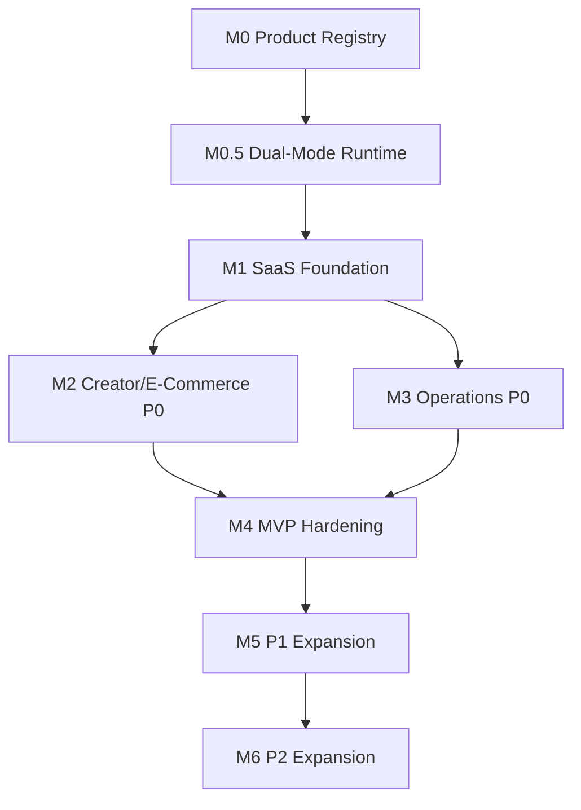

# Multica Dual-Mode Runtime Implementation Plan

> **For agentic workers:** REQUIRED SUB-SKILL: Use superpowers:subagent-driven-development (recommended) or superpowers:executing-plans to implement this plan task-by-task. Steps use checkbox (`- [ ]`) syntax for tracking.

**Goal:** Add a dual-mode agent runtime foundation so `aistudio` works as a standalone Web SaaS and can optionally connect to Multica Desktop/daemon for local desktop agent execution.

**Architecture:** Introduce an `AgentRuntimeProvider` boundary consumed by product UI, with a Web/mock provider as the default and a Multica provider behind desktop bridge and API configuration. Keep Multica-specific daemon/API details inside adapter modules so upstream Multica can keep iterating without leaking implementation details into the 64-feature product surface.

**Tech Stack:** React 19, TypeScript 5.8, Vite 6, local `tsx` contract scripts, existing `lucide-react` UI icons, Multica Desktop bridge shape (`window.daemonAPI`), Multica HTTP endpoints (`/api/agents`, `/api/runtimes`, `/api/issues`, `/api/tasks/:id/cancel`).

---

## Source Inputs

- Product design: `docs/superpowers/specs/2026-06-09-multica-dual-mode-integration-design.md`
- MVP roadmap: `docs/mvp-development-roadmap.md`
- PRD: `docs/saas-product-prd.md`
- Current app shell: `src/main.tsx`, `src/App.tsx`, `src/types.ts`
- UI integration points: `src/components/SettingsView.tsx`, `src/components/AgentStatusDashboardView.tsx`, `src/components/GlobalAgentDispatcherModal.tsx`, `src/components/TaskCenter.tsx`, `src/components/TasksView.tsx`
- Multica local evidence:
  - `E:\code\_tmp\multica\apps\desktop\src\preload\index.ts`
  - `E:\code\_tmp\multica\apps\desktop\src\shared\daemon-types.ts`
  - `E:\code\_tmp\multica\apps\desktop\src\shared\runtime-config.ts`
  - `E:\code\_tmp\multica\packages\core\api\client.ts`
  - `E:\code\_tmp\multica\packages\core\types\api.ts`
  - `E:\code\_tmp\multica\packages\core\types\agent.ts`

## File Map

### Documentation

- Modify: `docs/mvp-development-roadmap.md`
  - Insert M0.5 between M0 and M1.
  - Add Multica runtime foundation to dependency graph and priority matrix.
- Create: `docs/multica-compatibility.md`
  - Record tested Multica source, bridge contract, daemon states, endpoints, and release checks.

### Runtime Core

- Create: `src/runtime/agentRuntimeTypes.ts`
  - Canonical runtime, agent, task, bridge, and provider types.
- Create: `src/runtime/multicaContractFixtures.ts`
  - Static fixture payloads for Multica daemon, runtime, agent, issue, and task contracts.
- Create: `src/runtime/webMockAgentRuntimeProvider.ts`
  - Default Web provider that keeps SaaS mode functional without Multica.
- Create: `src/runtime/AgentRuntimeContext.tsx`
  - React context/provider and `useAgentRuntime()` hook.
- Create: `src/runtime/desktopAgentBridge.ts`
  - Safe browser/Desktop bridge detection and `window.daemonAPI` adapter.
- Create: `src/runtime/desktopRuntimeActions.ts`
  - Desktop-only daemon start/stop/restart action helper with bridge gating.
- Create: `src/runtime/multicaMappers.ts`
  - Pure mapping functions from Multica daemon/API payloads to `aistudio` runtime models.
- Create: `src/runtime/multicaApiClient.ts`
  - Minimal Multica HTTP client for agents, runtimes, issues, task cancel.
- Create: `src/runtime/multicaAgentRuntimeProvider.ts`
  - Provider implementation that combines desktop bridge state with Multica API data.
- Create: `src/runtime/runtimeMode.ts`
  - Selects `web`, `desktop_multica`, or `self_hosted_multica` from bridge and environment.
- Create: `src/runtime/useAgentRuntimeStatus.ts`
  - Shared hook for status polling and bridge subscriptions.

### UI

- Create: `src/components/runtime/DesktopAgentRuntimePanel.tsx`
  - Settings panel for runtime mode, daemon status, CLI providers, API URLs, and desktop actions.
- Modify: `src/components/SettingsView.tsx`
  - Add "Desktop Agent Runtime" settings tab.
- Modify: `src/components/AgentStatusDashboardView.tsx`
  - Display cloud/local runtime status, daemon badge, providers, runtime count, last heartbeat.
- Modify: `src/components/GlobalAgentDispatcherModal.tsx`
  - Replace local simulation-only dispatch with provider-backed dispatch while preserving Web/mock behavior.
- Modify: `src/components/TaskCenter.tsx`
  - Show runtime-backed task badges and provider status in active task rows.
- Modify: `src/components/TasksView.tsx`
  - Use canonical task/runtime metadata for board/list task cards.
- Modify: `src/main.tsx`
  - Wrap the app with `AgentRuntimeContextProvider`.

### Verification

- Modify: `package.json`
  - Add script entries for local contract checks.
- Create: `scripts/runtime-contract.test.ts`
  - Verifies fixtures and public type-level contracts through runtime assertions.
- Create: `scripts/desktop-bridge.test.ts`
  - Verifies bridge detection and daemon action mapping.
- Create: `scripts/multica-mappers.test.ts`
  - Verifies daemon, runtime, agent, issue, and task status mapping.
- Create: `scripts/web-runtime-provider.test.ts`
  - Verifies Web/mock provider status, agent list, task creation, cancel, and subscription behavior.
- Create: `scripts/multica-api-client.test.ts`
  - Verifies endpoint paths and request bodies with a fake `fetch`.

## Implementation Tasks

### Task 1: Insert M0.5 Roadmap And Compatibility Baseline

**Files:**
- Modify: `docs/mvp-development-roadmap.md`
- Create: `docs/multica-compatibility.md`

- [ ] **Step 1: Insert M0.5 into the milestone table**

In `docs/mvp-development-roadmap.md`, add this row between M0 and M1:

```markdown
| M0.5 | Dual-Mode Runtime Foundation | Runtime provider, Web/mock mode, Multica Desktop bridge detection, read-only Multica runtime status, and compatibility contract exist before task dispatch depends on them. | 4-7 days |
```

- [ ] **Step 2: Insert the M0.5 milestone section after M0**

Add this section after "Milestone M0":

```markdown
## Milestone M0.5: Dual-Mode Runtime Foundation

### Objective

Keep `aistudio` independently deployable as Web SaaS while adding an optional Desktop Agent Runtime powered by Multica.

### Tasks

#### M0.5-T1: Runtime Provider Contract

- Add `AgentRuntimeProvider` and canonical runtime/task/agent types.
- Add a Web/mock provider that is always available in browser mode.
- Add fixture-based contract checks for daemon, runtime, agent, issue, and task mappings.

Acceptance criteria:

- App builds with no Multica configuration.
- Web mode reports a healthy remote/mock runtime.
- Runtime contract scripts pass without a live Multica server.

#### M0.5-T2: Desktop Bridge Detection

- Add `DesktopAgentBridge` detection for Multica Desktop's `window.daemonAPI`.
- Map daemon states: `running`, `stopped`, `starting`, `stopping`, `installing_cli`, `cli_not_found`, `auth_expired`.
- Keep desktop controls unavailable in normal browser mode.

Acceptance criteria:

- Browser mode detects no bridge and hides daemon controls.
- Desktop bridge fixtures can start, stop, restart, stream logs, and report auth-expired.

#### M0.5-T3: Multica Read-Only Adapter

- Configure Multica API/WS URLs through environment and settings.
- Read agents and runtimes through Multica HTTP endpoints.
- Combine daemon status and runtime list in Settings and Agent Status Dashboard.

Acceptance criteria:

- Settings shows runtime mode, server URL, daemon state, CLI agents, and provider count.
- Agent dashboard distinguishes cloud/web and local Multica runtimes.
- Unreachable Multica marks desktop runtime degraded while Web SaaS remains usable.
```

- [ ] **Step 3: Update dependency graph**

Replace the current graph with:



- [ ] **Step 4: Create compatibility matrix document**

Create `docs/multica-compatibility.md` with this content:

```markdown
# Multica Compatibility Matrix

Date: 2026-06-09

## Integration Policy

`aistudio` integrates Multica through adapter contracts only. Product modules consume `AgentRuntimeProvider`; they do not import Multica UI or copy Multica source files.

## Tested Source

| Area | Local Source Used For Contract | Required Surface |
|---|---|---|
| Desktop preload | `E:\code\_tmp\multica\apps\desktop\src\preload\index.ts` | `window.daemonAPI`, `window.desktopAPI.runtimeConfig` |
| Daemon states | `E:\code\_tmp\multica\apps\desktop\src\shared\daemon-types.ts` | `running`, `stopped`, `starting`, `stopping`, `installing_cli`, `cli_not_found`, `auth_expired` |
| Runtime config | `E:\code\_tmp\multica\apps\desktop\src\shared\runtime-config.ts` | `apiUrl`, `wsUrl`, `appUrl` |
| Agents/runtimes API | `E:\code\_tmp\multica\packages\core\api\client.ts` | `GET /api/agents`, `GET /api/runtimes` |
| Dispatch API | `E:\code\_tmp\multica\packages\core\api\client.ts` | `POST /api/issues`, `POST /api/tasks/:id/cancel` |

## Minimum Contract

- Web mode works when every Multica URL and bridge object is absent.
- Desktop mode detects `window.daemonAPI` without throwing in a normal browser.
- Daemon status maps to an `aistudio` runtime status.
- Runtime and agent lists map to local provider availability.
- Multica task references are stored as external runtime metadata on `aistudio` tasks.
- Compatibility failure marks desktop runtime degraded and never blocks Web SaaS navigation.

## Release Verification

- `npm run lint`
- `npm run build`
- `npm run test:runtime-contract`
- `npm run test:desktop-bridge`
- `npm run test:multica-mappers`
- `npm run test:web-runtime-provider`
- `npm run test:multica-api-client`
```

- [ ] **Step 5: Verify documentation changed**

Run:

```powershell
Select-String -Path docs\mvp-development-roadmap.md -Pattern "M0.5"
Select-String -Path docs\multica-compatibility.md -Pattern "Minimum Contract"
```

Expected:

```text
docs\mvp-development-roadmap.md:...M0.5...
docs\multica-compatibility.md:...Minimum Contract...
```

- [ ] **Step 6: Commit**

```bash
git add docs/mvp-development-roadmap.md docs/multica-compatibility.md
git commit -m "Document dual-mode runtime foundation" -m "Constraint: aistudio must remain standalone Web SaaS while desktop mode uses Multica through adapters.
Confidence: high
Scope-risk: narrow
Directive: Keep Multica-specific behavior in runtime adapters, not product modules.
Tested: Select-String confirmed M0.5 and compatibility baseline entries.
Not-tested: No app build required for documentation-only change."
```

### Task 2: Add Runtime Types And Static Contract Fixtures

**Files:**
- Create: `src/runtime/agentRuntimeTypes.ts`
- Create: `src/runtime/multicaContractFixtures.ts`
- Create: `scripts/runtime-contract.test.ts`
- Modify: `package.json`

- [ ] **Step 1: Add the failing contract test script**

Create `scripts/runtime-contract.test.ts`:

```ts
import assert from 'node:assert/strict';

import {
  multicaAgentFixture,
  multicaDaemonStatusFixtures,
  multicaIssueFixture,
  multicaRuntimeFixture,
  multicaTaskFixture,
} from '../src/runtime/multicaContractFixtures.ts';
import { RuntimeCapabilityError } from '../src/runtime/agentRuntimeTypes.ts';

assert.equal(multicaDaemonStatusFixtures.running.state, 'running');
assert.equal(multicaDaemonStatusFixtures.authExpired.state, 'auth_expired');
assert.equal(multicaRuntimeFixture.provider, 'codex');
assert.equal(multicaAgentFixture.runtime_id, multicaRuntimeFixture.id);
assert.equal(multicaIssueFixture.assignee_type, 'agent');
assert.equal(multicaTaskFixture.status, 'running');

const error = new RuntimeCapabilityError('TASK_DISPATCH_UNAVAILABLE', 'Task dispatch is disabled for this runtime.');
assert.equal(error.code, 'TASK_DISPATCH_UNAVAILABLE');
assert.equal(error.name, 'RuntimeCapabilityError');

console.log('runtime contract fixtures passed');
```

- [ ] **Step 2: Run test and verify it fails before files exist**

Run:

```powershell
npx tsx scripts/runtime-contract.test.ts
```

Expected:

```text
Error [ERR_MODULE_NOT_FOUND]: Cannot find module ...src/runtime/multicaContractFixtures.ts
```

- [ ] **Step 3: Create canonical runtime types**

Create `src/runtime/agentRuntimeTypes.ts`:

```ts
export type RuntimeMode = 'web' | 'desktop_multica' | 'self_hosted_multica';

export type RuntimeProviderKind = 'mock' | 'multica';

export type RuntimeHealth =
  | 'available'
  | 'degraded'
  | 'offline'
  | 'auth_expired'
  | 'incompatible';

export type AgentTaskStatus =
  | 'queued'
  | 'running'
  | 'succeeded'
  | 'failed'
  | 'cancelled';

export type RuntimeCapability =
  | 'runtime_status'
  | 'list_agents'
  | 'list_tasks'
  | 'create_task'
  | 'cancel_task'
  | 'task_events'
  | 'daemon_controls'
  | 'daemon_logs';

export interface RuntimeStatus {
  mode: RuntimeMode;
  providerKind: RuntimeProviderKind;
  health: RuntimeHealth;
  label: string;
  message: string;
  serverUrl?: string;
  wsUrl?: string;
  appUrl?: string;
  bridgeAvailable: boolean;
  daemonState?: MulticaDaemonState;
  daemonId?: string;
  deviceName?: string;
  runtimeCount: number;
  cliProviders: string[];
  capabilities: RuntimeCapability[];
  lastHeartbeatAt?: string;
  compatibilityWarning?: string;
}

export type MulticaDaemonState =
  | 'running'
  | 'stopped'
  | 'starting'
  | 'stopping'
  | 'installing_cli'
  | 'cli_not_found'
  | 'auth_expired';

export interface RawMulticaDaemonStatus {
  state: MulticaDaemonState;
  pid?: number;
  uptime?: string;
  daemonId?: string;
  deviceName?: string;
  agents?: string[];
  workspaceCount?: number;
  profile?: string;
  serverUrl?: string;
}

export interface AgentSummary {
  id: string;
  name: string;
  role: string;
  provider: string;
  runtimeId?: string;
  runtimeMode: 'cloud' | 'local' | 'mock';
  status: 'idle' | 'working' | 'blocked' | 'error' | 'offline';
  maxConcurrentTasks?: number;
  source: RuntimeProviderKind;
}

export interface AgentTask {
  id: string;
  title: string;
  description?: string;
  status: AgentTaskStatus;
  agentId?: string;
  runtimeId?: string;
  progress?: number;
  source: RuntimeProviderKind;
  externalRef?: {
    system: 'multica';
    issueId?: string;
    taskId?: string;
    issueIdentifier?: string;
  };
  createdAt: string;
  updatedAt: string;
  error?: string;
}

export interface TaskQuery {
  status?: AgentTaskStatus;
  agentId?: string;
  runtimeId?: string;
}

export interface CreateAgentTaskInput {
  title: string;
  description: string;
  agentId?: string;
  runtimeId?: string;
  priority?: 'low' | 'medium' | 'high';
  metadata?: Record<string, string | number | boolean>;
}

export interface AgentTaskEvent {
  taskId: string;
  status: AgentTaskStatus;
  progress?: number;
  message?: string;
  occurredAt: string;
}

export type Unsubscribe = () => void;

export interface AgentRuntimeProvider {
  mode: RuntimeMode;
  providerKind: RuntimeProviderKind;
  getRuntimeStatus(): Promise<RuntimeStatus>;
  listAgents(): Promise<AgentSummary[]>;
  listTasks(params?: TaskQuery): Promise<AgentTask[]>;
  createTask(input: CreateAgentTaskInput): Promise<AgentTask>;
  cancelTask(taskId: string): Promise<void>;
  subscribeToTask(taskId: string, cb: (event: AgentTaskEvent) => void): Unsubscribe;
  subscribeToRuntime(cb: (status: RuntimeStatus) => void): Unsubscribe;
}

export class RuntimeCapabilityError extends Error {
  constructor(
    readonly code:
      | 'TASK_DISPATCH_UNAVAILABLE'
      | 'TASK_CANCEL_UNAVAILABLE'
      | 'DESKTOP_BRIDGE_UNAVAILABLE'
      | 'MULTICA_API_UNAVAILABLE',
    message: string,
  ) {
    super(message);
    this.name = 'RuntimeCapabilityError';
  }
}
```

- [ ] **Step 4: Create Multica fixtures**

Create `src/runtime/multicaContractFixtures.ts`:

```ts
import type { RawMulticaDaemonStatus } from './agentRuntimeTypes.ts';

export const multicaDaemonStatusFixtures = {
  running: {
    state: 'running',
    pid: 18044,
    uptime: '2h10m',
    daemonId: 'daemon_local_001',
    deviceName: 'Windows Workstation',
    agents: ['codex', 'claude', 'gemini'],
    workspaceCount: 1,
    profile: 'default',
    serverUrl: 'http://127.0.0.1:3000',
  },
  stopped: {
    state: 'stopped',
    deviceName: 'Windows Workstation',
    agents: [],
    workspaceCount: 0,
    serverUrl: 'http://127.0.0.1:3000',
  },
  authExpired: {
    state: 'auth_expired',
    deviceName: 'Windows Workstation',
    agents: [],
    workspaceCount: 0,
    serverUrl: 'http://127.0.0.1:3000',
  },
  cliNotFound: {
    state: 'cli_not_found',
    deviceName: 'Windows Workstation',
    agents: [],
    workspaceCount: 0,
    serverUrl: 'http://127.0.0.1:3000',
  },
} satisfies Record<string, RawMulticaDaemonStatus>;

export const multicaRuntimeFixture = {
  id: 'runtime_codex_local_001',
  workspace_id: 'workspace_aistudio_001',
  daemon_id: 'daemon_local_001',
  name: 'Codex Local Runtime',
  runtime_mode: 'local',
  provider: 'codex',
  launch_header: 'codex',
  status: 'online',
  device_info: 'Windows 11',
  metadata: { cli_version: '0.1.0' },
  owner_id: 'user_001',
  visibility: 'private',
  last_seen_at: '2026-06-09T00:00:00.000Z',
  created_at: '2026-06-09T00:00:00.000Z',
  updated_at: '2026-06-09T00:00:00.000Z',
} as const;

export const multicaAgentFixture = {
  id: 'agent_codex_001',
  workspace_id: 'workspace_aistudio_001',
  runtime_id: 'runtime_codex_local_001',
  name: 'Codex Local Agent',
  description: 'Runs local desktop agent tasks through Multica.',
  runtime_mode: 'local',
  status: 'idle',
  max_concurrent_tasks: 1,
  model: 'gpt-5.5',
  owner_id: 'user_001',
} as const;

export const multicaIssueFixture = {
  id: 'issue_001',
  identifier: 'AIS-1',
  title: 'Generate e-commerce campaign copy',
  description: 'Create campaign copy for a product launch.',
  status: 'todo',
  priority: 'medium',
  assignee_type: 'agent',
  assignee_id: 'agent_codex_001',
  created_at: '2026-06-09T00:00:00.000Z',
  updated_at: '2026-06-09T00:00:00.000Z',
} as const;

export const multicaTaskFixture = {
  id: 'task_001',
  agent_id: 'agent_codex_001',
  runtime_id: 'runtime_codex_local_001',
  issue_id: 'issue_001',
  status: 'running',
  priority: 50,
  dispatched_at: '2026-06-09T00:00:10.000Z',
  started_at: '2026-06-09T00:00:12.000Z',
  completed_at: null,
  result: null,
  error: null,
  created_at: '2026-06-09T00:00:00.000Z',
  kind: 'quick_create',
} as const;
```

- [ ] **Step 5: Add package script**

In `package.json`, add:

```json
"test:runtime-contract": "tsx scripts/runtime-contract.test.ts"
```

- [ ] **Step 6: Run test and typecheck**

Run:

```powershell
npm run test:runtime-contract
npm run lint
```

Expected:

```text
runtime contract fixtures passed
```

and `npm run lint` exits with code 0.

- [ ] **Step 7: Commit**

```bash
git add package.json scripts/runtime-contract.test.ts src/runtime/agentRuntimeTypes.ts src/runtime/multicaContractFixtures.ts
git commit -m "Define agent runtime contract" -m "Constraint: runtime consumers must not import Multica internals.
Confidence: high
Scope-risk: narrow
Directive: Extend agentRuntimeTypes before adding product-module-specific runtime fields.
Tested: npm run test:runtime-contract; npm run lint
Not-tested: Browser UI not touched in this task."
```

### Task 3: Add Web Mock Provider And Runtime Context

**Files:**
- Create: `src/runtime/webMockAgentRuntimeProvider.ts`
- Create: `src/runtime/AgentRuntimeContext.tsx`
- Create: `scripts/web-runtime-provider.test.ts`
- Modify: `src/main.tsx`
- Modify: `package.json`

- [ ] **Step 1: Write failing Web provider test**

Create `scripts/web-runtime-provider.test.ts`:

```ts
import assert from 'node:assert/strict';

import { createWebMockAgentRuntimeProvider } from '../src/runtime/webMockAgentRuntimeProvider.ts';

const provider = createWebMockAgentRuntimeProvider();

const status = await provider.getRuntimeStatus();
assert.equal(status.mode, 'web');
assert.equal(status.providerKind, 'mock');
assert.equal(status.health, 'available');
assert.equal(status.bridgeAvailable, false);

const agents = await provider.listAgents();
assert.equal(agents.length >= 2, true);
assert.equal(agents[0]?.source, 'mock');

let eventCount = 0;
const unsubscribe = provider.subscribeToRuntime(() => {
  eventCount += 1;
});

const task = await provider.createTask({
  title: 'Mock dispatch',
  description: 'Verify Web mode can create a task without Multica.',
  agentId: agents[0]?.id,
  priority: 'medium',
});

assert.equal(task.status, 'queued');
assert.equal(task.source, 'mock');

await provider.cancelTask(task.id);
const cancelled = await provider.listTasks({ status: 'cancelled' });
assert.equal(cancelled.some((item) => item.id === task.id), true);

unsubscribe();
assert.equal(eventCount >= 1, true);

console.log('web runtime provider passed');
```

- [ ] **Step 2: Run test and verify it fails before implementation**

Run:

```powershell
npx tsx scripts/web-runtime-provider.test.ts
```

Expected:

```text
Error [ERR_MODULE_NOT_FOUND]: Cannot find module ...src/runtime/webMockAgentRuntimeProvider.ts
```

- [ ] **Step 3: Create Web/mock provider**

Create `src/runtime/webMockAgentRuntimeProvider.ts`:

```ts
import type {
  AgentRuntimeProvider,
  AgentSummary,
  AgentTask,
  AgentTaskEvent,
  CreateAgentTaskInput,
  RuntimeStatus,
  TaskQuery,
  Unsubscribe,
} from './agentRuntimeTypes.ts';

const nowIso = () => new Date().toISOString();

const MOCK_AGENTS: AgentSummary[] = [
  {
    id: 'mock-global-agent',
    name: 'Web Cloud Agent',
    role: 'SaaS assistant',
    provider: 'web',
    runtimeMode: 'mock',
    status: 'idle',
    maxConcurrentTasks: 4,
    source: 'mock',
  },
  {
    id: 'mock-copy-agent',
    name: 'Copywriting Agent',
    role: 'Copy and campaign generation',
    provider: 'web',
    runtimeMode: 'mock',
    status: 'idle',
    maxConcurrentTasks: 2,
    source: 'mock',
  },
];

export function createWebMockAgentRuntimeProvider(): AgentRuntimeProvider {
  const tasks = new Map<string, AgentTask>();
  const runtimeListeners = new Set<(status: RuntimeStatus) => void>();
  const taskListeners = new Map<string, Set<(event: AgentTaskEvent) => void>>();

  const status: RuntimeStatus = {
    mode: 'web',
    providerKind: 'mock',
    health: 'available',
    label: 'Web SaaS Runtime',
    message: 'Standalone Web mode is available. Desktop Agent Runtime is optional.',
    bridgeAvailable: false,
    runtimeCount: 1,
    cliProviders: ['web'],
    capabilities: ['runtime_status', 'list_agents', 'list_tasks', 'create_task', 'cancel_task', 'task_events'],
    lastHeartbeatAt: nowIso(),
  };

  const emitRuntime = () => {
    const next = { ...status, lastHeartbeatAt: nowIso() };
    for (const listener of runtimeListeners) listener(next);
  };

  const emitTask = (event: AgentTaskEvent) => {
    const listeners = taskListeners.get(event.taskId);
    if (!listeners) return;
    for (const listener of listeners) listener(event);
  };

  return {
    mode: 'web',
    providerKind: 'mock',
    async getRuntimeStatus() {
      return { ...status, lastHeartbeatAt: nowIso() };
    },
    async listAgents() {
      return MOCK_AGENTS.map((agent) => ({ ...agent }));
    },
    async listTasks(params?: TaskQuery) {
      return [...tasks.values()].filter((task) => {
        if (params?.status && task.status !== params.status) return false;
        if (params?.agentId && task.agentId !== params.agentId) return false;
        if (params?.runtimeId && task.runtimeId !== params.runtimeId) return false;
        return true;
      });
    },
    async createTask(input: CreateAgentTaskInput) {
      const timestamp = nowIso();
      const task: AgentTask = {
        id: `mock-task-${Date.now()}`,
        title: input.title,
        description: input.description,
        status: 'queued',
        agentId: input.agentId ?? MOCK_AGENTS[0]!.id,
        runtimeId: 'mock-web-runtime',
        progress: 0,
        source: 'mock',
        createdAt: timestamp,
        updatedAt: timestamp,
      };
      tasks.set(task.id, task);
      emitRuntime();
      emitTask({
        taskId: task.id,
        status: task.status,
        progress: 0,
        message: 'Mock task queued in Web SaaS mode.',
        occurredAt: timestamp,
      });
      return task;
    },
    async cancelTask(taskId: string) {
      const existing = tasks.get(taskId);
      if (!existing) return;
      const updated: AgentTask = {
        ...existing,
        status: 'cancelled',
        updatedAt: nowIso(),
      };
      tasks.set(taskId, updated);
      emitTask({
        taskId,
        status: 'cancelled',
        message: 'Mock task cancelled.',
        occurredAt: updated.updatedAt,
      });
      emitRuntime();
    },
    subscribeToTask(taskId: string, cb: (event: AgentTaskEvent) => void): Unsubscribe {
      const listeners = taskListeners.get(taskId) ?? new Set<(event: AgentTaskEvent) => void>();
      listeners.add(cb);
      taskListeners.set(taskId, listeners);
      return () => listeners.delete(cb);
    },
    subscribeToRuntime(cb: (status: RuntimeStatus) => void): Unsubscribe {
      runtimeListeners.add(cb);
      cb({ ...status, lastHeartbeatAt: nowIso() });
      return () => runtimeListeners.delete(cb);
    },
  };
}
```

- [ ] **Step 4: Create React runtime context**

Create `src/runtime/AgentRuntimeContext.tsx`:

```tsx
import React, { createContext, useContext, useMemo } from 'react';

import type { AgentRuntimeProvider } from './agentRuntimeTypes.ts';
import { createWebMockAgentRuntimeProvider } from './webMockAgentRuntimeProvider.ts';

const AgentRuntimeContext = createContext<AgentRuntimeProvider | null>(null);

export function AgentRuntimeContextProvider({
  children,
  provider,
}: {
  children: React.ReactNode;
  provider?: AgentRuntimeProvider;
}) {
  const runtimeProvider = useMemo(() => provider ?? createWebMockAgentRuntimeProvider(), [provider]);

  return (
    <AgentRuntimeContext.Provider value={runtimeProvider}>
      {children}
    </AgentRuntimeContext.Provider>
  );
}

export function useAgentRuntime(): AgentRuntimeProvider {
  const provider = useContext(AgentRuntimeContext);
  if (!provider) {
    throw new Error('useAgentRuntime must be used within AgentRuntimeContextProvider');
  }
  return provider;
}
```

- [ ] **Step 5: Wrap app in runtime provider**

Modify `src/main.tsx`:

```tsx
import {StrictMode} from 'react';
import {createRoot} from 'react-dom/client';
import App from './App.tsx';
import './index.css';
import { ThemeProvider } from './components/ThemeProvider.tsx';
import { UndoRedoProvider } from './context/UndoRedoContext';
import { AgentRuntimeContextProvider } from './runtime/AgentRuntimeContext.tsx';

createRoot(document.getElementById('root')!).render(
  <StrictMode>
    <ThemeProvider>
      <UndoRedoProvider>
        <AgentRuntimeContextProvider>
          <App />
        </AgentRuntimeContextProvider>
      </UndoRedoProvider>
    </ThemeProvider>
  </StrictMode>,
);
```

- [ ] **Step 6: Add package script**

In `package.json`, add:

```json
"test:web-runtime-provider": "tsx scripts/web-runtime-provider.test.ts"
```

- [ ] **Step 7: Verify**

Run:

```powershell
npm run test:web-runtime-provider
npm run lint
npm run build
```

Expected:

```text
web runtime provider passed
```

and lint/build exit with code 0.

- [ ] **Step 8: Commit**

```bash
git add package.json scripts/web-runtime-provider.test.ts src/main.tsx src/runtime/AgentRuntimeContext.tsx src/runtime/webMockAgentRuntimeProvider.ts
git commit -m "Add default web agent runtime provider" -m "Constraint: Web SaaS mode must work without Multica config or desktop bridge.
Confidence: high
Scope-risk: moderate
Directive: Keep mock behavior deterministic enough for tests and demos.
Tested: npm run test:web-runtime-provider; npm run lint; npm run build
Not-tested: Desktop bridge path is covered in the next task."
```

### Task 4: Add Desktop Bridge Detection

**Files:**
- Create: `src/runtime/desktopAgentBridge.ts`
- Create: `scripts/desktop-bridge.test.ts`
- Modify: `package.json`

- [ ] **Step 1: Write failing desktop bridge test**

Create `scripts/desktop-bridge.test.ts`:

```ts
import assert from 'node:assert/strict';

import { detectDesktopAgentBridge } from '../src/runtime/desktopAgentBridge.ts';

delete (globalThis as { window?: unknown }).window;
assert.equal(detectDesktopAgentBridge(), null);

(globalThis as { window?: unknown }).window = {
  daemonAPI: {
    start: async () => ({ success: true }),
    stop: async () => ({ success: true }),
    restart: async () => ({ success: true }),
    getStatus: async () => ({
      state: 'running',
      daemonId: 'daemon_local_001',
      deviceName: 'Windows Workstation',
      agents: ['codex'],
      serverUrl: 'http://127.0.0.1:3000',
    }),
    onStatusChange: (callback: (status: unknown) => void) => {
      callback({ state: 'running', agents: ['codex'] });
      return () => undefined;
    },
    syncToken: async () => undefined,
    setTargetApiUrl: async () => undefined,
    startLogStream: () => undefined,
    stopLogStream: () => undefined,
    onLogLine: (callback: (line: string) => void) => {
      callback('daemon ready');
      return () => undefined;
    },
  },
};

const bridge = detectDesktopAgentBridge();
assert.notEqual(bridge, null);
assert.equal(bridge?.isAvailable(), true);

const status = await bridge!.getDaemonStatus();
assert.equal(status.state, 'running');
assert.deepEqual(status.agents, ['codex']);

const startResult = await bridge!.startDaemon();
assert.equal(startResult.success, true);

let logLine = '';
bridge!.streamDaemonLogs((line) => {
  logLine = line;
})();
assert.equal(logLine, 'daemon ready');

console.log('desktop bridge detection passed');
```

- [ ] **Step 2: Run test and verify it fails before implementation**

Run:

```powershell
npx tsx scripts/desktop-bridge.test.ts
```

Expected:

```text
Error [ERR_MODULE_NOT_FOUND]: Cannot find module ...src/runtime/desktopAgentBridge.ts
```

- [ ] **Step 3: Implement desktop bridge**

Create `src/runtime/desktopAgentBridge.ts`:

```ts
import type { RawMulticaDaemonStatus, Unsubscribe } from './agentRuntimeTypes.ts';

export interface BridgeActionResult {
  success: boolean;
  error?: string;
}

export interface DesktopAgentBridge {
  isAvailable(): boolean;
  getDaemonStatus(): Promise<RawMulticaDaemonStatus>;
  startDaemon(): Promise<BridgeActionResult>;
  stopDaemon(): Promise<BridgeActionResult>;
  restartDaemon(): Promise<BridgeActionResult>;
  streamDaemonLogs(cb: (line: string) => void): Unsubscribe;
  subscribeToDaemonStatus(cb: (status: RawMulticaDaemonStatus) => void): Unsubscribe;
  syncAuthToken(token: string, userId: string): Promise<void>;
  setTargetApiUrl(url: string): Promise<void>;
}

interface MulticaDaemonApi {
  start(): Promise<BridgeActionResult>;
  stop(): Promise<BridgeActionResult>;
  restart(): Promise<BridgeActionResult>;
  getStatus(): Promise<RawMulticaDaemonStatus>;
  onStatusChange(cb: (status: RawMulticaDaemonStatus) => void): Unsubscribe;
  syncToken(token: string, userId: string): Promise<void>;
  setTargetApiUrl(url: string): Promise<void>;
  startLogStream(): void;
  stopLogStream(): void;
  onLogLine(cb: (line: string) => void): Unsubscribe;
}

interface WindowWithDaemonApi {
  daemonAPI?: Partial<MulticaDaemonApi>;
}

function readWindow(): WindowWithDaemonApi | null {
  const maybeWindow = (globalThis as { window?: unknown }).window;
  if (!maybeWindow || typeof maybeWindow !== 'object') return null;
  return maybeWindow as WindowWithDaemonApi;
}

function hasBridgeApi(api: Partial<MulticaDaemonApi> | undefined): api is MulticaDaemonApi {
  return Boolean(
    api &&
      typeof api.start === 'function' &&
      typeof api.stop === 'function' &&
      typeof api.restart === 'function' &&
      typeof api.getStatus === 'function' &&
      typeof api.onStatusChange === 'function' &&
      typeof api.syncToken === 'function' &&
      typeof api.setTargetApiUrl === 'function' &&
      typeof api.startLogStream === 'function' &&
      typeof api.stopLogStream === 'function' &&
      typeof api.onLogLine === 'function',
  );
}

export function detectDesktopAgentBridge(): DesktopAgentBridge | null {
  const api = readWindow()?.daemonAPI;
  if (!hasBridgeApi(api)) return null;

  return {
    isAvailable: () => true,
    getDaemonStatus: () => api.getStatus(),
    startDaemon: () => api.start(),
    stopDaemon: () => api.stop(),
    restartDaemon: () => api.restart(),
    streamDaemonLogs: (cb) => {
      api.startLogStream();
      const unsubscribe = api.onLogLine(cb);
      return () => {
        unsubscribe();
        api.stopLogStream();
      };
    },
    subscribeToDaemonStatus: (cb) => api.onStatusChange(cb),
    syncAuthToken: (token, userId) => api.syncToken(token, userId),
    setTargetApiUrl: (url) => api.setTargetApiUrl(url),
  };
}
```

- [ ] **Step 4: Add package script**

In `package.json`, add:

```json
"test:desktop-bridge": "tsx scripts/desktop-bridge.test.ts"
```

- [ ] **Step 5: Verify**

Run:

```powershell
npm run test:desktop-bridge
npm run lint
```

Expected:

```text
desktop bridge detection passed
```

and `npm run lint` exits with code 0.

- [ ] **Step 6: Commit**

```bash
git add package.json scripts/desktop-bridge.test.ts src/runtime/desktopAgentBridge.ts
git commit -m "Detect Multica desktop bridge safely" -m "Constraint: browser mode must not throw when Electron bridge objects are absent.
Confidence: high
Scope-risk: narrow
Directive: Treat daemonAPI as optional and validate every function before use.
Tested: npm run test:desktop-bridge; npm run lint
Not-tested: Real Electron preload integration requires desktop smoke verification."
```

### Task 5: Add Multica Mappers

**Files:**
- Create: `src/runtime/multicaMappers.ts`
- Create: `scripts/multica-mappers.test.ts`
- Modify: `package.json`

- [ ] **Step 1: Write failing mapper tests**

Create `scripts/multica-mappers.test.ts`:

```ts
import assert from 'node:assert/strict';

import {
  multicaAgentFixture,
  multicaDaemonStatusFixtures,
  multicaIssueFixture,
  multicaRuntimeFixture,
  multicaTaskFixture,
} from '../src/runtime/multicaContractFixtures.ts';
import {
  mapDaemonStatusToRuntimeStatus,
  mapMulticaAgentToAgentSummary,
  mapMulticaIssueToAgentTask,
  mapMulticaTaskStatus,
  mapMulticaTaskToAgentTask,
} from '../src/runtime/multicaMappers.ts';

const running = mapDaemonStatusToRuntimeStatus(multicaDaemonStatusFixtures.running);
assert.equal(running.health, 'available');
assert.equal(running.mode, 'desktop_multica');
assert.deepEqual(running.cliProviders, ['codex', 'claude', 'gemini']);

const expired = mapDaemonStatusToRuntimeStatus(multicaDaemonStatusFixtures.authExpired);
assert.equal(expired.health, 'auth_expired');
assert.equal(expired.daemonState, 'auth_expired');

const agent = mapMulticaAgentToAgentSummary(multicaAgentFixture);
assert.equal(agent.runtimeMode, 'local');
assert.equal(agent.provider, 'codex');

const issueTask = mapMulticaIssueToAgentTask(multicaIssueFixture);
assert.equal(issueTask.externalRef?.issueId, 'issue_001');
assert.equal(issueTask.status, 'queued');

assert.equal(mapMulticaTaskStatus('queued'), 'queued');
assert.equal(mapMulticaTaskStatus('dispatched'), 'queued');
assert.equal(mapMulticaTaskStatus('waiting_local_directory'), 'queued');
assert.equal(mapMulticaTaskStatus('running'), 'running');
assert.equal(mapMulticaTaskStatus('completed'), 'succeeded');
assert.equal(mapMulticaTaskStatus('failed'), 'failed');
assert.equal(mapMulticaTaskStatus('cancelled'), 'cancelled');

const runtimeTask = mapMulticaTaskToAgentTask(multicaTaskFixture, multicaIssueFixture);
assert.equal(runtimeTask.status, 'running');
assert.equal(runtimeTask.externalRef?.taskId, 'task_001');
assert.equal(runtimeTask.runtimeId, multicaRuntimeFixture.id);

console.log('multica mappers passed');
```

- [ ] **Step 2: Run test and verify it fails before mapper exists**

Run:

```powershell
npx tsx scripts/multica-mappers.test.ts
```

Expected:

```text
Error [ERR_MODULE_NOT_FOUND]: Cannot find module ...src/runtime/multicaMappers.ts
```

- [ ] **Step 3: Implement mappers**

Create `src/runtime/multicaMappers.ts`:

```ts
import type {
  AgentSummary,
  AgentTask,
  AgentTaskStatus,
  RawMulticaDaemonStatus,
  RuntimeHealth,
  RuntimeStatus,
} from './agentRuntimeTypes.ts';

interface MulticaAgentLike {
  id: string;
  name: string;
  description?: string;
  runtime_id?: string;
  runtime_mode?: string;
  status?: string;
  max_concurrent_tasks?: number;
}

interface MulticaIssueLike {
  id: string;
  identifier?: string;
  title: string;
  description?: string;
  assignee_id?: string;
  created_at?: string;
  updated_at?: string;
}

interface MulticaTaskLike {
  id: string;
  agent_id: string;
  runtime_id: string;
  issue_id: string;
  status: string;
  error?: string | null;
  created_at?: string;
  completed_at?: string | null;
}

function daemonHealth(state: RawMulticaDaemonStatus['state']): RuntimeHealth {
  switch (state) {
    case 'running':
      return 'available';
    case 'starting':
    case 'stopping':
    case 'installing_cli':
      return 'degraded';
    case 'auth_expired':
      return 'auth_expired';
    case 'stopped':
    case 'cli_not_found':
      return 'offline';
  }
}

function daemonMessage(status: RawMulticaDaemonStatus): string {
  switch (status.state) {
    case 'running':
      return status.agents?.length
        ? `Desktop daemon running with ${status.agents.length} CLI provider(s).`
        : 'Desktop daemon running, no CLI providers registered yet.';
    case 'stopped':
      return 'Desktop daemon is stopped. Local tasks cannot run on this device.';
    case 'starting':
      return 'Desktop daemon is starting.';
    case 'stopping':
      return 'Desktop daemon is stopping.';
    case 'installing_cli':
      return 'Desktop daemon is installing required CLI runtime files.';
    case 'cli_not_found':
      return 'Multica CLI setup failed or CLI was not found.';
    case 'auth_expired':
      return 'Multica desktop sign-in expired. Reauthentication is required.';
  }
}

export function mapDaemonStatusToRuntimeStatus(status: RawMulticaDaemonStatus): RuntimeStatus {
  const cliProviders = [...new Set(status.agents ?? [])];
  return {
    mode: 'desktop_multica',
    providerKind: 'multica',
    health: daemonHealth(status.state),
    label: 'Desktop Agent Runtime',
    message: daemonMessage(status),
    serverUrl: status.serverUrl,
    bridgeAvailable: true,
    daemonState: status.state,
    daemonId: status.daemonId,
    deviceName: status.deviceName,
    runtimeCount: cliProviders.length,
    cliProviders,
    capabilities: [
      'runtime_status',
      'list_agents',
      'list_tasks',
      'daemon_controls',
      'daemon_logs',
    ],
    lastHeartbeatAt: new Date().toISOString(),
  };
}

export function mapMulticaAgentToAgentSummary(agent: MulticaAgentLike): AgentSummary {
  const provider = agent.runtime_id?.includes('codex') ? 'codex' : 'multica';
  return {
    id: agent.id,
    name: agent.name,
    role: agent.description || 'Multica agent',
    provider,
    runtimeId: agent.runtime_id,
    runtimeMode: agent.runtime_mode === 'local' ? 'local' : 'cloud',
    status: agent.status === 'working'
      ? 'working'
      : agent.status === 'blocked'
        ? 'blocked'
        : agent.status === 'error'
          ? 'error'
          : agent.status === 'offline'
            ? 'offline'
            : 'idle',
    maxConcurrentTasks: agent.max_concurrent_tasks,
    source: 'multica',
  };
}

export function mapMulticaTaskStatus(status: string): AgentTaskStatus {
  switch (status) {
    case 'queued':
    case 'dispatched':
    case 'waiting_local_directory':
      return 'queued';
    case 'running':
      return 'running';
    case 'completed':
      return 'succeeded';
    case 'failed':
      return 'failed';
    case 'cancelled':
      return 'cancelled';
    default:
      return 'failed';
  }
}

export function mapMulticaIssueToAgentTask(issue: MulticaIssueLike): AgentTask {
  const timestamp = issue.updated_at ?? issue.created_at ?? new Date().toISOString();
  return {
    id: `multica-issue-${issue.id}`,
    title: issue.title,
    description: issue.description,
    status: 'queued',
    agentId: issue.assignee_id,
    source: 'multica',
    externalRef: {
      system: 'multica',
      issueId: issue.id,
      issueIdentifier: issue.identifier,
    },
    createdAt: issue.created_at ?? timestamp,
    updatedAt: timestamp,
  };
}

export function mapMulticaTaskToAgentTask(task: MulticaTaskLike, issue?: MulticaIssueLike): AgentTask {
  const timestamp = task.completed_at ?? task.created_at ?? new Date().toISOString();
  return {
    id: `multica-task-${task.id}`,
    title: issue?.title ?? `Multica task ${task.id}`,
    description: issue?.description,
    status: mapMulticaTaskStatus(task.status),
    agentId: task.agent_id,
    runtimeId: task.runtime_id,
    source: 'multica',
    externalRef: {
      system: 'multica',
      issueId: task.issue_id,
      taskId: task.id,
      issueIdentifier: issue?.identifier,
    },
    createdAt: task.created_at ?? timestamp,
    updatedAt: timestamp,
    error: task.error ?? undefined,
  };
}
```

- [ ] **Step 4: Add package script**

In `package.json`, add:

```json
"test:multica-mappers": "tsx scripts/multica-mappers.test.ts"
```

- [ ] **Step 5: Verify**

Run:

```powershell
npm run test:multica-mappers
npm run lint
```

Expected:

```text
multica mappers passed
```

and `npm run lint` exits with code 0.

- [ ] **Step 6: Commit**

```bash
git add package.json scripts/multica-mappers.test.ts src/runtime/multicaMappers.ts
git commit -m "Map Multica runtime contracts into aistudio models" -m "Constraint: adapter mapping must fail soft when Multica adds fields or states.
Confidence: high
Scope-risk: narrow
Directive: Keep mapping pure and covered by fixtures before wiring UI.
Tested: npm run test:multica-mappers; npm run lint
Not-tested: Live Multica server responses are covered by release smoke checks."
```

### Task 6: Add Multica API Client

**Files:**
- Create: `src/runtime/multicaApiClient.ts`
- Create: `scripts/multica-api-client.test.ts`
- Modify: `package.json`

- [ ] **Step 1: Write failing API client tests**

Create `scripts/multica-api-client.test.ts`:

```ts
import assert from 'node:assert/strict';

import { createMulticaApiClient } from '../src/runtime/multicaApiClient.ts';

const calls: Array<{ url: string; init?: RequestInit }> = [];

const fakeFetch: typeof fetch = async (url, init) => {
  calls.push({ url: String(url), init });
  const path = String(url);
  if (path.endsWith('/api/agents?workspace_id=workspace_aistudio_001')) {
    return Response.json([{ id: 'agent_001', name: 'Codex', runtime_id: 'runtime_001', runtime_mode: 'local', status: 'idle' }]);
  }
  if (path.endsWith('/api/runtimes?workspace_id=workspace_aistudio_001&owner=me')) {
    return Response.json([{ id: 'runtime_001', provider: 'codex', status: 'online' }]);
  }
  if (path.endsWith('/api/issues')) {
    return Response.json({ id: 'issue_001', identifier: 'AIS-1', title: 'Dispatch', assignee_type: 'agent', assignee_id: 'agent_001' });
  }
  if (path.endsWith('/api/tasks/task_001/cancel')) {
    return new Response(null, { status: 204 });
  }
  return new Response(JSON.stringify({ error: 'not found' }), { status: 404, statusText: 'Not Found' });
};

const client = createMulticaApiClient({
  apiUrl: 'http://127.0.0.1:3000',
  token: 'token_001',
  fetchImpl: fakeFetch,
});

const agents = await client.listAgents('workspace_aistudio_001');
assert.equal(agents[0]?.id, 'agent_001');

const runtimes = await client.listRuntimes('workspace_aistudio_001', 'me');
assert.equal(runtimes[0]?.provider, 'codex');

const issue = await client.createIssue({
  title: 'Dispatch',
  description: 'Dispatch through Multica.',
  assignee_type: 'agent',
  assignee_id: 'agent_001',
});
assert.equal(issue.id, 'issue_001');

await client.cancelTask('task_001');

assert.equal(calls[0]?.init?.headers && (calls[0].init.headers as Record<string, string>).Authorization, 'Bearer token_001');
assert.equal(calls[2]?.init?.method, 'POST');
assert.equal(calls[3]?.init?.method, 'POST');

console.log('multica api client passed');
```

- [ ] **Step 2: Run test and verify it fails before client exists**

Run:

```powershell
npx tsx scripts/multica-api-client.test.ts
```

Expected:

```text
Error [ERR_MODULE_NOT_FOUND]: Cannot find module ...src/runtime/multicaApiClient.ts
```

- [ ] **Step 3: Implement minimal API client**

Create `src/runtime/multicaApiClient.ts`:

```ts
export interface MulticaApiClientOptions {
  apiUrl: string;
  token?: string;
  fetchImpl?: typeof fetch;
}

export interface MulticaCreateIssueRequest {
  title: string;
  description?: string;
  status?: string;
  priority?: string;
  assignee_type?: string;
  assignee_id?: string;
  parent_issue_id?: string;
  project_id?: string;
  start_date?: string;
  due_date?: string;
  attachment_ids?: string[];
}

export interface MulticaApiClient {
  listAgents(workspaceId?: string): Promise<unknown[]>;
  listRuntimes(workspaceId?: string, owner?: 'me'): Promise<unknown[]>;
  createIssue(input: MulticaCreateIssueRequest): Promise<Record<string, unknown>>;
  cancelTask(taskId: string): Promise<void>;
}

function normalizeBaseUrl(apiUrl: string): string {
  return apiUrl.replace(/\/+$/, '');
}

function headers(token?: string): Record<string, string> {
  return {
    'Content-Type': 'application/json',
    ...(token ? { Authorization: `Bearer ${token}` } : {}),
  };
}

async function parseJsonResponse(response: Response, endpoint: string): Promise<unknown> {
  if (!response.ok) {
    let message = `${endpoint} failed with ${response.status} ${response.statusText}`;
    try {
      const body = await response.json() as { error?: string };
      if (body.error) message = body.error;
    } catch {
      message = `${endpoint} failed with ${response.status} ${response.statusText}`;
    }
    throw new Error(message);
  }
  if (response.status === 204) return undefined;
  return response.json() as Promise<unknown>;
}

export function createMulticaApiClient(options: MulticaApiClientOptions): MulticaApiClient {
  const baseUrl = normalizeBaseUrl(options.apiUrl);
  const fetchImpl = options.fetchImpl ?? fetch;

  return {
    async listAgents(workspaceId?: string) {
      const search = new URLSearchParams();
      if (workspaceId) search.set('workspace_id', workspaceId);
      const query = search.toString();
      const response = await fetchImpl(`${baseUrl}/api/agents${query ? `?${query}` : ''}`, {
        headers: headers(options.token),
      });
      return parseJsonResponse(response, 'GET /api/agents') as Promise<unknown[]>;
    },
    async listRuntimes(workspaceId?: string, owner?: 'me') {
      const search = new URLSearchParams();
      if (workspaceId) search.set('workspace_id', workspaceId);
      if (owner) search.set('owner', owner);
      const query = search.toString();
      const response = await fetchImpl(`${baseUrl}/api/runtimes${query ? `?${query}` : ''}`, {
        headers: headers(options.token),
      });
      return parseJsonResponse(response, 'GET /api/runtimes') as Promise<unknown[]>;
    },
    async createIssue(input: MulticaCreateIssueRequest) {
      const response = await fetchImpl(`${baseUrl}/api/issues`, {
        method: 'POST',
        headers: headers(options.token),
        body: JSON.stringify(input),
      });
      return parseJsonResponse(response, 'POST /api/issues') as Promise<Record<string, unknown>>;
    },
    async cancelTask(taskId: string) {
      const response = await fetchImpl(`${baseUrl}/api/tasks/${encodeURIComponent(taskId)}/cancel`, {
        method: 'POST',
        headers: headers(options.token),
      });
      await parseJsonResponse(response, 'POST /api/tasks/:id/cancel');
    },
  };
}
```

- [ ] **Step 4: Add package script**

In `package.json`, add:

```json
"test:multica-api-client": "tsx scripts/multica-api-client.test.ts"
```

- [ ] **Step 5: Verify**

Run:

```powershell
npm run test:multica-api-client
npm run lint
```

Expected:

```text
multica api client passed
```

and `npm run lint` exits with code 0.

- [ ] **Step 6: Commit**

```bash
git add package.json scripts/multica-api-client.test.ts src/runtime/multicaApiClient.ts
git commit -m "Add minimal Multica API client" -m "Constraint: adapter uses documented Multica HTTP surfaces instead of Multica UI imports.
Confidence: medium
Scope-risk: moderate
Directive: Keep endpoint coverage intentionally narrow until task dispatch flows prove demand.
Tested: npm run test:multica-api-client; npm run lint
Not-tested: Live Multica auth and CSRF behavior require desktop/self-hosted smoke verification."
```

### Task 7: Add Multica Runtime Provider And Mode Resolver

**Files:**
- Create: `src/runtime/runtimeMode.ts`
- Create: `src/runtime/multicaAgentRuntimeProvider.ts`
- Modify: `src/runtime/AgentRuntimeContext.tsx`
- Modify: `src/main.tsx`

- [ ] **Step 1: Create runtime mode resolver**

Create `src/runtime/runtimeMode.ts`:

```ts
import type { RuntimeMode } from './agentRuntimeTypes.ts';
import { detectDesktopAgentBridge } from './desktopAgentBridge.ts';

export interface RuntimeEnvironment {
  multicaApiUrl?: string;
  multicaWsUrl?: string;
  multicaAppUrl?: string;
  multicaToken?: string;
  multicaWorkspaceId?: string;
}

export function readRuntimeEnvironment(): RuntimeEnvironment {
  const env = import.meta.env;
  return {
    multicaApiUrl: env.VITE_MULTICA_API_URL,
    multicaWsUrl: env.VITE_MULTICA_WS_URL,
    multicaAppUrl: env.VITE_MULTICA_APP_URL,
    multicaToken: env.VITE_MULTICA_TOKEN,
    multicaWorkspaceId: env.VITE_MULTICA_WORKSPACE_ID,
  };
}

export function resolveRuntimeMode(env: RuntimeEnvironment = readRuntimeEnvironment()): RuntimeMode {
  if (detectDesktopAgentBridge()) return 'desktop_multica';
  if (env.multicaApiUrl && env.multicaWsUrl) return 'self_hosted_multica';
  return 'web';
}
```

- [ ] **Step 2: Create Multica provider**

Create `src/runtime/multicaAgentRuntimeProvider.ts`:

```ts
import type {
  AgentRuntimeProvider,
  AgentSummary,
  AgentTask,
  AgentTaskEvent,
  CreateAgentTaskInput,
  RuntimeMode,
  RuntimeStatus,
  TaskQuery,
  Unsubscribe,
} from './agentRuntimeTypes.ts';
import { RuntimeCapabilityError } from './agentRuntimeTypes.ts';
import type { DesktopAgentBridge } from './desktopAgentBridge.ts';
import { createMulticaApiClient, type MulticaApiClient } from './multicaApiClient.ts';
import {
  mapDaemonStatusToRuntimeStatus,
  mapMulticaAgentToAgentSummary,
  mapMulticaIssueToAgentTask,
} from './multicaMappers.ts';
import type { RuntimeEnvironment } from './runtimeMode.ts';

export interface MulticaRuntimeProviderOptions {
  mode: Exclude<RuntimeMode, 'web'>;
  env: RuntimeEnvironment;
  bridge?: DesktopAgentBridge | null;
  apiClient?: MulticaApiClient;
}

export function createMulticaAgentRuntimeProvider(options: MulticaRuntimeProviderOptions): AgentRuntimeProvider {
  const client = options.apiClient ?? createMulticaApiClient({
    apiUrl: options.env.multicaApiUrl ?? 'http://127.0.0.1:3000',
    token: options.env.multicaToken,
  });
  const runtimeListeners = new Set<(status: RuntimeStatus) => void>();
  const taskListeners = new Map<string, Set<(event: AgentTaskEvent) => void>>();

  const getStatusWithoutBridge = (): RuntimeStatus => ({
    mode: options.mode,
    providerKind: 'multica',
    health: options.env.multicaApiUrl ? 'degraded' : 'offline',
    label: options.mode === 'self_hosted_multica' ? 'Self-hosted Multica Runtime' : 'Desktop Agent Runtime',
    message: options.env.multicaApiUrl
      ? 'Multica API is configured. Desktop daemon bridge is not available in this surface.'
      : 'Multica API is not configured.',
    serverUrl: options.env.multicaApiUrl,
    wsUrl: options.env.multicaWsUrl,
    appUrl: options.env.multicaAppUrl,
    bridgeAvailable: false,
    runtimeCount: 0,
    cliProviders: [],
    capabilities: ['runtime_status', 'list_agents', 'list_tasks'],
    lastHeartbeatAt: new Date().toISOString(),
  });

  const emitRuntime = async () => {
    const status = await provider.getRuntimeStatus();
    for (const listener of runtimeListeners) listener(status);
  };

  const provider: AgentRuntimeProvider = {
    mode: options.mode,
    providerKind: 'multica',
    async getRuntimeStatus() {
      if (!options.bridge) return getStatusWithoutBridge();
      try {
        const daemonStatus = await options.bridge.getDaemonStatus();
        const status = mapDaemonStatusToRuntimeStatus(daemonStatus);
        return {
          ...status,
          mode: options.mode,
          serverUrl: daemonStatus.serverUrl ?? options.env.multicaApiUrl,
          wsUrl: options.env.multicaWsUrl,
          appUrl: options.env.multicaAppUrl,
        };
      } catch (error) {
        return {
          ...getStatusWithoutBridge(),
          health: 'degraded',
          compatibilityWarning: error instanceof Error ? error.message : 'Unable to read Multica daemon status.',
        };
      }
    },
    async listAgents(): Promise<AgentSummary[]> {
      const agents = await client.listAgents(options.env.multicaWorkspaceId);
      return agents.map((agent) => mapMulticaAgentToAgentSummary(agent as Parameters<typeof mapMulticaAgentToAgentSummary>[0]));
    },
    async listTasks(params?: TaskQuery): Promise<AgentTask[]> {
      if (params?.status || params?.agentId || params?.runtimeId) return [];
      return [];
    },
    async createTask(input: CreateAgentTaskInput): Promise<AgentTask> {
      if (!input.agentId) {
        throw new RuntimeCapabilityError('TASK_DISPATCH_UNAVAILABLE', 'Choose a Multica agent before dispatching a desktop task.');
      }
      const issue = await client.createIssue({
        title: input.title,
        description: input.description,
        assignee_type: 'agent',
        assignee_id: input.agentId,
        priority: input.priority === 'high' ? 'high' : input.priority === 'low' ? 'low' : 'medium',
      });
      await emitRuntime();
      return mapMulticaIssueToAgentTask(issue as Parameters<typeof mapMulticaIssueToAgentTask>[0]);
    },
    async cancelTask(taskId: string): Promise<void> {
      const rawTaskId = taskId.replace(/^multica-task-/, '');
      await client.cancelTask(rawTaskId);
      const listeners = taskListeners.get(taskId);
      if (listeners) {
        for (const listener of listeners) {
          listener({
            taskId,
            status: 'cancelled',
            message: 'Multica task cancellation requested.',
            occurredAt: new Date().toISOString(),
          });
        }
      }
      await emitRuntime();
    },
    subscribeToTask(taskId: string, cb: (event: AgentTaskEvent) => void): Unsubscribe {
      const listeners = taskListeners.get(taskId) ?? new Set<(event: AgentTaskEvent) => void>();
      listeners.add(cb);
      taskListeners.set(taskId, listeners);
      return () => listeners.delete(cb);
    },
    subscribeToRuntime(cb: (status: RuntimeStatus) => void): Unsubscribe {
      runtimeListeners.add(cb);
      const bridgeUnsubscribe = options.bridge?.subscribeToDaemonStatus(async () => {
        await emitRuntime();
      });
      void emitRuntime();
      return () => {
        runtimeListeners.delete(cb);
        bridgeUnsubscribe?.();
      };
    },
  };

  return provider;
}
```

- [ ] **Step 3: Update runtime context to select provider**

Modify `src/runtime/AgentRuntimeContext.tsx`:

```tsx
import React, { createContext, useContext, useMemo } from 'react';

import type { AgentRuntimeProvider } from './agentRuntimeTypes.ts';
import { detectDesktopAgentBridge } from './desktopAgentBridge.ts';
import { createMulticaAgentRuntimeProvider } from './multicaAgentRuntimeProvider.ts';
import { readRuntimeEnvironment, resolveRuntimeMode } from './runtimeMode.ts';
import { createWebMockAgentRuntimeProvider } from './webMockAgentRuntimeProvider.ts';

const AgentRuntimeContext = createContext<AgentRuntimeProvider | null>(null);

function createDefaultAgentRuntimeProvider(): AgentRuntimeProvider {
  const env = readRuntimeEnvironment();
  const mode = resolveRuntimeMode(env);
  if (mode === 'web') return createWebMockAgentRuntimeProvider();
  return createMulticaAgentRuntimeProvider({
    mode,
    env,
    bridge: detectDesktopAgentBridge(),
  });
}

export function AgentRuntimeContextProvider({
  children,
  provider,
}: {
  children: React.ReactNode;
  provider?: AgentRuntimeProvider;
}) {
  const runtimeProvider = useMemo(() => provider ?? createDefaultAgentRuntimeProvider(), [provider]);

  return (
    <AgentRuntimeContext.Provider value={runtimeProvider}>
      {children}
    </AgentRuntimeContext.Provider>
  );
}

export function useAgentRuntime(): AgentRuntimeProvider {
  const provider = useContext(AgentRuntimeContext);
  if (!provider) {
    throw new Error('useAgentRuntime must be used within AgentRuntimeContextProvider');
  }
  return provider;
}
```

- [ ] **Step 4: Verify existing tests and app build**

Run:

```powershell
npm run test:runtime-contract
npm run test:desktop-bridge
npm run test:multica-mappers
npm run test:web-runtime-provider
npm run test:multica-api-client
npm run lint
npm run build
```

Expected:

```text
runtime contract fixtures passed
desktop bridge detection passed
multica mappers passed
web runtime provider passed
multica api client passed
```

and lint/build exit with code 0.

- [ ] **Step 5: Commit**

```bash
git add src/runtime/AgentRuntimeContext.tsx src/runtime/runtimeMode.ts src/runtime/multicaAgentRuntimeProvider.ts
git commit -m "Select runtime provider by mode" -m "Constraint: Web remains default when desktop bridge and self-hosted config are absent.
Confidence: medium
Scope-risk: moderate
Directive: Keep provider selection at app root; product components consume useAgentRuntime only.
Tested: npm run test:runtime-contract; npm run test:desktop-bridge; npm run test:multica-mappers; npm run test:web-runtime-provider; npm run test:multica-api-client; npm run lint; npm run build
Not-tested: Live Multica API auth requires configured desktop/self-hosted environment."
```

### Task 8: Add Shared Runtime Status Hook

**Files:**
- Create: `src/runtime/useAgentRuntimeStatus.ts`

- [ ] **Step 1: Implement hook**

Create `src/runtime/useAgentRuntimeStatus.ts`:

```ts
import { useEffect, useState } from 'react';

import type { RuntimeStatus } from './agentRuntimeTypes.ts';
import { useAgentRuntime } from './AgentRuntimeContext.tsx';

export function useAgentRuntimeStatus() {
  const provider = useAgentRuntime();
  const [status, setStatus] = useState<RuntimeStatus | null>(null);
  const [isLoading, setIsLoading] = useState(true);
  const [error, setError] = useState<string | null>(null);

  useEffect(() => {
    let isMounted = true;

    async function load() {
      setIsLoading(true);
      try {
        const next = await provider.getRuntimeStatus();
        if (!isMounted) return;
        setStatus(next);
        setError(null);
      } catch (err) {
        if (!isMounted) return;
        setError(err instanceof Error ? err.message : 'Unable to read runtime status.');
      } finally {
        if (isMounted) setIsLoading(false);
      }
    }

    void load();
    const unsubscribe = provider.subscribeToRuntime((next) => {
      if (!isMounted) return;
      setStatus(next);
      setIsLoading(false);
      setError(null);
    });

    return () => {
      isMounted = false;
      unsubscribe();
    };
  }, [provider]);

  return { status, isLoading, error, refresh: () => provider.getRuntimeStatus().then(setStatus) };
}
```

- [ ] **Step 2: Verify**

Run:

```powershell
npm run lint
npm run build
```

Expected: both commands exit with code 0.

- [ ] **Step 3: Commit**

```bash
git add src/runtime/useAgentRuntimeStatus.ts
git commit -m "Add shared runtime status hook" -m "Constraint: settings and dashboards need one status subscription path.
Confidence: high
Scope-risk: narrow
Directive: Prefer this hook over component-local polling.
Tested: npm run lint; npm run build
Not-tested: UI rendering is added in following tasks."
```

### Task 9: Add Settings Runtime Panel

**Files:**
- Create: `src/components/runtime/DesktopAgentRuntimePanel.tsx`
- Create: `src/runtime/desktopRuntimeActions.ts`
- Modify: `src/components/SettingsView.tsx`

- [ ] **Step 1: Create desktop runtime action helper**

Create `src/runtime/desktopRuntimeActions.ts`:

```ts
import { detectDesktopAgentBridge } from './desktopAgentBridge.ts';

export async function runDesktopRuntimeAction(action: 'start' | 'stop' | 'restart') {
  const bridge = detectDesktopAgentBridge();
  if (!bridge) throw new Error('当前环境没有桌面桥接，无法控制本机 daemon。');
  if (action === 'start') return bridge.startDaemon();
  if (action === 'stop') return bridge.stopDaemon();
  return bridge.restartDaemon();
}
```

- [ ] **Step 2: Create Desktop Agent Runtime panel**

Create `src/components/runtime/DesktopAgentRuntimePanel.tsx`:

```tsx
import React, { useState } from 'react';
import { AlertTriangle, CheckCircle2, Loader2, MonitorCog, Play, RotateCcw, Server, Square } from 'lucide-react';

import { RuntimeCapabilityError } from '../../runtime/agentRuntimeTypes.ts';
import { useAgentRuntime } from '../../runtime/AgentRuntimeContext.tsx';
import { runDesktopRuntimeAction } from '../../runtime/desktopRuntimeActions.ts';
import { useAgentRuntimeStatus } from '../../runtime/useAgentRuntimeStatus.ts';

function healthLabel(health: string) {
  switch (health) {
    case 'available':
      return '可用';
    case 'degraded':
      return '降级';
    case 'offline':
      return '离线';
    case 'auth_expired':
      return '需要重新登录';
    case 'incompatible':
      return '版本不兼容';
    default:
      return '未知';
  }
}

export function DesktopAgentRuntimePanel() {
  const provider = useAgentRuntime();
  const { status, isLoading, error, refresh } = useAgentRuntimeStatus();
  const [actionError, setActionError] = useState<string | null>(null);

  const runAction = async (action: 'start' | 'stop' | 'restart') => {
    setActionError(null);
    try {
      const bridge = 'bridgeAvailable' in (status ?? {}) && status?.bridgeAvailable;
      if (!bridge) {
        throw new RuntimeCapabilityError('DESKTOP_BRIDGE_UNAVAILABLE', '当前环境没有桌面桥接，无法控制本机 daemon。');
      }
      await runDesktopRuntimeAction(action);
      await refresh();
    } catch (err) {
      setActionError(err instanceof Error ? err.message : '桌面运行时操作失败。');
    }
  };

  return (
    <section className="bg-[var(--bg-panel)] border border-[var(--border-color)] rounded-[var(--radius-xl)] p-5 space-y-5">
      <div className="flex items-start justify-between gap-4">
        <div>
          <h3 className="text-base font-black text-[var(--text-main)] flex items-center">
            <MonitorCog className="icon-md mr-2 text-indigo-600" />
            Desktop Agent Runtime
          </h3>
          <p className="text-sm text-[var(--text-muted)] mt-1">
            Web 模式保持独立运行；桌面模式连接 Multica 本地 daemon。
          </p>
        </div>
        <span className="text-xs font-bold px-2 py-1 rounded-md bg-[var(--bg-hover)] border border-[var(--border-color)] text-[var(--text-main)]">
          {status ? healthLabel(status.health) : '读取中'}
        </span>
      </div>

      {isLoading && (
        <div className="flex items-center text-sm text-[var(--text-muted)]">
          <Loader2 className="icon-sm mr-2 animate-spin" />
          正在读取运行时状态
        </div>
      )}

      {(error || actionError || status?.compatibilityWarning) && (
        <div className="flex items-start text-sm text-amber-700 bg-amber-50 border border-amber-100 rounded-[var(--radius-lg)] p-3">
          <AlertTriangle className="icon-sm mr-2 mt-0.5 shrink-0" />
          <span>{error || actionError || status?.compatibilityWarning}</span>
        </div>
      )}

      {status && (
        <div className="grid grid-cols-1 md:grid-cols-2 gap-3 text-sm">
          <div className="p-3 rounded-[var(--radius-lg)] bg-[var(--bg-hover)] border border-[var(--border-color)]">
            <div className="text-[11px] font-bold text-[var(--text-muted)] uppercase">Mode</div>
            <div className="font-bold text-[var(--text-main)] mt-1">{status.mode}</div>
          </div>
          <div className="p-3 rounded-[var(--radius-lg)] bg-[var(--bg-hover)] border border-[var(--border-color)]">
            <div className="text-[11px] font-bold text-[var(--text-muted)] uppercase">Daemon</div>
            <div className="font-bold text-[var(--text-main)] mt-1">{status.daemonState ?? 'not detected'}</div>
          </div>
          <div className="p-3 rounded-[var(--radius-lg)] bg-[var(--bg-hover)] border border-[var(--border-color)]">
            <div className="text-[11px] font-bold text-[var(--text-muted)] uppercase">Providers</div>
            <div className="font-bold text-[var(--text-main)] mt-1">{status.cliProviders.join(', ') || 'web'}</div>
          </div>
          <div className="p-3 rounded-[var(--radius-lg)] bg-[var(--bg-hover)] border border-[var(--border-color)]">
            <div className="text-[11px] font-bold text-[var(--text-muted)] uppercase">Server</div>
            <div className="font-bold text-[var(--text-main)] mt-1 flex items-center">
              <Server className="icon-sm mr-1" />
              {status.serverUrl ?? 'not configured'}
            </div>
          </div>
        </div>
      )}

      <div className="flex flex-wrap gap-2">
        <button
          type="button"
          onClick={() => void runAction('start')}
          disabled={!status?.bridgeAvailable}
          className="px-3 py-2 rounded-[var(--radius-lg)] bg-gray-900 text-white disabled:bg-[var(--bg-hover)] disabled:text-[var(--text-muted)] text-sm font-bold flex items-center"
        >
          <Play className="icon-sm mr-1.5" />
          Start
        </button>
        <button
          type="button"
          onClick={() => void runAction('stop')}
          disabled={!status?.bridgeAvailable}
          className="px-3 py-2 rounded-[var(--radius-lg)] border border-[var(--border-color)] text-sm font-bold flex items-center"
        >
          <Square className="icon-sm mr-1.5" />
          Stop
        </button>
        <button
          type="button"
          onClick={() => void runAction('restart')}
          disabled={!status?.bridgeAvailable}
          className="px-3 py-2 rounded-[var(--radius-lg)] border border-[var(--border-color)] text-sm font-bold flex items-center"
        >
          <RotateCcw className="icon-sm mr-1.5" />
          Restart
        </button>
        {provider.mode === 'web' && (
          <div className="text-sm text-[var(--text-muted)] flex items-center">
            <CheckCircle2 className="icon-sm mr-1.5 text-green-600" />
            当前是 Web SaaS 模式，桌面运行时为可选能力。
          </div>
        )}
      </div>
    </section>
  );
}
```

- [ ] **Step 3: Add Settings tab**

Modify `src/components/SettingsView.tsx` imports:

```tsx
import { DesktopAgentRuntimePanel } from './runtime/DesktopAgentRuntimePanel';
```

Add this tab record to the `tabs` array:

```tsx
{ id: 'runtime', icon: MonitorCog, label: '桌面运行时' },
```

Add `MonitorCog` to the `lucide-react` import list.

Add this render branch inside the settings content area where other tabs render:

```tsx
{activeTab === 'runtime' && <DesktopAgentRuntimePanel />}
```

- [ ] **Step 4: Verify**

Run:

```powershell
npm run lint
npm run build
```

Expected: both commands exit with code 0.

- [ ] **Step 5: Browser smoke**

With dev server running:

```powershell
npm run dev
```

Open `http://127.0.0.1:3000/`, navigate to Settings, open "桌面运行时".

Expected:

- Web mode shows `web`.
- Daemon state shows `not detected`.
- Start/Stop/Restart buttons are disabled.
- Dashboard and sidebar still render.
- Browser console has no runtime errors.

- [ ] **Step 6: Commit**

```bash
git add src/components/SettingsView.tsx src/components/runtime/DesktopAgentRuntimePanel.tsx src/runtime/desktopRuntimeActions.ts
git commit -m "Surface desktop runtime settings" -m "Constraint: daemon controls must be disabled outside trusted desktop bridge mode.
Confidence: medium
Scope-risk: moderate
Directive: Do not expose local daemon controls from normal browser mode.
Tested: npm run lint; npm run build; browser smoke on Settings runtime tab
Not-tested: Real desktop bridge action buttons need Electron runtime verification."
```

### Task 10: Integrate Agent Status Dashboard

**Files:**
- Modify: `src/components/AgentStatusDashboardView.tsx`

- [ ] **Step 1: Add runtime imports**

Add imports:

```tsx
import { MonitorCog, Server, WifiOff } from 'lucide-react';
import { useAgentRuntimeStatus } from '../runtime/useAgentRuntimeStatus.ts';
```

If those icons already exist in the import list, reuse the existing names and avoid duplicates.

- [ ] **Step 2: Read runtime status in component**

Inside `AgentStatusDashboardView`, add:

```tsx
const { status: runtimeStatus, isLoading: isRuntimeLoading } = useAgentRuntimeStatus();
```

- [ ] **Step 3: Add a compact runtime summary above agent cards**

Place this block near the top of the dashboard content:

```tsx
<div className="grid grid-cols-1 md:grid-cols-4 gap-3 mb-5">
  <div className="bg-[var(--bg-panel)] border border-[var(--border-color)] rounded-[var(--radius-xl)] p-4">
    <div className="text-[11px] font-black text-[var(--text-muted)] uppercase flex items-center">
      <MonitorCog className="icon-sm mr-1.5" />
      Runtime Mode
    </div>
    <div className="text-lg font-black text-[var(--text-main)] mt-2">
      {runtimeStatus?.mode ?? (isRuntimeLoading ? 'loading' : 'web')}
    </div>
  </div>
  <div className="bg-[var(--bg-panel)] border border-[var(--border-color)] rounded-[var(--radius-xl)] p-4">
    <div className="text-[11px] font-black text-[var(--text-muted)] uppercase flex items-center">
      <Server className="icon-sm mr-1.5" />
      Runtime Health
    </div>
    <div className="text-lg font-black text-[var(--text-main)] mt-2">
      {runtimeStatus?.health ?? 'available'}
    </div>
  </div>
  <div className="bg-[var(--bg-panel)] border border-[var(--border-color)] rounded-[var(--radius-xl)] p-4">
    <div className="text-[11px] font-black text-[var(--text-muted)] uppercase">CLI Providers</div>
    <div className="text-sm font-bold text-[var(--text-main)] mt-2">
      {runtimeStatus?.cliProviders.join(', ') || 'web'}
    </div>
  </div>
  <div className="bg-[var(--bg-panel)] border border-[var(--border-color)] rounded-[var(--radius-xl)] p-4">
    <div className="text-[11px] font-black text-[var(--text-muted)] uppercase flex items-center">
      <WifiOff className="icon-sm mr-1.5" />
      Bridge
    </div>
    <div className="text-sm font-bold text-[var(--text-main)] mt-2">
      {runtimeStatus?.bridgeAvailable ? 'desktop bridge connected' : 'browser/web only'}
    </div>
  </div>
</div>
```

- [ ] **Step 4: Verify**

Run:

```powershell
npm run lint
npm run build
```

Expected: both commands exit with code 0.

- [ ] **Step 5: Browser smoke**

Open `http://127.0.0.1:3000/`, navigate to Agent Status.

Expected:

- Runtime summary appears above agent cards.
- Web mode shows "web", "available", "web", and "browser/web only".
- No console errors.

- [ ] **Step 6: Commit**

```bash
git add src/components/AgentStatusDashboardView.tsx
git commit -m "Show runtime status on agent dashboard" -m "Constraint: dashboard must explain cloud versus local runtime without exposing Multica internals.
Confidence: high
Scope-risk: narrow
Directive: Keep runtime summary compact and status-driven.
Tested: npm run lint; npm run build; browser smoke on Agent Status
Not-tested: Desktop bridge badge requires Electron runtime."
```

### Task 11: Integrate Global Agent Dispatcher

**Files:**
- Modify: `src/components/GlobalAgentDispatcherModal.tsx`

- [ ] **Step 1: Replace local-only agent seed with provider data**

Add imports:

```tsx
import { useAgentRuntime } from '../runtime/AgentRuntimeContext.tsx';
import type { AgentSummary, AgentTask } from '../runtime/agentRuntimeTypes.ts';
```

Replace `AgentTarget` with:

```tsx
type AgentTarget = AgentSummary & {
  progress: number;
  dispatchStatus: 'idle' | 'running' | 'completed' | 'failed';
};
```

- [ ] **Step 2: Load agents when modal opens**

Inside `GlobalAgentDispatcherModal`:

```tsx
const runtime = useAgentRuntime();
const [dispatchResults, setDispatchResults] = useState<AgentTask[]>([]);
const [runtimeError, setRuntimeError] = useState<string | null>(null);
```

Replace seeded `agents` state with:

```tsx
const [agents, setAgents] = useState<AgentTarget[]>([]);
```

Add effect:

```tsx
useEffect(() => {
  if (!isOpen) return;
  let isMounted = true;
  setRuntimeError(null);
  runtime.listAgents()
    .then((items) => {
      if (!isMounted) return;
      setAgents(items.map((agent) => ({ ...agent, progress: 0, dispatchStatus: 'idle' })));
    })
    .catch((err) => {
      if (!isMounted) return;
      setRuntimeError(err instanceof Error ? err.message : '无法读取 Agent 列表。');
    });
  return () => {
    isMounted = false;
  };
}, [isOpen, runtime]);
```

- [ ] **Step 3: Replace simulated dispatch with provider dispatch**

Replace `startDispatch` with:

```tsx
const startDispatch = async () => {
  if (selectedAgents.length === 0 || !taskInput.trim()) return;
  setIsDispatching(true);
  setRuntimeError(null);
  setDispatchResults([]);

  try {
    const createdTasks = await Promise.all(
      selectedAgents.map(async (id) => {
        setAgents((prev) =>
          prev.map((agent) =>
            agent.id === id ? { ...agent, dispatchStatus: 'running', progress: 20 } : agent,
          ),
        );
        const task = await runtime.createTask({
          title: taskInput.trim().slice(0, 80),
          description: taskInput.trim(),
          agentId: id,
          priority: 'medium',
          metadata: { source: 'global_agent_dispatcher' },
        });
        setAgents((prev) =>
          prev.map((agent) =>
            agent.id === id ? { ...agent, dispatchStatus: 'completed', progress: 100 } : agent,
          ),
        );
        return task;
      }),
    );
    setDispatchResults(createdTasks);
  } catch (err) {
    setRuntimeError(err instanceof Error ? err.message : 'Agent 调度失败。');
    setAgents((prev) =>
      prev.map((agent) =>
        selectedAgents.includes(agent.id) && agent.dispatchStatus === 'running'
          ? { ...agent, dispatchStatus: 'failed', progress: 100 }
          : agent,
      ),
    );
  } finally {
    setIsDispatching(false);
  }
};
```

- [ ] **Step 4: Update render fields**

Replace uses of `agent.status` in dispatch progress with `agent.dispatchStatus`. Replace role display with:

```tsx
<span className="text-[11px] font-medium text-[var(--text-muted)] bg-[var(--bg-hover)] px-1.5 py-0.5 rounded uppercase tracking-wider">
  {agent.provider} · {agent.runtimeMode}
</span>
```

Show runtime error above the dispatch button:

```tsx
{runtimeError && (
  <div className="mb-3 text-xs font-bold text-red-700 bg-red-50 border border-red-100 rounded-[var(--radius-lg)] p-3">
    {runtimeError}
  </div>
)}
```

Show created task references in the right-side result card:

```tsx
{dispatchResults.length > 0 && (
  <div className="mt-4 space-y-2">
    {dispatchResults.map((task) => (
      <div key={task.id} className="text-[12px] text-[var(--text-muted)] bg-[var(--bg-hover)] border border-[var(--border-color)] rounded-lg p-2">
        {task.title} · {task.status} · {task.externalRef?.issueIdentifier ?? task.id}
      </div>
    ))}
  </div>
)}
```

- [ ] **Step 5: Verify**

Run:

```powershell
npm run lint
npm run build
```

Expected: both commands exit with code 0.

- [ ] **Step 6: Browser smoke**

Open dispatcher modal from the app.

Expected:

- Agent list loads from Web/mock provider in browser mode.
- Selecting an agent and entering text creates a mock queued task.
- The result shows task id/status.
- No console errors.

- [ ] **Step 7: Commit**

```bash
git add src/components/GlobalAgentDispatcherModal.tsx
git commit -m "Route global dispatch through runtime provider" -m "Constraint: dispatcher must work in Web/mock mode before Multica desktop dispatch is enabled.
Confidence: medium
Scope-risk: moderate
Directive: Keep dispatcher UI provider-agnostic; Multica details stay in runtime provider.
Tested: npm run lint; npm run build; browser smoke on dispatcher mock task
Not-tested: Live Multica issue creation requires configured token and workspace id."
```

### Task 12: Add Runtime Badges To Task Center And Tasks Board

**Files:**
- Modify: `src/components/TaskCenter.tsx`
- Modify: `src/components/TasksView.tsx`

- [ ] **Step 1: Add status hook to Task Center**

In `src/components/TaskCenter.tsx`, import:

```tsx
import { useAgentRuntimeStatus } from '../runtime/useAgentRuntimeStatus.ts';
```

Inside `TaskCenter`, add:

```tsx
const { status: runtimeStatus } = useAgentRuntimeStatus();
```

Add this badge near the `Beta` badge in the header:

```tsx
<span className="ml-2 bg-emerald-50 text-emerald-700 text-[10px] uppercase font-bold px-1.5 py-0.5 rounded tracking-wide border border-emerald-100">
  {runtimeStatus?.mode ?? 'web'} · {runtimeStatus?.health ?? 'available'}
</span>
```

- [ ] **Step 2: Add runtime badge to active task cards**

Inside the active rendering section, add:

```tsx
<span className="text-[10px] font-bold text-indigo-700 bg-indigo-50 border border-indigo-100 px-1.5 py-0.5 rounded">
  {runtimeStatus?.providerKind ?? 'mock'}
</span>
```

Place the badge next to task type so active queue items show whether they are mock/web or Multica-backed.

- [ ] **Step 3: Add runtime summary to TasksView**

In `src/components/TasksView.tsx`, import:

```tsx
import { useAgentRuntimeStatus } from '../runtime/useAgentRuntimeStatus.ts';
```

Inside `TasksView`, add:

```tsx
const { status: runtimeStatus } = useAgentRuntimeStatus();
```

Near the top-level page header, add:

```tsx
<div className="text-xs font-bold text-[var(--text-muted)] bg-[var(--bg-panel)] border border-[var(--border-color)] rounded-[var(--radius-lg)] px-3 py-2 inline-flex items-center">
  Runtime: {runtimeStatus?.mode ?? 'web'} · {runtimeStatus?.health ?? 'available'}
</div>
```

- [ ] **Step 4: Verify**

Run:

```powershell
npm run lint
npm run build
```

Expected: both commands exit with code 0.

- [ ] **Step 5: Browser smoke**

Open Task Center and Tasks page.

Expected:

- Runtime badge appears.
- Web/mock mode remains usable.
- No text overlap in header badges.
- No console errors.

- [ ] **Step 6: Commit**

```bash
git add src/components/TaskCenter.tsx src/components/TasksView.tsx
git commit -m "Show runtime source in task surfaces" -m "Constraint: users need to distinguish Web tasks from desktop runtime tasks.
Confidence: high
Scope-risk: narrow
Directive: Use runtime metadata as badges; do not mix Multica raw ids into visible task titles.
Tested: npm run lint; npm run build; browser smoke on Task Center and Tasks
Not-tested: Real Multica task rows require live dispatch."
```

### Task 13: Add Audit And Security Hooks For Desktop Runtime Actions

**Files:**
- Create: `src/runtime/runtimeAudit.ts`
- Modify: `src/runtime/multicaAgentRuntimeProvider.ts`
- Modify: `src/runtime/desktopRuntimeActions.ts`

- [ ] **Step 1: Add audit helper**

Create `src/runtime/runtimeAudit.ts`:

```ts
export type RuntimeAuditAction =
  | 'runtime_status_checked'
  | 'daemon_start_requested'
  | 'daemon_stop_requested'
  | 'daemon_restart_requested'
  | 'agent_task_dispatched'
  | 'agent_task_cancel_requested'
  | 'runtime_auth_expired'
  | 'runtime_compatibility_warning';

export interface RuntimeAuditEvent {
  action: RuntimeAuditAction;
  runtimeMode: string;
  providerKind: string;
  targetId?: string;
  metadata?: Record<string, string | number | boolean>;
  occurredAt: string;
}

const STORAGE_KEY = 'aistudio_runtime_audit_events';

export function recordRuntimeAuditEvent(event: Omit<RuntimeAuditEvent, 'occurredAt'>): RuntimeAuditEvent {
  const next: RuntimeAuditEvent = {
    ...event,
    occurredAt: new Date().toISOString(),
  };
  const existing = JSON.parse(localStorage.getItem(STORAGE_KEY) ?? '[]') as RuntimeAuditEvent[];
  localStorage.setItem(STORAGE_KEY, JSON.stringify([next, ...existing].slice(0, 200)));
  window.dispatchEvent(new CustomEvent('AISTUDIO_RUNTIME_AUDIT', { detail: next }));
  return next;
}

export function readRuntimeAuditEvents(): RuntimeAuditEvent[] {
  return JSON.parse(localStorage.getItem(STORAGE_KEY) ?? '[]') as RuntimeAuditEvent[];
}
```

- [ ] **Step 2: Audit dispatch and cancel in Multica provider**

In `src/runtime/multicaAgentRuntimeProvider.ts`, import:

```ts
import { recordRuntimeAuditEvent } from './runtimeAudit.ts';
```

After successful `createIssue`, add:

```ts
recordRuntimeAuditEvent({
  action: 'agent_task_dispatched',
  runtimeMode: options.mode,
  providerKind: 'multica',
  targetId: String(issue.id ?? ''),
  metadata: {
    agentId: input.agentId,
    priority: input.priority ?? 'medium',
  },
});
```

After `cancelTask`, add:

```ts
recordRuntimeAuditEvent({
  action: 'agent_task_cancel_requested',
  runtimeMode: options.mode,
  providerKind: 'multica',
  targetId: taskId,
});
```

- [ ] **Step 3: Audit desktop daemon actions**

In `src/runtime/desktopRuntimeActions.ts`, import:

```ts
import { recordRuntimeAuditEvent } from './runtimeAudit.ts';
```

Before returning from `runDesktopRuntimeAction`, add:

```ts
recordRuntimeAuditEvent({
  action:
    action === 'start'
      ? 'daemon_start_requested'
      : action === 'stop'
        ? 'daemon_stop_requested'
        : 'daemon_restart_requested',
  runtimeMode: 'desktop_multica',
  providerKind: 'multica',
});
```

- [ ] **Step 4: Verify**

Run:

```powershell
npm run lint
npm run build
```

Expected: both commands exit with code 0.

- [ ] **Step 5: Browser smoke**

Create a mock dispatch from Global Agent Dispatcher.

Expected:

- `localStorage.getItem('aistudio_runtime_audit_events')` contains an `agent_task_dispatched` entry for mock or Multica path depending on current mode.
- Existing Activity Logs page still renders.

- [ ] **Step 6: Commit**

```bash
git add src/runtime/runtimeAudit.ts src/runtime/multicaAgentRuntimeProvider.ts src/runtime/desktopRuntimeActions.ts
git commit -m "Audit desktop runtime actions" -m "Constraint: local execution actions must leave an aistudio product audit trail.
Confidence: medium
Scope-risk: moderate
Directive: Replace localStorage audit sink with persistent SaaS audit repository when M1 data layer lands.
Tested: npm run lint; npm run build; browser smoke with local audit storage
Not-tested: Persistent workspace audit repository awaits SaaS data foundation."
```

### Task 14: Add Environment Documentation And Example Keys

**Files:**
- Create or modify: `.env.example`
- Modify: `docs/multica-compatibility.md`

- [ ] **Step 1: Add environment examples**

Create or update `.env.example`:

```dotenv
# Existing AI provider settings
GEMINI_API_KEY=

# Optional Multica dual-mode runtime settings
VITE_MULTICA_API_URL=
VITE_MULTICA_WS_URL=
VITE_MULTICA_APP_URL=
VITE_MULTICA_WORKSPACE_ID=

# Development-only token for local adapter smoke tests.
# Production auth should come from the trusted desktop bridge or backend session.
VITE_MULTICA_TOKEN=
```

- [ ] **Step 2: Document auth rule in compatibility matrix**

Append to `docs/multica-compatibility.md`:

```markdown
## Token And Auth Rules

- Browser Web mode must not receive local daemon tokens.
- `VITE_MULTICA_TOKEN` is development-only for local smoke verification.
- Production desktop mode should obtain or sync auth through a trusted desktop bridge.
- If Multica reports `auth_expired`, `aistudio` marks desktop runtime `auth_expired` and leaves Web SaaS usable.
```

- [ ] **Step 3: Verify**

Run:

```powershell
Select-String -Path .env.example -Pattern "VITE_MULTICA_API_URL"
Select-String -Path docs\multica-compatibility.md -Pattern "Token And Auth Rules"
npm run lint
```

Expected:

```text
.env.example:...VITE_MULTICA_API_URL...
docs\multica-compatibility.md:...Token And Auth Rules...
```

and `npm run lint` exits with code 0.

- [ ] **Step 4: Commit**

```bash
git add .env.example docs/multica-compatibility.md
git commit -m "Document Multica runtime environment" -m "Constraint: desktop auth must not leak local daemon tokens into ordinary browser mode.
Confidence: high
Scope-risk: narrow
Directive: Treat VITE_MULTICA_TOKEN as development-only until backend auth handoff exists.
Tested: Select-String for env and docs entries; npm run lint
Not-tested: Production secret manager integration is outside this runtime foundation task."
```

### Task 15: Final Verification And Desktop Smoke Checklist

**Files:**
- Modify: `docs/multica-compatibility.md`

- [ ] **Step 1: Run full local verification**

Run:

```powershell
npm run test:runtime-contract
npm run test:desktop-bridge
npm run test:multica-mappers
npm run test:web-runtime-provider
npm run test:multica-api-client
npm run lint
npm run build
```

Expected:

```text
runtime contract fixtures passed
desktop bridge detection passed
multica mappers passed
web runtime provider passed
multica api client passed
```

and lint/build exit with code 0.

- [ ] **Step 2: Run browser smoke in Web mode**

Run:

```powershell
npm run dev
```

Open `http://127.0.0.1:3000/`.

Expected:

- Dashboard renders title `个人AI助手 - 多AGENT架构工作站`.
- Settings > Desktop Agent Runtime shows Web SaaS mode and disabled daemon controls.
- Agent Status Dashboard shows runtime summary.
- Global Agent Dispatcher creates a mock task.
- Task Center and Tasks page show runtime badges.
- Browser console has no errors.

- [ ] **Step 3: Run desktop bridge fixture smoke**

Inject a bridge fixture in the browser console before app initialization in a local test page, or run a tiny harness that sets `globalThis.window.daemonAPI`.

Use this payload:

```ts
window.daemonAPI = {
  start: async () => ({ success: true }),
  stop: async () => ({ success: true }),
  restart: async () => ({ success: true }),
  getStatus: async () => ({
    state: 'running',
    daemonId: 'daemon_local_001',
    deviceName: 'Windows Workstation',
    agents: ['codex', 'claude', 'gemini'],
    serverUrl: 'http://127.0.0.1:3000',
  }),
  onStatusChange: (cb) => {
    cb({ state: 'running', agents: ['codex', 'claude', 'gemini'] });
    return () => undefined;
  },
  syncToken: async () => undefined,
  setTargetApiUrl: async () => undefined,
  startLogStream: () => undefined,
  stopLogStream: () => undefined,
  onLogLine: () => () => undefined,
};
```

Expected:

- Runtime mode resolves to `desktop_multica`.
- Daemon state shows `running`.
- CLI providers show `codex, claude, gemini`.
- Web SaaS navigation remains usable.

- [ ] **Step 4: Update compatibility matrix verification section**

Append:

```markdown
## Verification Log

| Date | Verification | Result |
|---|---|---|
| 2026-06-09 | Runtime contract scripts | Pass when all `npm run test:*` runtime scripts complete. |
| 2026-06-09 | Web mode smoke | Dashboard, Settings runtime tab, Agent Status, Dispatcher, Task Center, and Tasks render without console errors. |
| 2026-06-09 | Desktop bridge fixture smoke | `window.daemonAPI` fixture maps to `desktop_multica`, daemon `running`, and CLI provider list. |
```

- [ ] **Step 5: Commit**

```bash
git add docs/multica-compatibility.md
git commit -m "Record runtime verification checklist" -m "Constraint: desktop mode release requires adapter evidence, not only UI rendering.
Confidence: high
Scope-risk: narrow
Directive: Update this verification log when validating against a new Multica release or commit.
Tested: npm run test:runtime-contract; npm run test:desktop-bridge; npm run test:multica-mappers; npm run test:web-runtime-provider; npm run test:multica-api-client; npm run lint; npm run build; Web browser smoke; desktop bridge fixture smoke
Not-tested: Live packaged desktop runtime and self-hosted server smoke require release environment."
```

## Milestone Summary

### M0.5-A: Contract And Safety Baseline

Tasks 1-5 establish roadmap, compatibility matrix, runtime types, Web/mock mode, desktop bridge detection, and pure Multica mappers.

Exit criteria:

- Web app builds with no Multica config.
- Fixture contract tests pass.
- Browser mode never throws when bridge objects are absent.

### M0.5-B: Adapter And Provider Wiring

Tasks 6-8 add HTTP client, Multica provider, mode resolver, app context, and shared status hook.

Exit criteria:

- Provider selection defaults to Web.
- Desktop/self-hosted modes are selected only from explicit bridge/config.
- Runtime status can be consumed by any product UI.

### M0.5-C: Product Surface Integration

Tasks 9-12 integrate Settings, Agent Status Dashboard, Global Agent Dispatcher, Task Center, and Tasks page.

Exit criteria:

- Users can see runtime mode and health.
- Web/mock dispatch works.
- Desktop controls remain gated behind bridge detection.

### M0.5-D: Audit, Docs, And Release Readiness

Tasks 13-15 add audit events, environment docs, verification log, and smoke checklist.

Exit criteria:

- Desktop runtime actions emit audit events.
- Compatibility matrix lists tested surfaces.
- All runtime contract scripts, lint, build, and browser smoke checks pass.

## Self-Review

### Spec Coverage

- Web standalone mode is covered by Tasks 2, 3, 7, 9, 10, 11, and 12.
- Desktop Multica mode is covered by Tasks 4, 5, 7, 9, 10, 11, 13, and 15.
- Self-hosted Multica config is covered by Tasks 7 and 14.
- Runtime provider boundary is covered by Tasks 2, 3, and 7.
- Desktop bridge boundary is covered by Tasks 4, 9, and 15.
- Multica read-only adapter is covered by Tasks 5, 6, 7, 8, 9, and 10.
- Task dispatch is covered by Tasks 6, 7, and 11.
- Audit/security rules are covered by Tasks 13 and 14.
- Upstream compatibility is covered by Tasks 1, 5, 6, 14, and 15.

### Placeholder Scan

This plan avoids unresolved placeholder markers and includes concrete file paths, commands, expected outputs, interfaces, fixtures, and UI insertion blocks.

### Type Consistency

- `RuntimeMode`, `RuntimeProviderKind`, `RuntimeHealth`, `AgentTaskStatus`, and `RuntimeCapabilityError` are introduced in Task 2 and reused consistently.
- `DesktopAgentBridge` is introduced in Task 4 and consumed by Tasks 7 and 9.
- `RuntimeStatus` is introduced in Task 2 and consumed by Tasks 3, 5, 7, 8, 9, 10, and 12.
- `AgentSummary` and `AgentTask` are introduced in Task 2 and consumed by Tasks 3, 5, 7, and 11.
- Package scripts are added before final verification commands rely on them.
