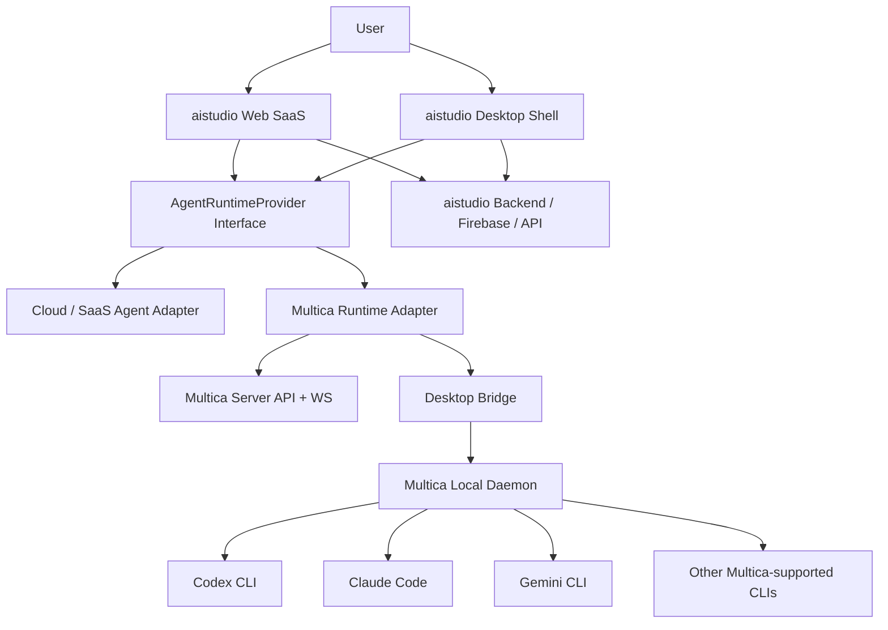

# Multica Dual-Mode Desktop Agent Integration Design

Date: 2026-06-09

Status: Draft for user review

## 1. Summary

`aistudio` should remain a standalone Web SaaS application while gaining an optional desktop runtime mode powered by `multica-ai/multica`.

The recommended integration is a dual-mode architecture:

- **Web standalone mode**: `aistudio` runs as a normal browser SaaS with cloud/server-backed AI jobs, asset workflows, tasks, billing, and audit logs.
- **Desktop Multica mode**: `aistudio` connects to a local Multica desktop/daemon runtime. Agent tasks can run on the user's machine through Multica-supported CLI agents such as Codex, Claude Code, Gemini, Copilot CLI, OpenCode, and others.

This keeps the business product independent while treating Multica as the desktop agent runtime provider.

## 2. Evidence

### Current `aistudio` Evidence

- `src/main.tsx` mounts `App` under `ThemeProvider` and `UndoRedoProvider`.
- `src/App.tsx` owns the app shell, active module state, sidebar/topbar layout, split screen, pinned modules, and module rendering.
- `src/components/Sidebar.tsx` currently defines the product navigation.
- `src/types.ts` defines the `ModuleId` union.
- `docs/saas-product-prd.md` positions the product as an AI operating workspace.
- `docs/mvp-development-roadmap.md` already identifies the need for a product registry, SaaS foundation, task system, usage/billing, settings, and audit logs.

### Multica Evidence

From `multica-ai/multica`:

- `README.md` / `README.zh-CN.md` describe Multica as a managed agents platform with Web, server, database, local daemon, and supported agent CLIs.
- `CLI_AND_DAEMON.md` defines `multica setup`, `multica login`, `multica daemon start`, `multica daemon status`, daemon logs, self-hosted setup, runtime registration, polling, heartbeats, and supported CLI agents.
- `apps/desktop/package.json` shows a real Electron desktop app using `electron-vite`, `@multica/core`, `@multica/ui`, and `@multica/views`.
- `apps/desktop/src/preload/index.ts` exposes `window.daemonAPI` to the renderer with daemon start/stop/restart/status/log/prefs/token methods.
- `apps/desktop/src/shared/daemon-types.ts` defines `DaemonState`, `DaemonStatus`, daemon state labels, daemon state colors, and user-facing daemon descriptions.
- `apps/desktop/src/shared/runtime-config.ts` defines `apiUrl`, `wsUrl`, and `appUrl` runtime configuration for cloud or self-hosted deployments.
- `packages/core/runtimes/*` and `packages/views/runtimes/*` provide runtime list, health, usage, update, and UI concepts.

## 3. Goals

1. Preserve `aistudio` as an independently deployable SaaS.
2. Add desktop agent capability without forcing every user into a desktop install.
3. Let users choose where agent work runs:
   - cloud/server runtime
   - local Multica desktop daemon
   - self-hosted Multica server plus local daemon
4. Map `aistudio` tasks and Agent operations onto Multica's issue/runtime/agent lifecycle.
5. Avoid coupling product modules directly to Multica implementation details.
6. Keep future options open: Multica Cloud, self-hosted Multica, or a custom `aistudio` agent backend.
7. Treat Multica as an actively maintained upstream that can keep iterating normally without being blocked by `aistudio` integration work.

## 4. Non-Goals

- Do not replace the current `aistudio` UI with Multica's UI.
- Do not merge the entire Multica monorepo into this repository.
- Do not make desktop mode mandatory for the Web SaaS.
- Do not expose local shell, file paths, tokens, or daemon controls to the browser unless the user is explicitly in desktop mode.
- Do not make every one of the 64 product modules depend on Multica in the first pass.
- Do not fork Multica internals unless a stable API/adapter cannot cover the need.
- Do not freeze Multica at a private one-off snapshot. The integration should tolerate upstream Multica releases through a versioned adapter contract.

## 5. Recommended Architecture



## 6. Mode Model

### Mode 1: Web Standalone

This is the default product mode.

Behavior:

- Runs in any browser.
- Uses normal SaaS backend for auth, workspace, asset vault, generation jobs, tasks, billing, settings, and audit logs.
- Agent execution uses cloud/provider APIs or mock adapters depending on environment.
- No local daemon controls appear unless desktop capability is detected.

Required UI state:

- Runtime mode: `web`
- Agent runtime status: cloud/remote only
- Desktop controls hidden
- Agent task creation available only for cloud-capable agents

### Mode 2: Desktop Multica

This mode is enabled when `aistudio` is running in a desktop shell or detects a trusted local desktop bridge.

Behavior:

- Uses the same product UI and business modules.
- Shows local runtime panel and daemon status.
- Can start, stop, restart, and inspect Multica daemon if the desktop bridge exposes those actions.
- Can create Multica-backed agent tasks.
- Streams agent/task progress back into `aistudio` task center, Agent dashboard, and audit logs.

Required UI state:

- Runtime mode: `desktop_multica`
- Desktop bridge available
- Multica daemon status visible
- Local runtime list visible
- Local task queue visible
- Auth/reauth state visible

### Mode 3: Self-Hosted Multica

This is a deployment configuration rather than a separate UI product.

Behavior:

- `aistudio` points to a self-hosted Multica server API/WS endpoint.
- Local Multica daemon connects to that self-hosted server.
- Web SaaS and desktop shell can both talk to the same self-hosted runtime plane.

Required configuration:

- `MULTICA_API_URL`
- `MULTICA_WS_URL`
- `MULTICA_APP_URL`
- workspace mapping between `aistudio` and Multica
- token/session handoff rules

## 7. Upstream Iteration Contract

Multica is expected to keep evolving as its own project. `aistudio` should integrate with it through stable seams instead of assuming the current source tree will stay fixed.

### Dependency Policy

- Prefer released Multica CLI/desktop/server packages or documented self-hosted deployment paths.
- Avoid copying Multica source files into `aistudio`.
- Avoid modifying Multica core runtime behavior for product-specific needs.
- Keep any Multica-specific code inside `aistudio` adapter modules.
- Track the Multica upstream commit or release version used during validation.

### Compatibility Policy

The Multica adapter should detect and record:

- Multica server API URL and version when available.
- Multica desktop/runtime config schema version.
- daemon status schema version when available.
- supported daemon states.
- supported task/issue lifecycle states.
- supported CLI providers.

If Multica changes a field or capability, the product should fail soft:

- keep Web SaaS mode usable.
- mark desktop runtime as degraded.
- show a compatibility warning.
- block only the affected desktop action.
- preserve existing `aistudio` task and audit records.

### Contract Tests

Add adapter-level tests that validate the minimum Multica contract:

- daemon status maps to `aistudio` runtime status.
- runtime list maps to local/cloud availability.
- task creation maps to Multica issue/task creation.
- task lifecycle events map to `aistudio` task states.
- auth-expired, stopped, running, and server-unreachable states are handled.

These tests should use fixtures rather than requiring a live Multica server in every test run. A live self-hosted Multica smoke test can be part of release verification.

### Upstream Sync Cadence

- Re-test against latest Multica before each desktop-mode release.
- Keep a short `docs/multica-compatibility.md` matrix once implementation begins.
- Record breaking Multica changes as adapter work, not product module work.
- Prefer upstream PRs to Multica for generic daemon/runtime improvements.

## 8. Integration Boundaries

### Boundary A: Product UI

Owned by `aistudio`.

Includes:

- 64-feature product navigation
- dashboard
- e-commerce workflows
- copywriting
- asset vault
- task center
- billing/settings/audit
- Agent status dashboard
- global agent dispatcher

This layer should not import Multica UI components directly in the first integration. It consumes a stable local interface.

### Boundary B: Runtime Provider Interface

New `aistudio` abstraction.

Proposed capabilities:

```ts
type RuntimeMode = "web" | "desktop_multica" | "self_hosted_multica";

interface AgentRuntimeProvider {
  mode: RuntimeMode;
  getRuntimeStatus(): Promise<RuntimeStatus>;
  listAgents(): Promise<AgentSummary[]>;
  listTasks(params?: TaskQuery): Promise<AgentTask[]>;
  createTask(input: CreateAgentTaskInput): Promise<AgentTask>;
  cancelTask(taskId: string): Promise<void>;
  subscribeToTask(taskId: string, cb: (event: AgentTaskEvent) => void): () => void;
  subscribeToRuntime(cb: (status: RuntimeStatus) => void): () => void;
}
```

This interface lets `aistudio` swap between:

- cloud adapter
- local mock adapter
- Multica adapter
- future custom agent runtime adapter

### Boundary C: Multica Adapter

Owned by integration code in `aistudio`.

Responsibilities:

- Authenticate to Multica server or receive desktop-provided auth.
- List Multica workspaces/runtimes/agents.
- Create Multica issues/tasks from `aistudio` task requests.
- Translate Multica statuses into `aistudio` task/agent states.
- Subscribe to Multica WebSocket events.
- Report usage and audit events back to `aistudio`.

It should not own product decisions like feature visibility, billing plans, or asset metadata.

### Boundary D: Desktop Bridge

Only available in desktop mode.

Possible sources:

- Multica's existing Electron desktop bridge.
- A future `aistudio` Electron/Tauri shell that embeds a Multica CLI/daemon controller.

Minimum bridge capabilities:

```ts
interface DesktopAgentBridge {
  isAvailable(): boolean;
  getDaemonStatus(): Promise<DaemonStatus>;
  startDaemon(): Promise<BridgeActionResult>;
  stopDaemon(): Promise<BridgeActionResult>;
  restartDaemon(): Promise<BridgeActionResult>;
  streamDaemonLogs(cb: (line: string) => void): () => void;
  syncAuthToken(token: string, userId: string): Promise<void>;
  setTargetApiUrl(url: string): Promise<void>;
}
```

This mirrors Multica's existing `window.daemonAPI` shape without forcing Web mode to know about Electron IPC.

## 9. Data Mapping

| `aistudio` Concept | Multica Concept | Notes |
|---|---|---|
| Workspace | Workspace | Need one-to-one or mapped workspace id. |
| Agent | Agent | `aistudio` may add business persona metadata. |
| Runtime | Runtime / local daemon registered CLI | Multica owns runtime detection and liveness. |
| Task | Issue / agent task queue item | `aistudio` task can create a Multica issue/task. |
| Agent Dispatch | Assign issue to agent or squad | Map dispatcher target to Multica agent/squad. |
| Activity Log | Activity / comments / audit events | Keep `aistudio` audit log as product record. |
| Generation Job | Task or subtask | Only long-running agent work should become Multica task. |
| Asset | Attachment/output artifact | Generated files can be attached to Multica task and saved to `aistudio` asset vault. |
| Skill/Template | Multica Skill / prompt template | Can be mapped later after P0 runtime integration. |

## 10. Core User Flows

### Flow A: Web User Without Desktop Runtime

1. User logs into `aistudio` in browser.
2. App detects no desktop bridge.
3. Agent panels show cloud/runtime-neutral status.
4. User can use normal SaaS features.
5. Desktop setup CTA is optional and non-blocking.

### Flow B: Desktop User Connects Multica Runtime

1. User opens `aistudio` desktop mode.
2. Desktop bridge exposes daemon status.
3. App shows "Desktop Agent Runtime" panel.
4. User starts or reconnects daemon.
5. Daemon registers available CLI runtimes with Multica server.
6. App shows available runtimes and agents.
7. User dispatches a task from Task Center or Agent Dispatcher.
8. Multica runs the task locally and streams progress.
9. `aistudio` updates task, agent status, audit log, and output assets.

### Flow C: Self-Hosted Deployment

1. Admin configures Multica self-hosted API/WS URLs.
2. Desktop daemon connects to self-hosted server.
3. `aistudio` uses the same URLs through the Multica adapter.
4. All runtime events remain within the self-hosted environment.

## 11. UI Changes

### P0 UI Additions

1. **Settings > Desktop Agent Runtime**
   - runtime mode
   - server URL
   - daemon status
   - detected CLI agents
   - start/stop/restart actions in desktop mode
   - setup instructions in Web mode

2. **Agent Status Dashboard**
   - cloud vs local runtime distinction
   - daemon status badge
   - runtime count
   - CLI provider list
   - last heartbeat

3. **Global Agent Dispatcher**
   - target runtime selector
   - agent provider selector
   - local/cloud availability indicator
   - dispatch result and task link

4. **Task Center**
   - local task badge
   - Multica-backed task status
   - progress/log summary
   - cancel/retry if supported

### UI Rules

- Web mode never shows dangerous local daemon controls.
- Desktop-only actions are hidden or disabled when no bridge exists.
- Auth-expired state must be explicit.
- Logs should be opt-in and redact secrets.
- The product should call this "Desktop Agent Runtime" or "Local Agent Runtime", not "Multica internals".

## 12. Security And Privacy

### Token Handling

- Browser Web mode must not receive local daemon tokens.
- Desktop mode may sync auth tokens through a trusted bridge only.
- Raw API keys should not be displayed after save.
- Multica token/session expiry should map to a clear `auth_expired` state.

### Local Execution

- Desktop mode can execute local CLI agents. This must be visibly disclosed.
- User should choose workspace/repository scope before dispatching local tasks.
- Task prompts should include only necessary product context.
- Sensitive assets/customer data should require explicit permission before being passed to local runtime tasks.

### Audit

Every desktop-runtime action should emit `aistudio` audit events:

- daemon start/stop/restart
- runtime connected/disconnected
- task dispatched
- task cancelled
- task completed/failed
- output asset imported
- auth expired/reauthenticated

## 13. Error Handling

| State | User Meaning | Product Response |
|---|---|---|
| no bridge | Running in Web mode | Hide desktop controls, show setup CTA. |
| cli_not_found | Multica CLI/daemon missing or install failed | Show install/retry instructions. |
| stopped | Local device cannot take tasks | Show start daemon action in desktop mode. |
| starting/stopping | Runtime transition | Disable duplicate actions and show progress. |
| running with zero runtimes | Daemon running but no supported CLI detected | Show CLI setup guidance. |
| auth_expired | Daemon credentials invalid | Show reauthenticate action. |
| server unreachable | Multica API/WS unavailable | Keep Web product usable; mark local runtime offline. |
| task failed | Agent execution failed | Surface failure reason, logs summary, retry option. |

## 14. Implementation Phases

### Phase 0: Design And Proof Boundary

- Confirm dual-mode architecture.
- Document runtime provider interface.
- Decide whether desktop shell is:
  - Multica desktop with embedded/linked `aistudio`, or
  - new `aistudio` desktop shell using Multica daemon/CLI concepts.
- Confirm workspace mapping strategy.
- Record the tested Multica upstream commit/release and the minimum adapter contract.

### Phase 1: Runtime Provider Interface

- Add `AgentRuntimeProvider` abstraction.
- Add Web/mock provider.
- Add runtime mode detection.
- Add settings model for runtime mode.
- No Multica task dispatch yet.

### Phase 2: Multica Adapter Read-Only

- Configure Multica API/WS endpoints.
- Read runtime status, agents, and runtime health.
- Surface status in Settings and Agent Status Dashboard.
- Verify Web mode remains unaffected.
- Add fixture-based compatibility tests for Multica runtime, daemon, and task schemas.

### Phase 3: Desktop Bridge

- Add `DesktopAgentBridge` interface.
- In desktop shell, map bridge to Multica `daemonAPI` behavior.
- Support daemon status, start/stop/restart, logs, and auth-expired state.
- Keep these APIs absent in browser mode.

### Phase 4: Task Dispatch

- Map `aistudio` Task Center / Global Agent Dispatcher to Multica issue/task creation.
- Stream Multica task updates into `aistudio`.
- Persist local runtime task references.
- Add cancel/retry where supported.

### Phase 5: Artifact And Audit Integration

- Import Multica task outputs into `aistudio` asset vault.
- Attach output metadata to `GenerationJob` or `Task`.
- Emit audit logs for local runtime activity.
- Track local runtime usage for billing/analytics.

### Phase 6: Production Hardening

- Add permission gates.
- Add data redaction.
- Add browser/desktop smoke tests.
- Add self-hosted setup docs.
- Add release packaging decision for desktop mode.
- Add `docs/multica-compatibility.md` with supported Multica version, tested server/desktop/daemon behavior, and known limitations.

## 15. Acceptance Criteria

### Web Standalone

- App works with no Multica config.
- Desktop-only controls are hidden when bridge is unavailable.
- Existing product navigation and P0 SaaS flows still work.
- `npm run lint` and `npm run build` pass.

### Desktop Multica Read-Only

- App can show daemon status when desktop bridge is available.
- App can show local runtime availability.
- App can show auth-expired / stopped / running states.
- Server URL and runtime mode are visible in Settings.

### Desktop Multica Dispatch

- User can dispatch a task to a Multica-backed agent.
- Task status updates return to `aistudio`.
- Task output is visible or importable.
- Cancellation/retry behavior is explicit.
- Every dispatch lifecycle event is audited.

### Self-Hosted

- Admin can configure self-hosted API/WS URLs.
- Runtime status works against self-hosted Multica.
- Web SaaS still works if Multica server is unreachable.

### Upstream Compatibility

- The adapter records the Multica version or commit validated for desktop mode.
- Fixture-based contract tests cover daemon status, runtime list, task dispatch, task lifecycle events, and auth-expired state.
- Web standalone mode remains usable if the Multica adapter reports an incompatible or unreachable runtime.

## 16. Risks And Mitigations

### Risk: Product Coupling To Multica Internals

Mitigation:

- Use `AgentRuntimeProvider` and `DesktopAgentBridge` interfaces.
- Keep Multica-specific code in one adapter.
- Do not import Multica UI directly in P0.

### Risk: Two Task Models Drift Apart

Mitigation:

- Define canonical `aistudio` task fields.
- Store Multica references as external runtime metadata.
- Treat Multica issue/task status as runtime state, not as the only product truth.

### Risk: Desktop Security Confusion

Mitigation:

- Make local execution explicit.
- Gate local dispatch with permissions.
- Redact logs and prompts.
- Require workspace/repo scope confirmation before local execution.

### Risk: Self-Hosted Complexity Slows MVP

Mitigation:

- Support configuration shape early.
- Fully harden self-hosted deployment after read-only runtime integration works.

### Risk: Windows Packaging And Daemon Control

Mitigation:

- Reuse Multica's existing Windows-aware CLI/daemon behavior where possible.
- Keep desktop bridge small and test daemon states independently.

### Risk: Multica Upstream Changes Break Desktop Mode

Mitigation:

- Version the `aistudio` adapter contract.
- Keep Multica-specific code out of business modules.
- Maintain a compatibility matrix once implementation begins.
- Treat breaking upstream changes as adapter work.
- Prefer upstream fixes or extension points when the need is generic.

## 17. Open Decisions

1. Should the first desktop shell be a fork/brand of Multica Desktop or a new `aistudio` desktop shell?
2. Should `aistudio` use Multica Cloud by default or encourage self-hosted Multica for Chinese/private deployments?
3. Should Multica issue/task objects become visible directly in the `aistudio` Task Center, or only through mapped task records?
4. Which P0 modules can dispatch desktop agent tasks first: Task Center, Agent Dispatcher, E-commerce generation, Copywriting, or Asset Vault?
5. Should desktop mode be gated by plan tier?
6. What data can be sent to local agent runtimes without explicit per-task confirmation?
7. What Multica release cadence should `aistudio` track for desktop mode: latest stable release, pinned tested release, or user-selected endpoint/version?

## 18. Recommended Next Step

Update `docs/mvp-development-roadmap.md` with a new milestone before M1:

- **M0.5: Dual-Mode Runtime Foundation**
  - define runtime provider interface
  - define desktop bridge interface
  - add runtime mode settings
  - add Multica read-only adapter
  - add desktop runtime status panel

This keeps the existing MVP roadmap intact while inserting the Multica foundation before SaaS task dispatch and agent orchestration work.
